# Architecture: BB Project Management (`bb-pm`)

> A self-hosted, Jira-style project management platform with deep Slack integration, a GitHub PR sync, an LLM-assisted "quick-issue" capture flow, and a public AI-system API. Built as a TypeScript pnpm monorepo (`NestJS API` + `React/Vite web` + shared types) backed by a single Postgres instance and an S3 bucket.

> Related: [`./PRD.md`](./PRD.md) · [`./IMPLEMENTATION_PLAN.md`](./IMPLEMENTATION_PLAN.md)

---

## 1. Goal & Scope

The platform is the team's single source of truth for **issues, specifications, daily reports, and standups**. The architecture must support:

- **Project + issue tracking** with hierarchical EPIC → TASK → SUB_TASK, dependencies, components, labels, comments, attachments, and activities.
- **Markdown specifications** (기획서) with inline section anchors and bi-directional issue↔spec links.
- **Slack-first workflows**: daily project reports, a conversational standup bot (1 question at a time over DM), and natural-language issue capture from DMs.
- **GitHub integration**: PAT-based linking with HMAC-verified webhooks that auto-link PRs to issues by parsing `PROJECT-123` keys and transition statuses on open/merge.
- **AI-system access**: stable `X-API-Key`-authenticated REST surface under `/api/external/*` for LLM agents to read/write issues, specs, and links.
- **Multi-tenant isolation by project**: every authenticated request that touches project data passes through a membership guard; superusers bypass.
- **Operational simplicity**: one Node process, one Postgres, one bucket, deployed as three Docker containers (`db`, `app`, `web/nginx`).

Out of scope today: SSO/SAML, real-time push (WebSocket / SSE), search engine (Elastic/Meili), CDN, multi-region, background job queue, message broker. The system relies on Node-scheduled cron and polled queries for everything async.

---

## 2. Current State & Pain Points

The codebase is a working monolith with 30+ NestJS modules and ~29 Prisma migrations. The shape is mostly clean but accumulating well-known monolith problems:

| #  | Pain point                                                                                          | Visible symptom                                                          |
|----|------------------------------------------------------------------------------------------------------|--------------------------------------------------------------------------|
| P1 | **Schedulers run inside the API process.** No leader election, no distributed lock.                  | If two API replicas are ever deployed, Slack reports/standups fire twice. |
| P2 | **Long-running side effects fire in fire-and-forget `.catch(() => {})`** (e.g., assignment notifications). | Failures are swallowed silently; no retry, no DLQ.                       |
| P3 | **No outbox / no transactional event bus.** Cross-module reactions (PR merged → issue status, assignee changed → notify, comment added → mention) are wired via direct service calls inside the same transaction or after it. | Hard to add new reactions; any new consumer means editing the producer.  |
| P4 | **Standup poll loop runs every minute** (`@Cron('0 * * * * *')`) doing N×SELECTs over all standup + report configs with per-config `Intl.DateTimeFormat` parsing. | DB chatter scales linearly with config count; not catastrophic, but wasteful and timezone math is brittle. |
| P5 | **In-process LRU caches** for Slack channel/user lists (5-min TTL, `Map<string, …>`).                | Cannot scale horizontally — each replica has its own cache; an admin in replica A doesn't see channel refreshes from replica B. |
| P6 | **Secrets in Postgres** (Slack bot tokens, GitHub PATs, project credentials) encrypted at rest with `AES-256-CBC` and a single `ENCRYPTION_KEY` env. | No envelope encryption, no key rotation, no KMS integration.             |
| P7 | **No event taxonomy.** Activity rows are the only event log, but they're written ad-hoc by each service with inconsistent `field` strings ("status", "github_pr_linked", "created"). | Search/analytics on "what happened" requires string regex over the `activities.field` column. |
| P8 | **Frontend talks to API only through polling** (`@tanstack/react-query` with `refetchOnWindowFocus: false`). | Two users on the same board diverge until one refreshes; the standup admin watching a configurable cron doesn't see triggers in real time. |
| P9 | **Auth is JWT + a single refresh-token slot per user** (`users.refresh_token` is overwritten on each login). | Logging in from a second device silently invalidates the first; no concept of session/device list. |
| P10 | **Avatar storage couples S3 keys to user IDs** (`avatars/{userId}.{ext}`) and `getAvatar` brute-force tries 4 extensions on miss. | Up to 4 S3 GETs per avatar fetch; no signed URLs, all traffic flows through the API process. |
| P11 | **External API and JWT API share the same controllers and services**, distinguished only by a `@Public() + @UseGuards(ApiKeyGuard)` decorator pair on the `external` controller. | Easy to forget; one misplaced decorator turns an internal endpoint into a public one. |

These don't break anything today, but every one of them is a load-bearing assumption that quietly breaks the day the team adds a second replica, a second slack workspace, or a CDN.

---

## 3. System Context (C4 Level 1)

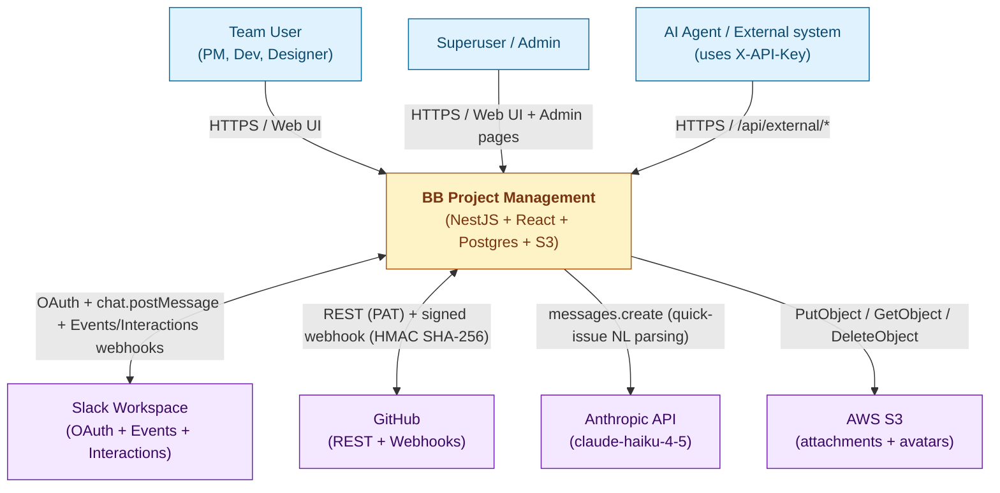

**Legend.** Yellow = the system. Purple = external SaaS/managed dependencies. Blue = humans/automated callers. Every external arrow is over HTTPS; Slack and GitHub webhooks are signature-verified at the controller level before any work runs.

---

## 4. Container Diagram (C4 Level 2)

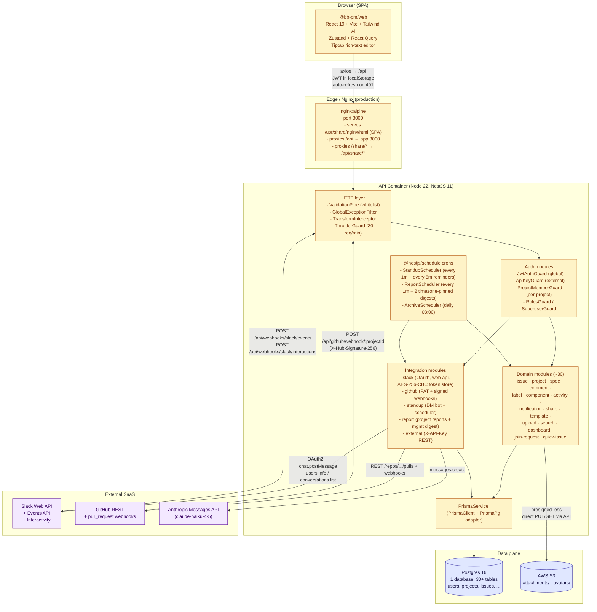

**Legend.** Yellow = existing components in the repo today. Blue = data stores. Purple = external SaaS. There are no green ("new") boxes in this diagram — this is a "where we are" map, not a target state.

---

## 5. Codebase Layout

```
bb-project-management/
├── packages/
│   ├── api/                       # NestJS 11 backend (ESM, Node 22)
│   │   ├── src/
│   │   │   ├── app.module.ts      # 30+ feature modules wired here
│   │   │   ├── main.ts            # bootstrap: ValidationPipe, CORS, Swagger
│   │   │   ├── common/            # guards, decorators, encryption, constants
│   │   │   ├── prisma/            # PrismaService (PrismaPg adapter)
│   │   │   ├── auth/              # register/login/refresh + JwtStrategy
│   │   │   ├── user/ project/ project-member/
│   │   │   ├── issue/             # 21KB service: CRUD + reorder + bulk + activities
│   │   │   ├── issue-link/ issue-spec-link/ comment/ activity/
│   │   │   ├── label/ component/ template/ attachment via upload/
│   │   │   ├── specification/     # 12KB service: 기획서 markdown + sections
│   │   │   ├── credential/        # encrypted project credentials (entries: Json)
│   │   │   ├── upload/            # S3 PUT/GET/DELETE for attachments + avatars
│   │   │   ├── slack/             # OAuth, WebClient, encrypted token vault
│   │   │   ├── standup/           # 31KB service: DM bot, scheduler, quick-issue glue
│   │   │   ├── report/            # daily project reports + mgmt digest formatters
│   │   │   ├── github/            # PAT connect, webhook verify, PR sync
│   │   │   ├── quick-issue/       # rule-parser + llm-enricher (Anthropic)
│   │   │   ├── external/          # API-key authenticated REST
│   │   │   ├── share/             # OG-tagged public issue preview HTML
│   │   │   ├── notification/ join-request/ dashboard/ search/
│   │   ├── prisma/
│   │   │   ├── schema.prisma      # 765 lines, 30 models, 7 enums
│   │   │   ├── migrations/        # 29 SQL migrations
│   │   │   └── seed.ts
│   │   ├── generated/prisma/      # Prisma 7 generated client (committed)
│   │   ├── prisma.config.ts
│   │   └── Dockerfile             # multi-stage: deps → builder → production
│   ├── web/                       # React 19 + Vite 8 + Tailwind v4
│   │   ├── src/
│   │   │   ├── App.tsx            # BrowserRouter + AuthGuard + AppLayout
│   │   │   ├── api/               # one axios module per domain
│   │   │   ├── stores/            # Zustand: auth, theme, shortcuts, toast, imagePreview
│   │   │   ├── hooks/             # keyboard shortcuts, openIssueFromUrl
│   │   │   ├── pages/             # 19 page components (Board, Timeline, Issues, ...)
│   │   │   ├── components/        # board/, comment/, editor/, spec/, ui/, ...
│   │   │   └── lib/               # constants, error, time, utils
│   │   ├── nginx.conf             # prod reverse proxy → app:3000
│   │   └── Dockerfile             # dev (vite) + build + production (nginx)
│   └── shared/                    # type-only workspace package (compiled via tsc)
├── scripts/                       # one-off migration scripts (migrate-jira-dc, ...)
├── docs/                          # PRD, IMPLEMENTATION_PLAN, this doc
├── docker-compose.yml             # dev: db only
├── docker-compose.prod.yml        # prod: db + app + web
├── Makefile                       # dev / prod / migrate / shell / clean
├── pnpm-workspace.yaml            # packages/*
└── .env / .env.example
```

### Module ownership matrix

| Concern                                  | Owning modules                                | Notes |
|------------------------------------------|------------------------------------------------|-------|
| Identity & sessions                      | `auth`, `user`                                 | JWT + 1 refresh-token slot per user |
| Project / membership / RBAC              | `project`, `project-member`, `join-request`    | `ProjectMemberGuard` resolves `key→id` and attaches `request.projectMember` |
| Core issue lifecycle                     | `issue`, `activity`, `label`, `component`      | Activities are the canonical change log |
| Cross-issue relationships                | `issue-link` (BLOCKS/DUPLICATES/...), `issue-spec-link` | |
| Knowledge base                           | `specification` (sections + comments)          | Markdown + per-section comment threads |
| Communication                            | `comment`, `notification`, `upload` (attach)   | Notification is in-DB; no push/email |
| Sharing                                  | `share`                                        | Public OG preview HTML for `PROJ-123` |
| Slack surface                            | `slack`, `standup`, `report`                    | Tokens encrypted at rest in `slack_integrations.bot_token` |
| GitHub surface                            | `github` (controller + service + sync + webhook) | PAT encrypted; webhook secret per project |
| External AI access                       | `external`, `api-key`, `quick-issue`           | API-key bcrypt-hashed + 8-char prefix index |
| Storage / files                          | `upload`                                       | S3 direct from API process; avatar served via `/api/upload/avatar/:userId` proxy |
| Cross-cutting infra                      | `common` (guards, filters, interceptors, encryption), `prisma` | |

---

## 6. Domain Model (ER)

The Prisma schema has 30 models and 7 enums. Below is the load-bearing core; integrations (Slack, GitHub, standup, reports) are listed in §7.

```mermaid
erDiagram
  USER ||--o{ PROJECT_MEMBER : "memberships"
  USER ||--o{ API_KEY : "issues"
  USER ||--o{ NOTIFICATION : "receives"
  USER ||--o{ ATTACHMENT : "uploads"
  USER ||--o{ ISSUE_TEMPLATE : "creates"

  PROJECT ||--o{ PROJECT_MEMBER : "has members"
  PROJECT ||--o{ ISSUE : "contains"
  PROJECT ||--o{ LABEL : "owns"
  PROJECT ||--o{ COMPONENT : "owns"
  PROJECT ||--o{ SPECIFICATION : "owns"
  PROJECT ||--o{ PROJECT_CREDENTIAL : "owns"
  PROJECT ||--o| GITHUB_INTEGRATION : "1:1"
  PROJECT ||--o| DAILY_REPORT_CONFIG : "1:1"
  PROJECT ||--o{ PROJECT_JOIN_REQUEST : "receives"

  ISSUE ||--o{ ISSUE_LABEL : "tagged"
  ISSUE ||--o{ ISSUE_COMPONENT : "categorized"
  ISSUE ||--o{ ACTIVITY : "change log"
  ISSUE ||--o{ COMMENT : "discussion"
  ISSUE ||--o{ ATTACHMENT : "files"
  ISSUE ||--o{ ISSUE_LINK : "source links"
  ISSUE ||--o{ ISSUE_LINK : "target links"
  ISSUE ||--o{ ISSUE_SPEC_LINK : "to specs"
  ISSUE ||--o{ GITHUB_PR_ISSUE_LINK : "PRs"
  ISSUE ||--o{ ISSUE : "parent/children (self)"

  LABEL ||--o{ ISSUE_LABEL : ""
  COMPONENT ||--o{ ISSUE_COMPONENT : ""

  SPECIFICATION ||--o{ SPEC_SECTION : "anchored"
  SPECIFICATION ||--o{ SPEC_COMMENT : "threads"
  SPECIFICATION ||--o{ ISSUE_SPEC_LINK : "linked from issues"

  GITHUB_INTEGRATION ||--o{ GITHUB_PULL_REQUEST : "stores PRs"
  GITHUB_PULL_REQUEST ||--o{ GITHUB_PR_ISSUE_LINK : "links to issues"

  USER {
    string id PK
    string email UK
    string passwordHash
    string slackUserId UK "nullable"
    enum   status "PENDING|ACTIVE|REJECTED|DELETED"
    bool   isSuperuser
    string refreshToken "bcrypt-hashed, single slot"
  }

  PROJECT {
    string id PK
    string key UK "human key (e.g., BBPM)"
    string name
  }

  ISSUE {
    string id PK
    int    number "auto-increment per project"
    string title
    text   description
    enum   status "BACKLOG|TODO|IN_PROGRESS|REVIEW_QA|DONE|CANCELED"
    enum   priority "HIGH|MEDIUM|LOW"
    enum   type "EPIC|TASK|BUG|SUB_TASK"
    int    order "fractional order in column, ORDER_GAP=1000"
    date   startDate "nullable"
    date   dueDate "nullable"
    date   focusDate "nullable, @db.Date (UTC midnight)"
    bool   isRecheck "set on backflow to IN_PROGRESS"
    date   archivedAt "auto-archive DONE/CANCELED after 3d"
  }

  ACTIVITY {
    string field "string-typed, ad-hoc: status, assigneeId, github_pr_linked, ..."
    string oldValue "nullable"
    string newValue "nullable"
  }
```

### Conventions worth knowing

- **Project key resolution.** `ProjectMemberGuard` accepts either UUID or human key in `:projectId`, swaps it to UUID in `request.params`, and downstream services only see UUIDs. This is why every controller can use `:projectId` and not maintain two route shapes.
- **Issue number scoping.** `(projectId, number)` is unique. The `number` is allocated inside a transaction by `MAX(number)+1` per project. **There is no advisory lock** — under concurrent issue creation the same number can collide and the second insert raises a unique-constraint violation. Practically rare; not architecturally safe.
- **Kanban ordering.** Issues within a `(projectId, status)` column have a fractional `order` field with an `ORDER_GAP=1000`. On reorder, if neighbours are <0.001 apart, the column is fully renormalized (`(idx+1) * 1000`). This is in `IssueService.reorder` and is the only place we renormalize.
- **Activity = audit + event log.** Every tracked field change writes one `Activity` row with the old/new string. The set of tracked fields is `IssueService.TRACKED_FIELDS`. Mutations from webhooks (GitHub PR linked, status synced) also write activities, with their own `field` slugs (`github_pr_linked`, `github_pr_auto_linked`, `github_pr_unlinked`, `created`).
- **Soft archive.** When an issue goes `DONE`/`CANCELED` and stays there for ≥3 days, `ArchiveScheduler` (cron `0 0 3 * * *`) sets `archivedAt = now()`. When the issue moves back out of `DONE`/`CANCELED` (via update OR drag), `archivedAt` is reset to `null`.
- **Hierarchy invariants** (in `IssueService.validateHierarchy`): `EPIC` cannot have a parent; `SUB_TASK` must have a parent and its parent cannot itself be a `SUB_TASK`; cycle detection walks the parent chain on update.

---

## 7. Integrations — Sequence Diagrams

The four external integrations each have their own controller, service, and (where applicable) scheduler. Each section below is the canonical happy-path.

### 7.1. Slack OAuth install

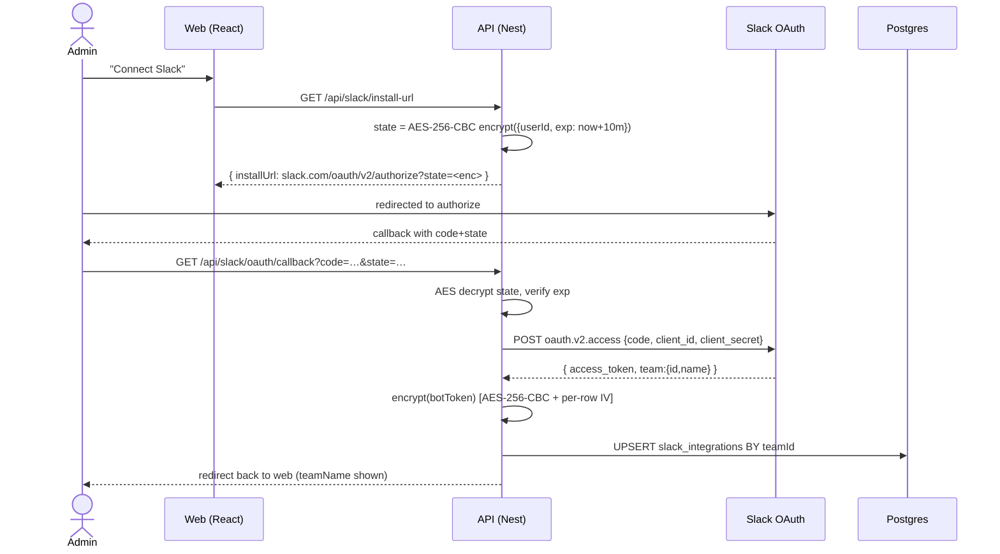

### 7.2. Slack standup — DM-driven 1-question-at-a-time bot

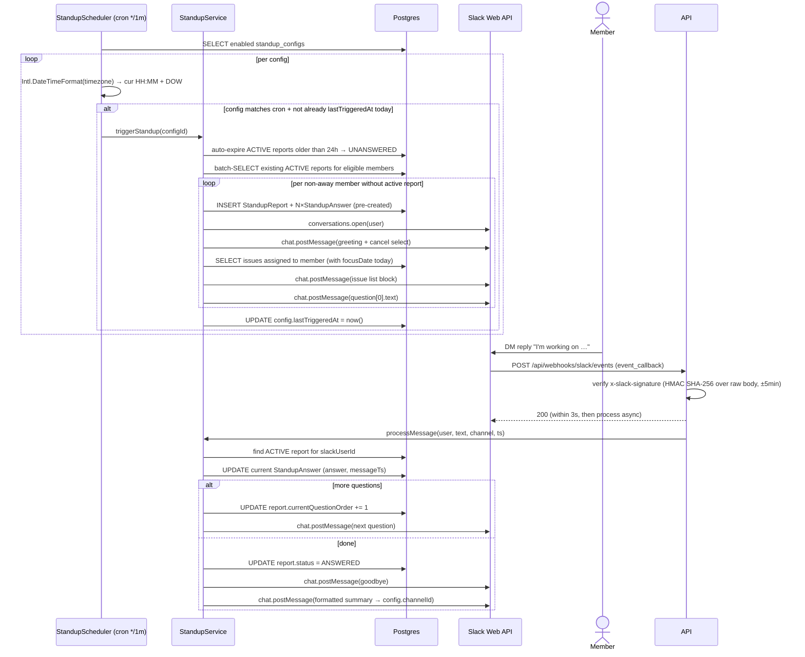

**Reminder loop.** `StandupScheduler.checkReminders` (every 5 min) finds `status=ACTIVE` reports older than 30 min with `remindedAt IS NULL`, sends one DM nudge, and stamps `remindedAt`. Idempotent by the `remindedAt IS NULL` clause.

**Quick-issue from DM.** A DM starting with `/issue ` or `!issue ` is routed to `handleQuickIssue` instead of `processMessage`: rule-parser extracts hints → LLM enricher calls Anthropic (`claude-haiku-4-5-20251001`, max_tokens=300, JSON-only) → preview block with `qi_confirm`/`qi_cancel` buttons → on confirm, calls `IssueService.create` through `QuickIssueService`.

### 7.3. GitHub PR webhook → issue auto-link + status sync

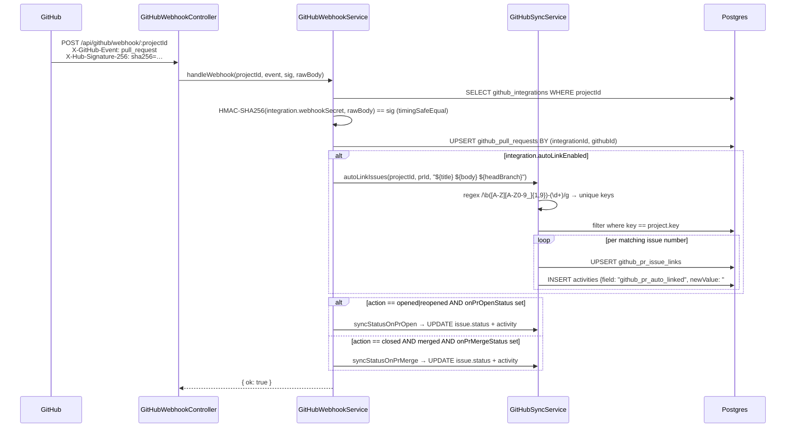

### 7.4. Daily project report + management digest

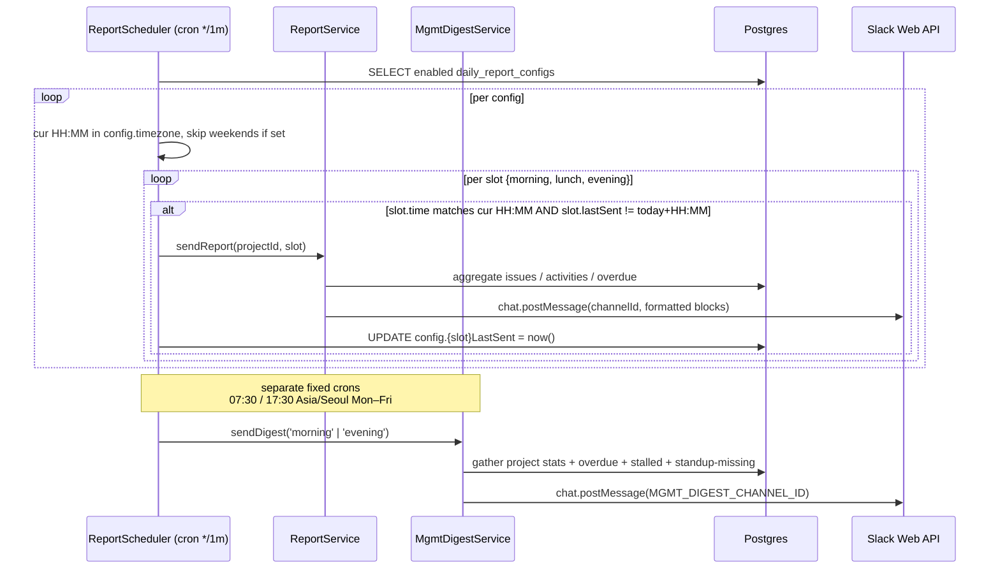

### 7.5. External AI API (X-API-Key)

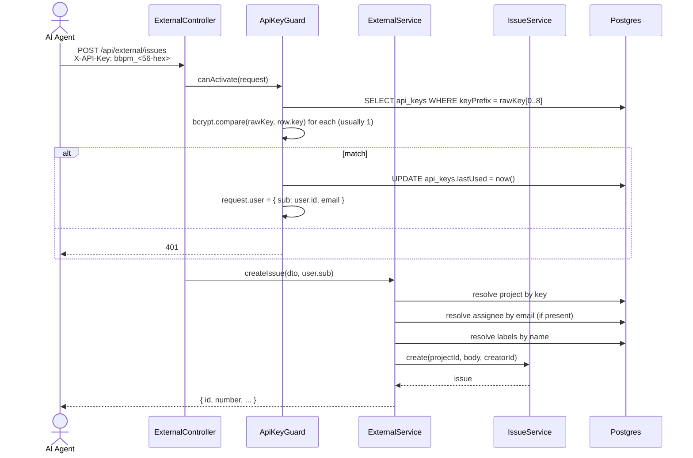

The API-key prefix optimisation: only the first 8 chars (`bbpm_xxx`) are indexed and used to narrow the bcrypt-compare set. With ~28 hex chars of entropy left, collisions on the prefix are vanishingly rare but bounded — the guard tolerates more than one row by iterating compare.

### 7.6. Issue assignment → Slack DM (fire-and-forget)

When an issue's `assigneeId` changes, the system writes the in-app `notifications` row (authoritative) and *then* triggers a best-effort Slack DM to the new assignee. The DM is opt-in by *user mapping*: it only fires when the recipient's `users.slack_user_id` is non-null (populated lazily by the standup flow, see §7.2).

```mermaid
sequenceDiagram
  actor Actor as Actor (PM)
  participant Issue as IssueService
  participant DB as Postgres
  participant Notif as NotificationService
  participant Slack as SlackService
  participant SlackAPI as Slack Web API
  actor Assignee as Assignee

  Actor->>Issue: PATCH /api/projects/.../issues/:id<br/>{ assigneeId: U2 }
  Issue->>DB: UPDATE issues, write Activity
  Issue->>DB: SELECT users.name WHERE id = actor.id
  Issue->>Notif: create({ type:'ASSIGNED', userId:U2, actorId, meta:{projectKey,issueNumber,issueTitle,actorName} })
  Notif->>DB: INSERT notifications (meta NOT persisted)
  Notif-->>Issue: notification row
  Note over Notif,Slack: Fire-and-forget — never blocks the PATCH response.
  Notif->>DB: SELECT users.slackUserId WHERE id = U2
  alt slackUserId is null
    Notif->>Notif: skip DM (in-app notification is enough)
  else slackUserId present
    Notif->>Slack: sendDirectMessage(slackUserId, text, blocks)
    Slack->>DB: SELECT first SlackIntegration (most recent)
    alt no SlackIntegration installed
      Slack-->>Notif: skip silently (debug log)
    else
      Slack->>SlackAPI: conversations.open({ users: slackUserId })
      Slack->>SlackAPI: chat.postMessage(channel: DM, blocks)
      Note over Slack,SlackAPI: Same retry loop as sendMessage:<br/>up to 3 retries on `ratelimited`<br/>with exponential backoff.
      SlackAPI-->>Assignee: 💬 "You've been assigned BBPM-123<br/>'Fix login redirect bug' by Alice"<br/>[View in BB-PM]
    end
  end
```

**Block payload**:

- Section: `:clipboard: *You've been assigned a new issue*`.
- Section with two `*Field*: value` fields — `*BBPM-123*\n<title>` and `*Assigned by*\n<actorName>`.
- Action button: `View in BB-PM` linking to `${FRONTEND_URL}/projects/<projectKey>/board?open=<issueId>`. `FRONTEND_URL` is the same env var used by `MgmtDigestService` (§7.4); defaults to `http://localhost:5173` in dev.

**Fire-and-forget guarantees**:

- The DM is dispatched from `NotificationService.create` via an explicit `.catch(log)` so any Slack error (no integration, DM channel cannot be opened, rate-limit exhausted) only produces a `warn` log — the issue PATCH succeeds.
- `meta` is **not persisted** — it's destructured off the create input and consumed only by the delivery side-effect. The `notifications` row stores the same fields it always did.

**Coverage**:

- Fires from every site that calls `IssueService.notifyAssignment`: PATCH `update` (`issue.service.ts:547`), `autoAssignUnassignedChildren` (`:124`), `bulkUpdate` (`:750`).
- Does **not** fire on drag-reorder — `reorder()` only mutates `status` + `order`, not `assigneeId`.

See [`docs/changelogs/slack-changelog.md`](./changelogs/slack-changelog.md), [`docs/changelogs/notification-changelog.md`](./changelogs/notification-changelog.md), [`docs/plans/slack-assignment-notification.md`](./plans/slack-assignment-notification.md).

---

## 8. State Machines

### 8.1. Issue lifecycle

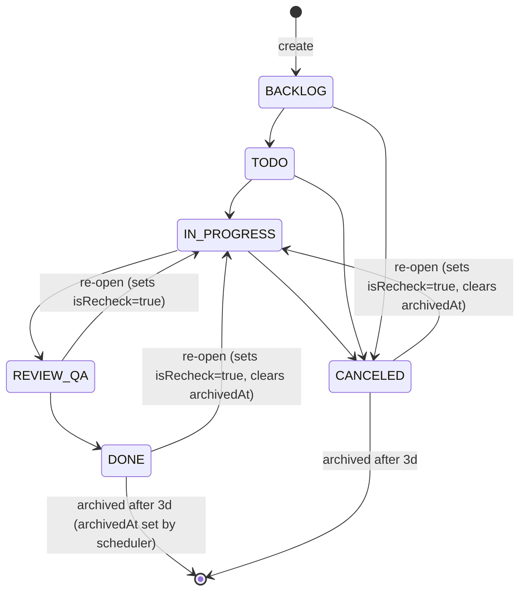

Transitions are not gated — any user with project membership can move an issue to any status — but auxiliary state is computed on transition:

- `isRecheck = true` whenever an issue moves back to `IN_PROGRESS` from `REVIEW_QA | DONE | CANCELED`. Cleared when moving away from `IN_PROGRESS`.
- `archivedAt = null` whenever an issue leaves `DONE` or `CANCELED`.
- One `Activity{field:"status"}` row is emitted whenever `status` actually changes (drag-reorder also emits this).

### 8.2. Standup report lifecycle

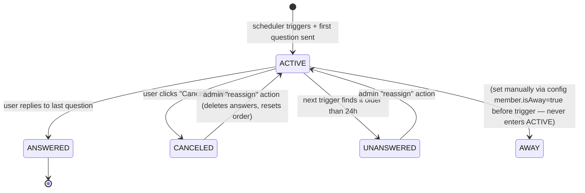

### 8.3. User account lifecycle

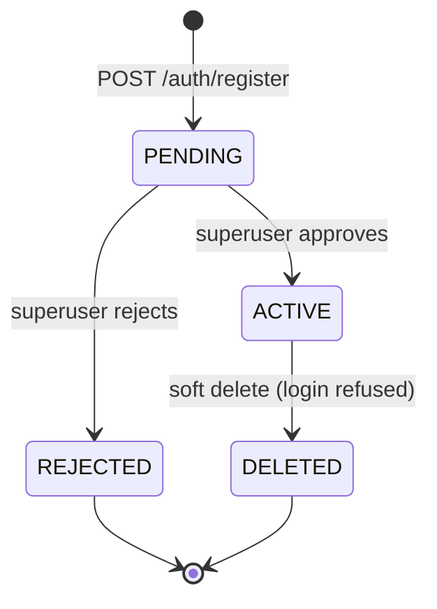

`LoginPage` enforces `status === ACTIVE` — `PENDING`/`REJECTED`/`DELETED` get a localized 403.

---

## 9. AuthN / AuthZ

### 9.1. Authentication

Two parallel authentication modes, both terminating on a request-shape of `request.user = { sub: userId, email }`:

1. **JWT bearer (interactive users).** Issued by `AuthService.buildTokenResponse`. Access token is a signed JWT (`JWT_SECRET`, expiry `JWT_EXPIRES_IN`, default 1h). Refresh token is the string `${userId}:${randomUUID()}`; only the UUID half is bcrypt-hashed (cost 10) and stored in `users.refresh_token`. There is exactly **one refresh-token slot per user** — logging in from device B invalidates device A's refresh.
2. **API key (external/AI callers).** `ApiKeyGuard` reads `X-API-Key`, narrows by the 8-char `keyPrefix` index, and bcrypt-compares against each row. On match, updates `lastUsed` and sets `request.user`. The `external` controller is `@Public()` (skips the global JWT guard) and `@UseGuards(ApiKeyGuard)`.

`JwtAuthGuard` is registered as a global `APP_GUARD`. The `@Public()` decorator short-circuits it for: register/login/refresh, share routes, Slack webhooks, GitHub webhooks, external controllers, OG-tag preview HTML.

### 9.2. Authorization

| Guard                  | Scope                                      | What it verifies |
|------------------------|--------------------------------------------|------------------|
| `JwtAuthGuard` (global)| every route except `@Public()`             | valid signed JWT, attaches `request.user` |
| `ProjectMemberGuard`   | routes with `:projectId`                   | resolves key→UUID; membership exists OR user is superuser; attaches `projectMember` and `isSuperuser` to request |
| `RolesGuard`           | manual `@Roles(...)`                       | `request.projectMember.role` ∈ allowed roles |
| `SuperuserGuard`       | admin pages                                | `users.isSuperuser === true` |
| `ApiKeyGuard`          | `/external/*`                              | hashed API key match |
| `ThrottlerGuard` (global) | every route                            | 30 requests / 60s per IP (default `ttl: 60_000, limit: 30`) |

Project roles are `ADMIN | PM | DEVELOPER`. Project creation auto-adds the creator AND every active superuser as `ADMIN` members of the new project.

### 9.3. Secrets at rest

`EncryptionService` (AES-256-CBC, 16-byte random IV per row, hex-encoded `iv:ciphertext` concat) wraps:

- `slack_integrations.bot_token`
- `github_integrations.access_token`
- (Indirectly via JSON) `project_credentials.entries[].value` when the caller marks `sensitive: true`

Single symmetric key from `ENCRYPTION_KEY` env (must be 32 bytes / 64 hex). No KMS, no key rotation, no envelope.

---

## 10. Async Work — Schedulers & Side Effects

There is no broker. Everything async runs in-process via `@nestjs/schedule` cron decorators on the API container.

| Cron expression                                | Job                                        | Action |
|------------------------------------------------|--------------------------------------------|--------|
| `0 0 3 * * *`                                  | `ArchiveScheduler.archiveOldIssues`        | mark `DONE`/`CANCELED` with `updatedAt < now-3d` as `archivedAt=now` |
| `0 * * * * *` (every minute)                   | `StandupScheduler.checkAndTriggerStandups` | for every enabled `standup_configs`, compare local HH:MM to cron fields, dedupe by `lastTriggeredAt` |
| `0 */5 * * * *` (every 5 minutes)              | `StandupScheduler.checkReminders`          | nudge `ACTIVE` reports older than 30 min once (`remindedAt IS NULL`) |
| `0 * * * * *` (every minute)                   | `ReportScheduler.checkAndSendReports`      | for every enabled `daily_report_configs`, send morning/lunch/evening if their HH:MM matches and `*LastSent` differs |
| `0 30 7 * * 1-5` Asia/Seoul                    | `ReportScheduler.sendMorningDigest`        | aggregate management digest → `MGMT_DIGEST_CHANNEL_ID` |
| `0 30 17 * * 1-5` Asia/Seoul                   | `ReportScheduler.sendEveningDigest`        | same, evening |

**Fire-and-forget patterns in-request:**

- `IssueService.notifyAssignment` — fetches `users.name` for the actor, then calls `NotificationService.create(..., meta:{...}).catch(() => {})`. The notification row is awaited; the downstream Slack DM dispatched by `NotificationService` is not (see §7.6).
- `NotificationService.create` (for `type === 'ASSIGNED'`) — dispatches `SlackService.sendDirectMessage` via `.catch(warn)`. The DM never blocks the issue PATCH, never throws upward, and silently skips when the recipient has no `slack_user_id` or no `SlackIntegration` is installed.
- `IssueService.autoAssignUnassignedChildren` — re-runs the same notify pattern in a loop.
- `IssueService.bulkUpdate` — notifies inside a `$transaction` callback. If the transaction rolls back, notifications were already sent (in this code, they're inside the tx, but a `$transaction(async tx => …)` boundary creates a subtle race).
- `GitHubSyncService.transitionLinkedIssues` — wraps each `update` in try/catch but does not retry.
- `JoinRequestService.sendSlackNotification` — Slack DM to ADMIN/PM on a new request, fire-and-forget with `warn` on failure.

This is P2/P3 in the pain-point register. None of these write to an outbox; they are direct calls.

---

## 11. Data Flow — Two Walk-throughs

### 11.1. "Drag an issue from TODO → IN_PROGRESS on the board"

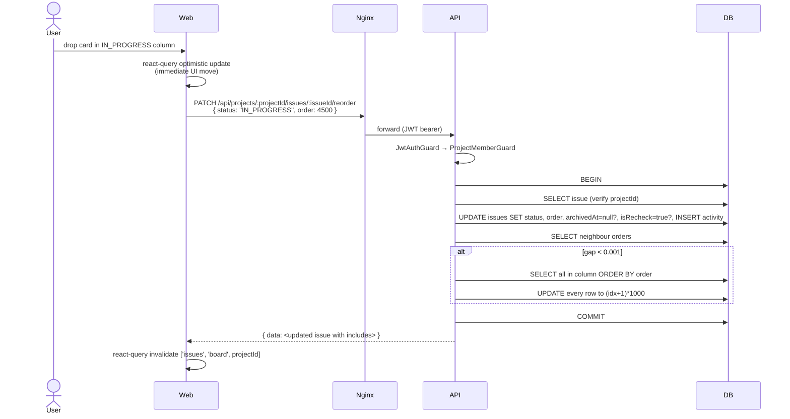

### 11.2. "Slack DM reply completes a standup"

Already covered in §7.2. Key invariants:

- Slack signature verified on raw body **before** any state read (`req.rawBody` is preserved via `NestFactory.create(AppModule, { rawBody: true })` in `main.ts`).
- HTTP 200 is sent within the 3-second Slack budget; all DB/Slack calls happen after `res.status(200).send()`.
- Each `processMessage` call mutates the `currentQuestionOrder` for one report; concurrent replies from the same user race, but Slack's own ordering plus the `currentQuestionOrder` field on the report record bounds the damage to "one extra answer overwrite".

---

## 12. Tech Stack

| Layer                  | Choice                                                | Why (today's reason)                                       |
|------------------------|-------------------------------------------------------|------------------------------------------------------------|
| Web framework          | React 19 + Vite 8 + Tailwind CSS v4                  | Fast HMR, tiny prod bundle through nginx; v4 oxide engine reduces build time |
| Web routing            | `react-router-dom` v7                                  | Familiar nested-route layout for AuthGuard → AppLayout     |
| Web state              | Zustand 5                                              | Small, no provider hell; one store per concern (auth, theme, toast, shortcuts) |
| Web data               | `@tanstack/react-query` 5                             | Cache invalidation per board/issue/dashboard view          |
| Web editor             | Tiptap 3 (StarterKit + tables + images + code blocks) | Rich text on issues/specs/comments                          |
| API framework          | NestJS 11 (ESM)                                       | DI + decorators map cleanly onto the 30-module shape       |
| API ORM                | Prisma 7 + PrismaPg adapter                            | Type-safe, with the new driver-adapter path (`@prisma/adapter-pg`) |
| API validation         | `class-validator` + `class-transformer` + ValidationPipe (`whitelist`) | Strip unknown fields, reject if `forbidNonWhitelisted` |
| API auth               | `@nestjs/jwt` + `@nestjs/passport` + JwtStrategy      | Standard bearer flow                                       |
| API throttle           | `@nestjs/throttler`                                    | 30 req/min/IP, can be overridden per route                  |
| API schedule           | `@nestjs/schedule`                                     | In-process cron — see §10 trade-off                         |
| API docs               | `@nestjs/swagger` at `/api/docs`                       | Doubles as the source for `/api-docs` web page (read-only) |
| Database               | Postgres 16-alpine                                     | Strong relational fit for the issue graph                  |
| File storage           | AWS S3 (`@aws-sdk/client-s3`)                          | `ap-northeast-2` default; avatars proxied through API       |
| AI                     | Anthropic Messages API, `claude-haiku-4-5-20251001`   | Cheap + fast for the quick-issue JSON-extraction prompt    |
| Slack                  | `@slack/web-api` 7 + custom OAuth + custom Events/Interactions controller | Bot + Events + Interactivity in one workspace per install |
| Container runtime      | Docker Compose (dev + prod variants)                   | `db` only in dev; `db + app + web/nginx` in prod            |
| Process model          | Single Node process per replica, schedulers inline    | See P1                                                      |
| Logging                | NestJS `Logger` + docker JSON file driver (10MB×3)    | No centralised logging today                                |
| Healthcheck            | `curl -f http://localhost:3000/api/docs`               | Liveness only; no readiness, no metrics                     |

---

## 13. Risk Register

| # | Risk                                                                                         | P | I | Mitigation today                                              | Gap |
|---|----------------------------------------------------------------------------------------------|---|---|----------------------------------------------------------------|-----|
| R1 | Two API replicas would double-send Slack reports/standups (no leader election)               | M | H | n/a — single replica enforced in compose                       | Need DB-advisory lock OR move schedulers out of process |
| R2 | Per-minute polling of standup + report configs across timezones is timezone-math heavy       | M | M | `Intl.DateTimeFormat` per check, `lastTriggeredAt` dedupe       | Pre-compute next-fire timestamp on save |
| R3 | Slack/GitHub tokens encrypted with one symmetric key in env (`ENCRYPTION_KEY`)                | L | H | AES-256-CBC + per-row IV                                       | No KMS, no rotation; rotating key requires re-encrypting every row |
| R4 | Single refresh-token slot per user                                                           | H | M | Bcrypt-hashed token in `users.refresh_token`                   | Move to `user_sessions` table keyed by `(userId, deviceId)` |
| R5 | Issue.number allocation races on concurrent create                                           | L | M | Inside `$transaction`, but no advisory lock                    | `pg_advisory_xact_lock(hashtext(projectId))` before SELECT MAX |
| R6 | Webhook handlers do real work inside the request (Slack 3s budget)                            | M | M | Slack: 200-then-process pattern; GitHub: synchronous in handler | GitHub handler should also return 200-then-process for slow auto-link/sync |
| R7 | Avatar `getAvatar` brute-forces 4 file extensions on cache miss                              | H | L | 4 sequential S3 GETs                                           | Store the actual key in `users.avatar` (already doing it for new uploads) |
| R8 | API key bcrypt-compare loops over every row sharing the prefix                                | L | L | 8-char prefix index narrows quickly                            | Keep prefix length, never relax |
| R9 | `fire-and-forget` notification + auto-link bug surface (silent failure)                       | M | M | `.catch(() => {})` only                                        | Outbox table + worker; minimally, log+alert |
| R10 | No central observability                                                                     | H | M | Docker logs only                                                | OpenTelemetry traces + structured logs to a sink              |
| R11 | `users.password_hash` + `slack bot tokens` + `github PATs` all in one DB; if leaked, very bad | L | H | Encrypted secrets, hashed passwords                            | DB-at-rest encryption + restricted backup access              |
| R12 | LLM prompt in `enrichWithLlm` is hard-coded; no per-project customization                     | L | L | Anthropic API key optional; rule-parser fallback               | Externalise prompt template per project once it matters       |

---

## 14. SLOs / Acceptance Bar

These are not measured yet; they are targets a future ops runbook should publish.

| Metric                                                           | Target |
|------------------------------------------------------------------|--------|
| API `/api/projects/:id/issues/board` P95 latency                 | < 250 ms |
| API `/api/dashboard/projects/:id` P95 latency (heavy aggregator) | < 800 ms |
| Slack webhook end-to-end (`receive → 200 OK`)                    | < 1 s (Slack budget 3 s) |
| Standup trigger drift from configured local HH:MM                | ≤ 90 s |
| Report send dedupe                                               | 100% (no double-send within same `(slot, date)`) |
| Issue create transaction                                         | < 200 ms with 1 transaction round-trip + activity insert |
| S3 attachment upload (≤ 10 MB)                                    | < 3 s end-to-end |
| Webhook signature verification failure rate                       | 0% under normal operation |

### Acceptance scenarios for the architecture as-described

| # | Scenario                                                                | Expected                                                                                |
|---|--------------------------------------------------------------------------|-----------------------------------------------------------------------------------------|
| 1 | User drags `BB-12` from `TODO` to `IN_PROGRESS`                          | DB has 1 issue update + 1 activity row; UI shows the move within 1 frame (optimistic).  |
| 2 | User drags `BB-12` back from `DONE` (archived) to `IN_PROGRESS`           | `archivedAt` is cleared; `isRecheck=true`; activity row written.                        |
| 3 | Slack standup config set to `09:00 Mon-Fri Asia/Seoul`                   | At 09:00 ±60s local time, all non-away members get a DM; `lastTriggeredAt` set.         |
| 4 | Slack standup config triggered twice in the same minute                  | Second trigger no-ops via `lastTriggeredAt == now` dedupe.                              |
| 5 | GitHub PR titled `BB-7 fix bug` opened with auto-link enabled            | `github_pr_issue_links` upserted; activity `github_pr_auto_linked` written; if `onPrOpenStatus` set, issue status transitioned + activity. |
| 6 | External agent creates an issue via `X-API-Key`                          | API key bcrypt-matched; `lastUsed` updated; issue + creator activity created.           |
| 7 | Login from device B while device A is logged in                          | Device A's next refresh fails 401; device A is logged out.                              |
| 8 | Two users create issues at exactly the same instant                      | Both see `BB-N` and `BB-N+1` — but rarely, both may attempt N+1 and one gets a 500 (P5 above). |
| 9 | Cron `*/1 *` runs on a system with skewed clock by ±30s                  | Drift is observable in `*LastSent`/`lastTriggeredAt` ≤ 60s; no double-send.            |
| 10 | API rate limit hit                                                       | 429 with throttler default error; web client surfaces toast (no auto-retry).            |

---

## 15. What's Intentionally Not Here

This document is the **current** architecture, not a target state. The following adjacent topics are referenced but not designed:

- A migration plan to move schedulers out of the API process (broker / external worker / Cloud Scheduler + HTTP) — flagged R1/R10; not designed.
- An outbox + consumer pattern for cross-module reactions — flagged P3/R9; not designed.
- A WebSocket/SSE push layer for live board updates — flagged P8; not designed.
- A search service (Elastic/Meili/Typesense) — current `search` module is a single SQL `ILIKE` aggregator over titles. Not redesigned.
- Multi-region / multi-tenant SaaS posture. The system is intentionally single-tenant and single-region today.

If/when any of those becomes priority, write a sibling document (e.g., `docs/architecture/scheduler-extraction.md`) and link it from the top blockquote.

---

## 16. Glossary

- **Project key.** Short human-typed prefix per project (e.g., `BBPM`, `BB`). Used in `BB-123` issue keys and in URLs (`/projects/BB/...`). Unique across the system. The `ProjectMemberGuard` resolves it to a UUID.
- **Activity.** A row in `activities` describing a field change (or a domain event like `github_pr_linked`). The schema's `field` is a `VARCHAR(50)` string and is intentionally not an enum — new event types are added by writing a new string slug.
- **Focus date.** Per-user, per-issue date marking "I want to work on this today". Stored as `@db.Date`. The dashboard and the standup DM both surface focus-date items first.
- **Recheck.** A boolean on an issue, auto-set to `true` whenever the issue moves back to `IN_PROGRESS` from any later stage. UI uses it to surface "needs re-review".
- **Quick-issue.** Slack-DM-driven issue capture: `/issue <free-form text>` → rule-parser (Korean/English) → optional LLM enrichment (Anthropic) → preview + confirm.
- **Mgmt digest.** Twice-daily Slack message to a fixed channel summarising activity across all projects (overdue, stalled, unassigned, missing standups).
- **External API.** The `/api/external/*` surface, gated by `X-API-Key`, intended for AI agents and external integrations. Same controllers/services as internal endpoints, scoped via `Public + ApiKeyGuard`.
