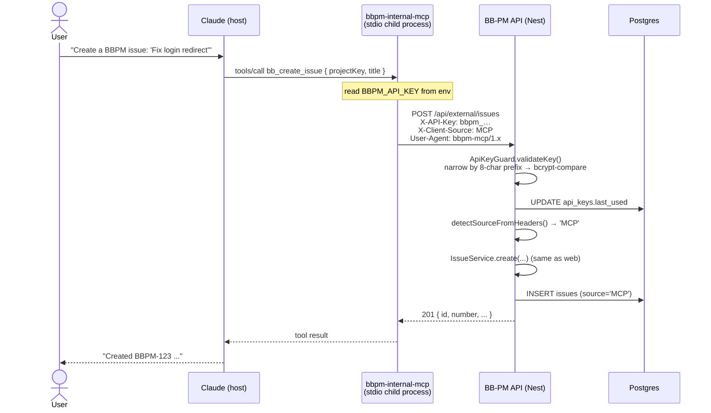
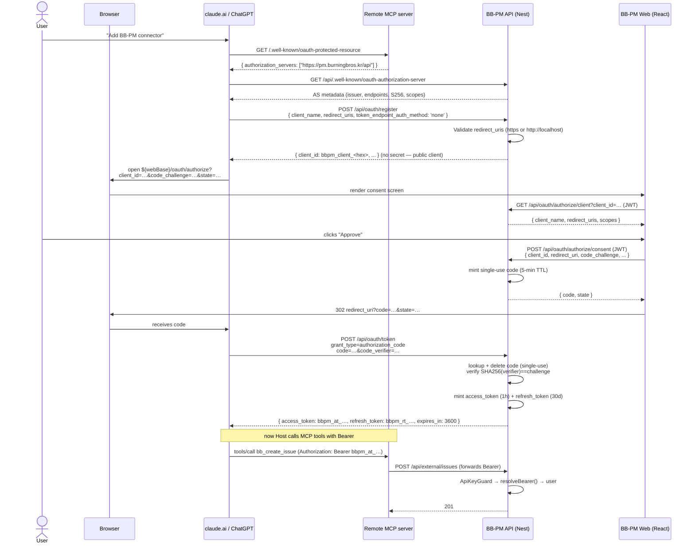

# MCP Server Architecture

> How Claude (and other LLM agents) talk to BB-PM through the
> Model Context Protocol. Covers the two delivery modes (local **npx**
> + hosted **remote MCP**), the authentication paths (long-lived
> **X-API-Key** vs short-lived **OAuth 2.1 Bearer**), how requests
> propagate from Claude → MCP server → BB-PM API, and the security
> posture (origin, transport, token storage, source tagging,
> rate limits, audit).

## 1. What this document is

There are two pieces of code that together make up the MCP surface:

1. **BB-PM API** (`packages/api/`) — this repo. Hosts the
   `/api/external/*` REST surface, the OAuth 2.1 Authorization Server
   at `/api/oauth/*`, and the source-tagging pipeline.
2. **`bbpm-internal-mcp`** (separate repo, distributed via `npx`).
   A thin Node-based MCP server. Translates MCP tool calls
   (`bb_create_issue`, `bb_get_digest`, …) into HTTPS calls against
   `/api/external/*`. Stateless — it stores no data of its own.

The MCP server is intentionally a *thin wrapper*. All business
logic, validation, authorization, and storage live in BB-PM. The MCP
server's only job is to surface a stable tool catalog to LLMs and
forward credentials.

```
┌─────────────────────┐       ┌─────────────────────┐       ┌──────────────────────┐
│  Claude / ChatGPT   │  MCP  │  bbpm-internal-mcp  │ HTTPS │   BB-PM API (Nest)   │
│  (the LLM client)   │ ◄───► │   (tool catalog)    │ ◄───► │  /api/external/*     │
└─────────────────────┘       └─────────────────────┘       │  /api/oauth/*        │
                                                            └──────────┬───────────┘
                                                                       │
                                                                ┌──────▼──────┐
                                                                │  Postgres   │
                                                                │   + S3      │
                                                                └─────────────┘
```

## 2. Two delivery modes

### 2.a Local — stdio over `npx`

Used by **Claude Desktop**, **Claude Code**, **Cursor**, **Claude
custom agents**, and any other MCP client that supports a child
process transport.

The user adds an entry to their MCP config (e.g.
`~/.claude/claude_desktop_config.json`):

```jsonc
{
  "mcpServers": {
    "bb-pm": {
      "command": "npx",
      "args": ["-y", "bbpm-internal-mcp@latest"],
      "env": {
        "BBPM_API_URL": "https://pm.burningbros.kr/api",
        "BBPM_API_KEY": "bbpm_<56-hex>"
      }
    }
  }
}
```

What happens on each Claude Code / Desktop session:

1. The host process spawns `npx -y bbpm-internal-mcp@latest`.
2. The MCP server speaks MCP over **stdio** (JSON-RPC framed on
   stdin/stdout) directly to Claude.
3. For every tool call, the server reads `BBPM_API_KEY` from its
   environment and issues an HTTPS request with header
   `X-API-Key: bbpm_…` to `BBPM_API_URL`.

**Authentication mode:** API key only. The user generated this key
through Profile → API Keys in the BB-PM web UI.

**Network shape:** the user's machine → BB-PM API. No central
proxy, no per-session state.

### 2.b Remote / cloud — HTTP transport with OAuth 2.1

Used by **claude.ai web custom connectors**, **ChatGPT remote
MCP servers**, and any future hosted client that cannot spawn a local
process.

The user adds a connector by pasting **just the MCP server URL** into
the host's UI (no key, no command). The host then:

1. Probes `<connector>/.well-known/oauth-protected-resource`. The
   MCP server replies with a small JSON payload pointing to BB-PM's
   Authorization Server at `https://pm.burningbros.kr/api`.
2. Probes `https://pm.burningbros.kr/api/.well-known/oauth-authorization-server`
   to fetch the AS metadata (RFC 8414).
3. Calls `POST /api/oauth/register` (RFC 7591 Dynamic Client
   Registration) to mint a fresh `client_id` (no human admin work).
4. Opens the user's browser to `${webBase}/oauth/authorize?...`,
   the user authenticates against BB-PM (existing JWT session), clicks
   **Approve** on a consent screen, and the browser is redirected
   back to the host with `?code=…`.
5. The host exchanges the code at `POST /api/oauth/token` with PKCE
   (`code_verifier`) for a `Bearer bbpm_at_<…>` access token + a
   `bbpm_rt_<…>` refresh token.
6. Every subsequent MCP tool call carries
   `Authorization: Bearer bbpm_at_<…>`. The remote MCP server simply
   forwards that header to BB-PM.

**Authentication mode:** OAuth 2.1 PKCE. No long-lived static
credentials anywhere in the user's account except the refresh token,
which is rotated on every use.

**Network shape:** the user's browser does the auth handshake; the
host's backend does the API calls. The BB-PM API sees both, but only
recognises the user via the Bearer token.

### 2.c Which mode for whom

| Client | Mode | Auth |
|---|---|---|
| Claude Code (terminal) | local (`npx`) | X-API-Key |
| Claude Desktop | local (`npx`) | X-API-Key |
| Cursor (agent mode) | local (`npx`) | X-API-Key |
| Custom scripts / `curl` | direct HTTPS | X-API-Key |
| claude.ai web custom connectors | remote (HTTP) | OAuth 2.1 Bearer |
| ChatGPT remote MCP | remote (HTTP) | OAuth 2.1 Bearer |
| MCP Inspector (dev) | either, usually remote | either |

Both modes terminate at the same `ApiKeyGuard`, which accepts both
credential types and normalises them into `request.user` so the
downstream `/api/external/*` controllers don't care which auth path
was taken.

## 3. End-to-end call paths

### 3.a Local mode — `npx` + API key



Key invariant: from `IssueService.create` onwards there is **no code
path that differs between a web user and an MCP call**. The auth
guard normalises identity; everything else is the same logic.

### 3.b Remote mode — OAuth 2.1 PKCE handshake



Key invariants of the OAuth flow:

- **PKCE S256 is mandatory.** The AS rejects every other
  `code_challenge_method`. There is no implicit grant, no password
  grant, no client-credentials grant.
- **Authorization codes are single-use.** Eagerly `DELETE`'d on
  exchange whether or not the exchange succeeds. Replay → `400`.
- **Refresh tokens rotate.** Every successful refresh deletes the
  old token and issues a new one. A leaked refresh token used twice
  results in both copies losing access (the rotated-out one fails;
  the rotated-in one will too on next refresh because the legitimate
  user's host already consumed it).
- **Scope can be down-scoped on refresh, never up-scoped.** Today the
  only scope is `mcp`; `openid`/`profile`/`email` exist for OIDC
  compatibility but the access token is opaque, not a JWT.
- **No secret for public clients** (`token_endpoint_auth_method:
  'none'`). The PKCE verifier replaces the secret. Sending a secret
  for a public client is a `401`.

## 4. Authentication & authorization

### 4.a Identity normalisation in `ApiKeyGuard`

The single chokepoint is `packages/api/src/api-key/api-key.guard.ts`.
It accepts **either** credential and ends up at the same
`request.user` shape:

```ts
// Path 1 — long-lived API key
X-API-Key: bbpm_<56-hex>
  → ApiKeyService.validateKey()
     • narrow by 8-char keyPrefix (indexed)
     • bcrypt.compare against ≤1 row in practice
     • stamp lastUsed
  → request.user = { sub: user.id, email }

// Path 2 — OAuth 2.1 access token
Authorization: Bearer bbpm_at_<base64url>
  → prisma.oAuthAccessToken.findUnique({ where: { token } })
     • check expiresAt > now
     • check user.status === 'ACTIVE'
  → request.user = { sub: user.id, email }
```

Downstream controllers (`/api/external/*`) read `@CurrentUser()` and
have no idea which path was used. **An MCP call acts as the user it
authenticated as.** Authorization to a project flows through normal
membership rules (`ProjectMemberGuard` for project-scoped routes; the
external API resolves project key → membership internally).

### 4.b Permission model

There is **no per-key or per-token scoping** to specific projects,
read-only, or specific tool names. A token has the same authority as
its owning user:

| User has access to | Token can do |
|---|---|
| Read project X | Read project X via MCP |
| ADMIN of project Y | Create / delete in project Y via MCP |
| Not a member of project Z | 404 on every call against Z |

Superuser bypass still applies — if the user is a superuser, the MCP
client can act across all projects.

This is intentional minimalism. The threat model is "developer wants
to give Claude their own permissions for a session," not "team wants
to share a read-only key." If/when we need scoping, it lands as:

- `scope: 'mcp:read'` vs `scope: 'mcp:write'` (OAuth side)
- `permissions: ['project:<key>:read', ...]` on API keys (DB column)

Both are deferred.

### 4.c What the consent screen actually shows

The OAuth authorize page (`/oauth/authorize` in the React app, source:
`packages/web/src/pages/OAuthAuthorizePage.tsx`) renders:

- The **client name** the host registered (from
  `POST /api/oauth/register`).
- A list of **scopes** translated to human-readable lines via
  `SCOPE_LABELS`:
  - `mcp` → "Read and write to your projects, issues, comments, and labels"
  - `openid` → "Verify your BBPM identity"
  - `profile` → "Read your name and avatar"
  - `email` → "Read your email address"
- **Approve** and **Deny** buttons. Deny returns
  `?error=access_denied` per RFC 6749 §4.1.2.1.

The page lives **outside `<AuthGuard>`** because the OAuth
`?response_type=code&client_id=…&code_challenge=…` params must
survive a round-trip through `/login` if the user isn't logged in.
`LoginPage` honours a `?next=` query so the redirect chain is:

```
oauth/authorize?…  →  (no session)  →  login?next=/oauth/authorize?…  →  (login)  →  oauth/authorize?…  →  consent  →  redirect_uri
```

## 5. Discovery (RFC 8414)

There are **two** well-known paths that resolve to the same AS
metadata document — both expose the JSON described by the RFC:

| Path | Why |
|---|---|
| `https://pm.burningbros.kr/api/.well-known/oauth-authorization-server` | The **canonical** path. `WellKnownController` (`packages/api/src/oauth/well-known.controller.ts`) is mounted at the API root. Required because claude.ai / ChatGPT compute the well-known URL by *appending* `/.well-known/...` to the issuer string. Our issuer is `https://pm.burningbros.kr/api`, so this is the path they hit. |
| `https://pm.burningbros.kr/api/oauth/.well-known/oauth-authorization-server` | **Legacy** path kept on `OAuthController` for backward compatibility with anything that already cached the old URL. |

Both return identical content, generated by `OAuthService.metadata`:

```json
{
  "issuer": "https://pm.burningbros.kr/api",
  "authorization_endpoint": "https://pm.burningbros.kr/oauth/authorize",
  "token_endpoint": "https://pm.burningbros.kr/api/oauth/token",
  "registration_endpoint": "https://pm.burningbros.kr/api/oauth/register",
  "revocation_endpoint": "https://pm.burningbros.kr/api/oauth/revoke",
  "userinfo_endpoint": "https://pm.burningbros.kr/api/oauth/userinfo",
  "scopes_supported": ["mcp", "openid", "profile", "email"],
  "response_types_supported": ["code"],
  "grant_types_supported": ["authorization_code", "refresh_token"],
  "code_challenge_methods_supported": ["S256"],
  "token_endpoint_auth_methods_supported": [
    "client_secret_basic",
    "client_secret_post",
    "none"
  ]
}
```

Note the split between `authorization_endpoint` (React app, **web
base**) and the rest (**API base**). The consent screen is a React
route, not a server-rendered page — that's why it lives at the apex
host, not under `/api`.

## 6. CORS

Two cohorts hit the API from a browser:

1. The **BB-PM web SPA** at `https://pm.burningbros.kr` — needs
   credentials (refresh-cookie session) and strict origin matching.
2. **Cross-origin OAuth clients** — `https://claude.ai`,
   `https://chatgpt.com`, MCP Inspector at `http://localhost:6274`,
   etc. — need CORS preflight to pass for `/api/oauth/*` and
   `/api/external/*` so the OAuth handshake can complete.

`packages/api/src/main.ts` resolves both with a callback origin
check:

```ts
const isOriginAllowed = (origin) => {
  if (configuredOrigins.includes(origin)) return true;                 // SPA, env-configured
  if (/^https?:\/\/(localhost|127.0.0.1|\[::1\])(:\d+)?$/.test(origin)) return true; // dev tools
  if (/^https:\/\/([a-z0-9-]+\.)?(claude\.ai|anthropic\.com|chatgpt\.com|openai\.com)$/.test(origin)) return true;
  return false;
};
```

Also exposed: `WWW-Authenticate` (so a browser-based client can read
the 401 challenge and start OAuth discovery) and `Mcp-Session-Id` (the
MCP streamable-HTTP transport's correlation header).

## 7. Source tagging (provenance)

Every row a write produces (`issues`, `activities`, `comments`) gets
a `source` column recording **which client** created it. The column
is a free-form string (intentionally not a Prisma enum) so future
clients can join without a migration; the `SourceLiteral` union in
`packages/api/src/common/source.ts` is the source of truth:

```ts
type SourceLiteral = 'WEB' | 'MCP' | 'SLACK' | 'WEBHOOK' | 'API' | 'SYSTEM';
```

Detection priority (`detectSourceFromHeaders`):

1. **`X-Client-Source` header** — clients we own (the bbpm-mcp server,
   future first-party scripts) send this verbatim. Wins because
   Node's `http` layer can rewrite `User-Agent` in subtle ways.
2. **`User-Agent` sniffing** — fallback for third parties:
   `bbpm-mcp` → `MCP`, Slackbot → `SLACK`, GitHub Hookshot →
   `WEBHOOK`.
3. **`API`** — anything else holding a valid API key / Bearer token.

The web UI renders a small coloured badge on every row whose source
is not `WEB`. The point is *visibility*: a developer sees at a glance
that "this comment was posted by Claude on my behalf" without needing
to look at audit logs.

## 8. Threat model & security posture

| Threat | Mitigation |
|---|---|
| API key leaked in env file / shell history | Bcrypt-hashed at rest; only `keyPrefix` is searchable. User can revoke via Profile → API Keys; revocation is immediate. The raw key is shown exactly once on creation; no recovery endpoint exists. |
| Bearer access token stolen | TTL = 1 hour. Tokens are opaque; resolving requires a DB row that we can `DELETE`. `POST /api/oauth/revoke` lets any client invalidate immediately. |
| Refresh token stolen | Rotated on every use. Reuse → both copies fail on next exchange (consume-once via eager `DELETE`). TTL = 30 days; idle refresh ages out. |
| Authorization code intercepted | Single-use, 5-min TTL, `DELETE`'d on exchange regardless of outcome. PKCE binds the code to the original `code_verifier`. |
| OAuth replay across clients | `clientId` is checked at both code-exchange and refresh time. A code minted for client A cannot be redeemed by client B. |
| Redirect URI substitution | `redirect_uri` is whitelisted at `POST /oauth/register` and checked **byte-for-byte** at both authorize and token exchange. `http://` is only allowed for `localhost` / `127.0.0.1` / `[::1]`. |
| Client impersonation via Dynamic Client Registration | Registration is `@Public()` (no auth) but **throttled** at 10 reqs/min/IP. Anyone can register a `client_id`; the consent screen still requires the **end user** to approve, and the only authority the resulting client gets is whatever that user grants. |
| CSRF on consent | The consent endpoint is JWT-only and POSTs from the same-origin React app. The OAuth `state` parameter (echoed back unchanged in the redirect) covers cross-origin CSRF for the host. |
| Tokens in URL fragments / referer leakage | The handshake uses the response mode `code` (query string), not `token` (fragment). The browser never sees the access token. |
| Constant-time comparisons | Client secret + PKCE challenge comparisons use `node:crypto.timingSafeEqual` after length-equalisation. |
| Rate limit bypass | Global `ThrottlerGuard` (30 req/min/IP) applies to everything; `POST /oauth/register` and `POST /oauth/token` get explicit `@Throttle` overrides (10/min and 60/min respectively). |
| Plaintext credentials in transit | Production terminates TLS at nginx; the API binds to `http://app:3000` inside the Docker network. No production hop is over plaintext. |

What's **not** in scope today (deliberate):

- **Per-key scoping** — no read-only or per-project keys yet.
- **Per-tool scopes** — `mcp` is one bag of permissions.
- **Audit log queryable by-token** — we tag rows with `source` but
  not with the token id that created them.
- **DPoP / mTLS** — bearer tokens are not sender-constrained.

## 9. Operational notes

- **Local dev:** point `BBPM_API_URL` at `http://localhost:3000/api`.
  The MCP server doesn't care about HTTPS — `http://localhost` matches
  the CORS allowlist.
- **MCP Inspector:** runs on `http://localhost:6274`; matches the
  loopback regex and works against either auth method out of the box.
- **Token TTL overrides:** `OAUTH_ACCESS_TOKEN_TTL` (seconds, default
  3600) and `OAUTH_REFRESH_TOKEN_TTL` (seconds, default 2592000)
  are env-configurable for short-lived testing.
- **Revocation:** delete `oauth_access_tokens` / `oauth_refresh_tokens`
  rows by `clientId` or `userId` to forcibly de-authorize anyone.
  There is no UI for this yet — emergency action only.
- **Cleanup:** expired auth codes / access tokens / refresh tokens are
  rejected at use time (the `expiresAt` check), but the rows are not
  yet garbage-collected. Acceptable for current volume; revisit when
  the tables grow.

## 10. Cross-references

- [`docs/changelogs/mcp-changelog.md`](../../changelogs/mcp-changelog.md) — commit-level history of the rollout.
- [`docs/changelogs/external-api-changelog.md`](../../changelogs/external-api-changelog.md) — the `/api/external/*` surface that MCP rides on top of.
- [`docs/changelogs/auth-changelog.md`](../../changelogs/auth-changelog.md) — JWT + API key history.
- [`docs/architecture/backend/patterns.md`](./patterns.md) §10 (single-source-of-truth membership), §11 (header-scoped guards).
- [`docs/architecture/backend/entities.md`](./entities.md) — `OAuthClient`, `OAuthAuthCode`, `OAuthAccessToken`, `OAuthRefreshToken` schemas.
- `packages/api/src/oauth/` — implementation.
- `packages/api/src/api-key/api-key.guard.ts` — dual-credential guard.
- `packages/api/src/common/source.ts` — source tagging.
