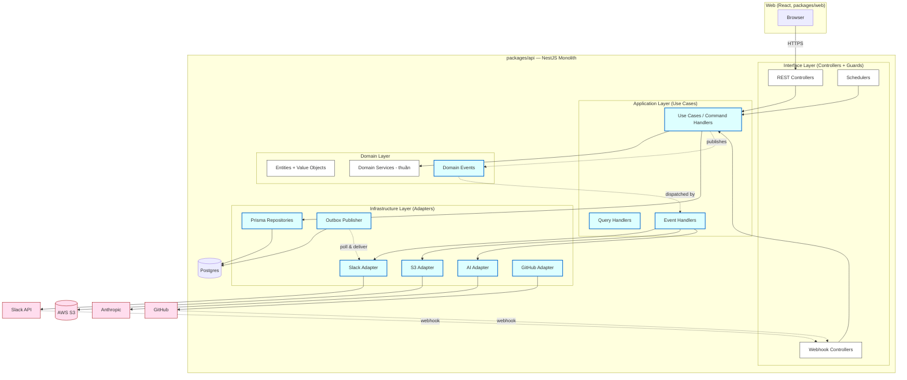
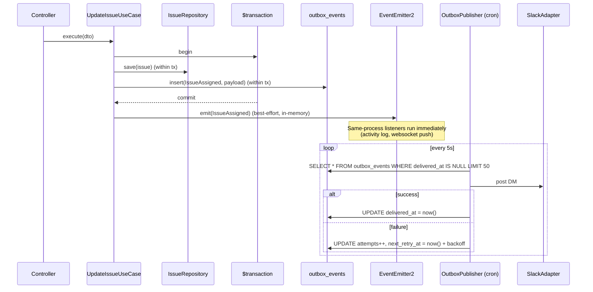
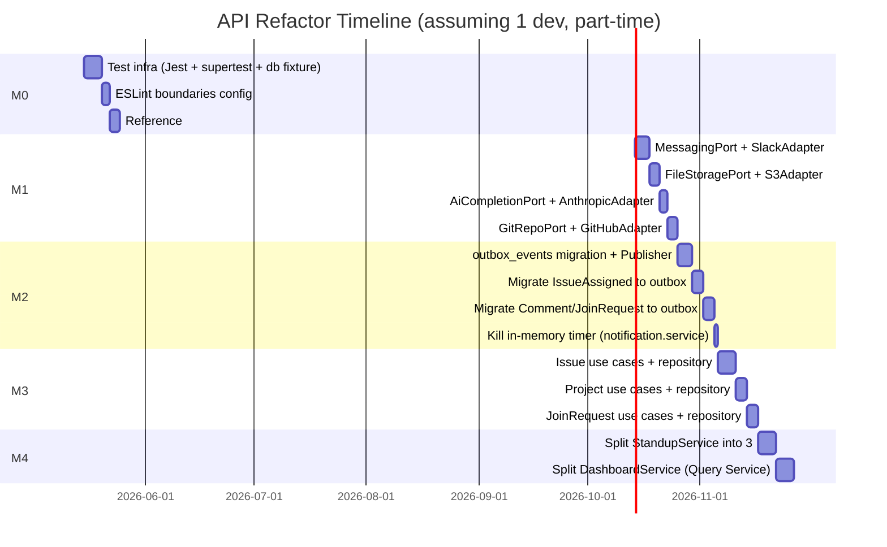

# Backend: Pragmatic Architecture Refactor Plan

> **Mục tiêu**: nâng cấp `packages/api` thành kiến trúc có thể test được, thay thế được vendor, và an toàn về side-effects — mà KHÔNG biến một monolith nội bộ thành phòng thí nghiệm DDD. Adopt vừa đủ Clean/Hexagonal/DDD/Event-Driven để xử lý 5 pain point load-bearing (god services, zero tests, vendor leakage, in-memory timer cho notification, missing transactions). Bỏ qua: aggregates, bounded contexts, microservices, Kafka, CQRS, event sourcing.

> Related:
> - [behavior-preservation-checklist.md](./behavior-preservation-checklist.md) — invariants per-module phải giữ; literal PR review checklist
> - [overview.md](./overview.md) — kiến trúc hiện tại
> - [patterns.md](./patterns.md) — recurring shapes
> - [modules-catalog.md](./modules-catalog.md) — module map
> - [entities.md](./entities.md) — Prisma models

---

## 1. Current State & Pain Points

NestJS 11 monolith, Prisma 7 + Postgres, ESM-first, deploy SSH-to-prod qua `docker-compose.prod.yml`. ~14.5 k LOC, 32 feature modules, 1 e2e test (healthcheck). Internal tool (Jira-lite) cho team ~30 người, chưa có constraint horizontal scale.

### 1.1. Pain Point Register

| # | Pain | Bằng chứng | Tác động |
|---|---|---|---|
| **P1** | God services | `dashboard.service.ts` 1137 LOC · `standup.service.ts` 1057 LOC · `issue.service.ts` 928 LOC | SRP vi phạm; review khó; conflict merge cao; impossible to unit test |
| **P2** | Zero unit/integration tests | Chỉ có `test/app.e2e-spec.ts` (25 LOC, chỉ test health) | Mọi refactor đều là blind change; bug regress vào prod (như đợt `createJoinRequest` rename vừa rồi) |
| **P3** | Direct PrismaService injection ở mọi tầng | 30+ service đều `constructor(private prisma: PrismaService)`; không có Repository abstraction | Domain logic bị couple với Prisma API; mock service trong test cần stub 30+ methods |
| **P4** | Vendor SDK leakage | `new WebClient()` được khởi tạo ở `slack.service.ts:95,156,205,272,338` và **lặp lại** ở `standup.service.ts:899` · `S3Client` inline ở `upload.service.ts:10–14` · `Anthropic` SDK là module-level singleton ở `llm-enricher.ts:32–39` (không inject được) | Không thể swap vendor (S3→R2, Slack→Discord, Anthropic→OpenAI); không thể test offline |
| **P5** | **In-memory `setTimeout` cho notification grace period** | `notification.service.ts:135` `scheduleAssignmentNotification` lưu timers ở Map trong process | **Mất notification khi pod restart**. Đây là functional bug, không phải code smell |
| **P6** | Side-effect coupling sync, fire-and-forget với `.catch(()=>{})` | Issue assigned → notification → Slack DM toàn bộ là sync in-process call chain; failure bị nuốt im lặng (`notification.service.ts:184`) | Không có retry · không có DLQ · không có visibility khi Slack down |
| **P7** | Missing transactions ở multi-write paths | `project.service.ts:32–67` tạo project rồi `label.createMany` riêng → fail giữa chừng để lại project zero-label · `issue.service.ts:694` auto-assign children sau update không cùng transaction | Inconsistent state khi partial failure |
| **P8** | Presentation logic trong domain service | `notification.service.ts:184–256` chứa 70 LOC Slack Block Kit JSON | Đổi format Slack message phải đụng notification service |
| **P9** | `process.env` truy cập trực tiếp trong service | `join-request.service.ts:244` `process.env.FRONTEND_URL ?? 'https://pm.burningbros.kr'` bypass `ConfigService` đã inject ở chỗ khác | Hardcoded prod URL trong source; deploy risk |
| **P10** | DTO ⇄ Entity ⇄ Persistence model lẫn lộn | DTO của controller được Prisma `data: dto` spread thẳng vào DB write (vd `issue.service.ts:558`) | Khó tách validation khỏi domain rule; rò rỉ field không ngờ tới DB nếu DTO whitelist sai |

### 1.2. Mapping pain → kiến trúc mục tiêu

| Pain | Paradigm fix |
|---|---|
| P1, P10 | Clean Architecture (lite): tách use-case khỏi service |
| P3, P2 | Repository pattern + DIP → testable |
| P4 | Hexagonal (lite): Port + Adapter cho 4 vendor |
| P5, P6 | Event-Driven (in-process) + Transactional Outbox |
| P7 | Domain event + Unit of Work qua `$transaction` callback |
| P8 | Strategy pattern cho renderer (Slack/email/webhook) |
| P9 | DIP qua `ConfigService` (đã có sẵn, chỉ là kỷ luật) |

---

## 2. Driving Forces & Non-Goals

### 2.1. Driving forces

1. **Testability** — viết test mà không cần boot AppModule + DB.
2. **Vendor portability** — đổi Slack→Discord, S3→R2, Anthropic→OpenAI mà không sửa domain code.
3. **Reliability của side-effect** — notification không mất khi restart; có retry + DLQ visibility.
4. **Maintainability** — service ≤ 300 LOC; rule "1 service 1 trách nhiệm".

### 2.2. Non-Goals (anti-over-engineering)

| Không làm | Lý do |
|---|---|
| ❌ Tách microservice | Team 5–10 dev, monolith hợp lý; tách service trả nợ ops cao hơn lợi ích |
| ❌ Bounded Context vật lý (separate DB per domain) | Schema 30 model nhưng FK chéo nhau (Issue ↔ Project ↔ User ↔ Notification…). Cắt sẽ phải distributed transaction → over-engineered |
| ❌ Aggregate Root + ID-only references | Prisma relational query đã quá phù hợp; aggregate sẽ chống lại ORM |
| ❌ Kafka / RabbitMQ | Volume notification ~vài ngàn/ngày. Postgres LISTEN/NOTIFY + Outbox + cron poller là quá đủ |
| ❌ CQRS toàn cục | Một số read model phức tạp (dashboard) thì có riêng query service được, nhưng KHÔNG separate write/read store |
| ❌ Event Sourcing | Activity table đã đủ audit; ES bắt rewrite mọi flow |
| ❌ Domain Events publish ra ngoài process | Trong-process EventEmitter2 + Outbox là điểm dừng |
| ❌ Generic abstraction "BaseService<T>" | Đã thử ở nhiều dự án và luôn rò rỉ leaky abstraction |

---

## 3. Target Architecture (Clean + Hexagonal — Lite)

### 3.1. C4 Container view



**Legend** — Xanh: thêm mới ở refactor này. Trắng: giữ nguyên. Đỏ: external. Mũi tên đứt: async/event.

### 3.2. Layer rules (cứng — code review từ chối nếu vi phạm)

| Layer | Được import từ | KHÔNG được import |
|---|---|---|
| Interface (`*.controller.ts`, `*.scheduler.ts`) | Application | Domain trực tiếp, Infrastructure trực tiếp, Prisma |
| Application (`*.use-case.ts`, `*.handler.ts`) | Domain, Application Ports | Prisma, vendor SDK, `@nestjs/platform-*` |
| Domain (`*.entity.ts`, `*.vo.ts`, `*.event.ts`, `*-domain.service.ts`) | KHÔNG gì cả (pure TypeScript) | Tất cả khác |
| Infrastructure (`*.repository.ts`, `*-adapter.ts`, `outbox.publisher.ts`) | Domain, Application Ports | Khác Infrastructure ngang hàng |

Enforce bằng `eslint-plugin-boundaries` (đã dùng ở frontend — copy config sang api).

### 3.3. Folder layout đề xuất (per-module)

```
src/issue/
├── domain/                          ← Pure, no NestJS, no Prisma
│   ├── issue.entity.ts              ← Aggregate-ish; methods + invariants
│   ├── issue-status.vo.ts
│   ├── issue-priority.vo.ts
│   └── events/
│       ├── issue-assigned.event.ts
│       └── issue-reviewer-assigned.event.ts
├── application/                     ← Orchestration (use cases)
│   ├── ports/
│   │   ├── issue.repository.ts      ← Interface (Port)
│   │   └── notification-publisher.ts
│   ├── create-issue.use-case.ts
│   ├── update-issue.use-case.ts
│   ├── assign-issue.use-case.ts     ← Đặc tả hành vi "assign" rõ ràng
│   ├── reorder-issues.use-case.ts
│   └── handlers/
│       └── on-issue-assigned.handler.ts   ← Event handler
├── infrastructure/                  ← Implements ports
│   └── issue.prisma.repository.ts   ← Implementation
├── interface/                       ← Hiện tại đang ở module root
│   ├── issue.controller.ts
│   └── dto/
│       ├── create-issue.dto.ts
│       └── update-issue.dto.ts
└── issue.module.ts                  ← Composition root, DI bindings
```

> **Trade-off khi không làm "DDD đầy đủ"**: không có aggregate boundary cứng, không có UoW custom — vì Prisma `$transaction(async tx => …)` đã làm tốt vai trò UoW; aggregate sẽ chống lại pattern relational mà schema hiện tại tận dụng (vd Issue có 12 relation, cắt aggregate sẽ phải lookup riêng từng cái).

---

## 4. Architecture Paradigm Scorecard

Đánh giá hiện trạng theo từng paradigm. Áp dụng có chọn lọc — phần nào "✗ Đừng" không apply vì over-engineering.

### 4.1. Clean Architecture

| Concept | Hiện trạng | Áp dụng? | Cách |
|---|---|---|---|
| Entity (domain object) | ❌ Không có; toàn dùng Prisma type | ✅ | Tạo `Issue` entity với invariant methods (`assign(user)`, `reorder(newOrder)`) |
| Use Case (Interactor) | ❌ Service chứa hết | ✅ | Tách use case riêng cho 5 flow phức tạp nhất: create issue, update issue, assign, reorder, archive |
| Interface Adapter | ❌ Controller gọi thẳng service | ⚠️ Một phần | Controller vẫn gọi use case; KHÔNG cần Presenter (REST envelope đã có Interceptor) |
| Frameworks & Drivers | ✅ Đã rõ (NestJS, Prisma) | — | — |
| Dependency Rule (inward) | ❌ Service import Prisma type ra controller | ✅ | ESLint boundary rules |

### 4.2. Hexagonal (Ports & Adapters)

| Port nên tạo | Adapter hiện có (smell) | Adapter mới |
|---|---|---|
| `MessagingPort` (chat) | Slack SDK leak ở 2 service | `SlackAdapter implements MessagingPort` |
| `FileStoragePort` | S3 SDK inline | `S3Adapter implements FileStoragePort` |
| `AiCompletionPort` | Anthropic singleton | `AnthropicAdapter implements AiCompletionPort` |
| `GitRepoPort` (PR/commit info) | GitHub SDK inline | `GitHubAdapter implements GitRepoPort` |
| `NotificationPort` | In-memory timer + Slack call | `OutboxNotificationPublisher implements NotificationPort` |

**KHÔNG** tạo port cho: Prisma (Repository pattern đã đủ), ConfigService (đã abstracted), Jwt (NestJS module đã đủ), Cron Scheduler (NestJS).

### 4.3. Domain-Driven Design (Tactical only)

| Tactical pattern | Apply? | Ghi chú |
|---|---|---|
| Entity | ✅ | Issue, Project, JoinRequest, Specification |
| Value Object | ✅ | `IssueStatus`, `IssuePriority`, `IssueOrder`, `ProjectKey`, `Email` |
| Aggregate Root | ⚠️ Không cứng | Treat Issue + nested Activities là 1 aggregate (đã transactional rồi); không build full pattern với private setters |
| Repository | ✅ | Đó là refactor lớn nhất; xem §6 |
| Domain Service | ✅ | `HierarchyValidator`, `IssueOrderingService` — pure functions |
| Domain Event | ✅ | Xem catalog §5.1 |
| Factory | ✅ Tối thiểu | `Issue.create(props)` static factory cho invariant |
| Specification (rule) | ⚠️ Có chọn lọc | Đã có Guards. Chỉ thêm Specification cho rule lặp ở nhiều use case (vd `IsProjectAdmin`) |
| Bounded Context | ❌ | Module hóa đã đủ vai trò context boundary |
| Anti-Corruption Layer | ⚠️ Per-vendor | Adapter là ACL với vendor SDK; không cần ACL nội bộ |

### 4.4. Event-Driven (In-Process + Outbox)



**Tại sao cả Outbox và in-process Bus?**
- **In-process Bus** (NestJS `@nestjs/event-emitter`): handler không-critical chạy ngay, cùng request lifecycle (vd ghi activity, push websocket). Mất event khi crash là chấp nhận được vì đã commit ở Prisma row chính.
- **Outbox**: handler critical với external IO (Slack DM, email, GitHub status). Ghi event trong cùng `$transaction` với business write → exactly-once delivery semantics. Publisher poll outbox; mất pod giữa chừng vẫn retry được.

### 4.5. SOLID — Specific Violations & Fixes

| Principle | Vi phạm hiện tại | Fix |
|---|---|---|
| **S**RP | `StandupService` (1057 LOC) làm config + report + slack bot + issue creation | Tách: `StandupConfigService` / `StandupReportService` / `StandupSlackBotService` |
| **O**CP | Mỗi notification type thêm 1 `if` trong `notification.service.ts` | Strategy: `NotificationRenderer` map theo type |
| **L**SP | Chưa hệ thống vì gần như không có interface | Khi tạo Port, mọi adapter phải tuân thủ contract — test contract |
| **I**SP | Không có interface segregation issue rõ (vì không có interface) | Mỗi Port chỉ define method mà use case thực sự cần (vd `MessagingPort.sendDirectMessage` & `MessagingPort.sendChannelMessage` — không gộp với `getStatus`) |
| **D**IP | Service phụ thuộc concrete (PrismaService, WebClient) | DI inject qua Port (interface) |

### 4.6. Design Patterns nên dùng (và đủ)

| Pattern | Vị trí | Ví dụ cụ thể |
|---|---|---|
| **Repository** | Mỗi entity chính | `IssueRepository`, `ProjectRepository`, `NotificationRepository` |
| **Adapter** | Mỗi vendor SDK | `SlackAdapter`, `S3Adapter`, `AnthropicAdapter`, `GitHubAdapter` |
| **Strategy** | Renderer + Parser | `NotificationRenderer` (per type) · `QuickIssueParser` (đã có ở `quick-issue/parsers/`) |
| **Factory** | Entity construction | `Issue.create(...)`, `Notification.assigned(...)` |
| **Observer** (Event) | Domain events | EventEmitter2 in-process + Outbox cho external |
| **Specification** | Reusable rules | `IsProjectAdmin`, `CanArchiveIssue` |
| **Unit of Work** | Multi-write transaction | `prisma.$transaction(async tx => …)` truyền vào use case |

**KHÔNG dùng** (sẽ over-engineer ở scale này): Saga orchestrator, Command bus với separate dispatcher, Mediator (Nest đã làm điều này qua DI), Visitor, Chain of Responsibility, Decorator wrapper cho repository (interceptor đã đủ).

---

## 5. Event Catalog & Outbox Design

### 5.1. Domain Event Catalog

| Event | Producer (Use Case) | Consumer(s) | Delivery | Purpose |
|---|---|---|---|---|
| `IssueCreated` | `CreateIssueUseCase` | ActivityLog, WebSocket | In-process | Audit + UI realtime |
| `IssueAssigned` | `UpdateIssueUseCase` · `BulkAssignUseCase` | NotificationOutbox, ActivityLog | **Outbox** + in-process | Slack DM + audit |
| `IssueReviewerAssigned` | `UpdateIssueUseCase` | NotificationOutbox | **Outbox** | Slack DM |
| `IssueStatusChanged` | `UpdateIssueUseCase` | ActivityLog, GitHubSync, WebSocket | In-process | Activity + sync GitHub PR status |
| `IssueArchived` | `ArchiveIssueUseCase` · scheduler | ActivityLog | In-process | Audit |
| `CommentCreated` | `CreateCommentUseCase` | NotificationOutbox (mention/comment), ActivityLog | **Outbox** | Notify mentioned users |
| `JoinRequestCreated` | `CreateJoinRequestUseCase` | NotificationOutbox (Slack to admins) | **Outbox** | Notify project admins |
| `JoinRequestApproved` | `ApproveJoinRequestUseCase` | NotificationOutbox | **Outbox** | Notify requester |
| `JoinRequestRejected` | `RejectJoinRequestUseCase` | NotificationOutbox | **Outbox** | Notify requester |
| `SpecCommentCreated` | `CreateSpecCommentUseCase` | NotificationOutbox | **Outbox** | Notify spec owner |
| `PullRequestLinked` | GitHub webhook handler | ActivityLog, IssueStatusUpdater | In-process | Auto-update issue status |

### 5.2. Outbox table

```sql
-- Migration: <timestamp>_create_outbox_events.sql
CREATE TABLE outbox_events (
  id              UUID PRIMARY KEY DEFAULT gen_random_uuid(),
  event_type      TEXT NOT NULL,                    -- 'IssueAssigned', etc.
  aggregate_type  TEXT NOT NULL,                    -- 'Issue', 'Project', ...
  aggregate_id    UUID NOT NULL,                    -- FK soft, không enforce vì cross-domain
  payload         JSONB NOT NULL,                   -- denormalized event data
  occurred_at     TIMESTAMPTZ NOT NULL DEFAULT now(),
  -- Delivery tracking
  delivered_at    TIMESTAMPTZ,                      -- NULL = chưa deliver
  attempts        INT NOT NULL DEFAULT 0,
  last_error      TEXT,
  next_retry_at   TIMESTAMPTZ NOT NULL DEFAULT now(),
  -- For batch ordering (per-aggregate ordering)
  sequence_no     BIGSERIAL NOT NULL
);

-- Indexes
CREATE INDEX idx_outbox_undelivered
  ON outbox_events (next_retry_at)
  WHERE delivered_at IS NULL;                       -- partial index: only undelivered

CREATE INDEX idx_outbox_aggregate
  ON outbox_events (aggregate_type, aggregate_id, sequence_no);

CREATE INDEX idx_outbox_cleanup
  ON outbox_events (delivered_at)
  WHERE delivered_at IS NOT NULL;                   -- for periodic prune
```

**Retention**: cron daily, xóa row `delivered_at < now() - INTERVAL '30 days'`.

**Backoff**: `next_retry_at = now() + LEAST(60s * 2^attempts, 1 hour)`. Hard fail sau 8 attempts → log warn, để row lại để inspect.

### 5.3. Publisher loop (đơn giản — không cần worker process riêng)

```typescript
// infrastructure/outbox/outbox.publisher.ts
@Injectable()
export class OutboxPublisher {
  constructor(
    private prisma: PrismaService,
    @Inject(MESSAGING_PORT) private messaging: MessagingPort,
    // ... other adapters
  ) {}

  @Cron('*/5 * * * * *')  // every 5s
  async pump() {
    const batch = await this.prisma.$queryRaw<OutboxRow[]>`
      SELECT * FROM outbox_events
      WHERE delivered_at IS NULL AND next_retry_at <= now()
      ORDER BY sequence_no
      LIMIT 50
      FOR UPDATE SKIP LOCKED  -- multi-replica safe
    `;
    for (const row of batch) await this.deliver(row);
  }
  // ... deliver() dispatches by event_type to the right adapter
}
```

**Tại sao 5s polling đủ**:
- Notification volume nội bộ ~vài ngàn/ngày → 5s lag UX chấp nhận được.
- LISTEN/NOTIFY có thể thay thế khi cần ngay, nhưng pull-based đơn giản hơn cho team chưa quen.

---

## 6. Repository Pattern (Largest Refactor)

### 6.1. Trước & Sau

**Trước** (`issue.service.ts:303`):
```typescript
const issue = await this.prisma.issue.create({
  data: { ...dto, projectId, creatorId },
  include: { assignee: true, reviewer: true, ... },
});
```

**Sau**:
```typescript
// application/create-issue.use-case.ts
@Injectable()
export class CreateIssueUseCase {
  constructor(
    @Inject(ISSUE_REPOSITORY) private issues: IssueRepository,
    @Inject(EVENT_BUS) private events: EventBus,
  ) {}

  async execute(cmd: CreateIssueCommand): Promise<Issue> {
    const issue = Issue.create({ ...cmd, creatorId: cmd.userId });
    await this.issues.save(issue);
    this.events.publish(new IssueCreated(issue));
    return issue;
  }
}

// application/ports/issue.repository.ts
export const ISSUE_REPOSITORY = Symbol('ISSUE_REPOSITORY');
export interface IssueRepository {
  findById(id: string): Promise<Issue | null>;
  findInProject(projectId: string, filter: IssueFilter): Promise<Issue[]>;
  save(issue: Issue): Promise<void>;
  delete(id: string): Promise<void>;
  // Specialized aggregate operation:
  reorder(items: Array<{ id: string; order: number }>, tx?: PrismaTx): Promise<void>;
}

// infrastructure/issue.prisma.repository.ts
@Injectable()
export class IssuePrismaRepository implements IssueRepository {
  constructor(private prisma: PrismaService) {}
  async findById(id) { /* maps Prisma → domain Issue */ }
  async save(issue) {
    if (issue.isNew) await this.prisma.issue.create({ data: this.toRow(issue) });
    else await this.prisma.issue.update({ where: { id: issue.id }, data: this.toRow(issue) });
  }
  // ...
}
```

### 6.2. Mapper convention

- `toRow(entity)` — entity → Prisma model (write side)
- `toDomain(row)` — Prisma model → entity (read side)
- Mapper sống cùng repository (`issue.prisma.repository.ts`), KHÔNG export ra layer khác.

### 6.3. Read model trade-off

Dashboard service hiện tại có nhiều query phức tạp aggregated (groupBy, percentile, burndown). KHÔNG biến những query này thành Repository — chúng thuộc về **Query Service** (CQRS-lite):
- `IssueRepository.findById` (entity, write side)
- `DashboardQueryService.getTeamBurndown(projectId, dateRange)` (DTO read model, không qua entity)

Đường ranh: nếu kết quả là **đối tượng domain hoàn chỉnh** → Repository. Nếu là **DTO phẳng cho UI** → Query Service.

---

## 7. Migration Phases

### 7.1. Phase table

| Phase | Tên | Output | Risk | Rollback |
|---|---|---|---|---|
| **M0** | Foundations | ESLint boundaries · Test infra · Domain layer skeleton · 3 reference entities | Low | Revert PR; layer files chỉ thêm, không break |
| **M1** | Vendor Adapters (Ports) | `MessagingPort`, `FileStoragePort`, `AiCompletionPort`, `GitRepoPort` + adapters Slack/S3/Anthropic/GitHub | Low–Med | Feature flag `USE_PORT_ADAPTERS=false` để gọi lại đường cũ |
| **M2** | Outbox + Event Bus | `outbox_events` table · `OutboxPublisher` cron · Migrate 4 notification flows (assign, reviewer, comment, join request) | **Med–High** | Feature flag `USE_OUTBOX=false`; outbox table không xóa khi off |
| **M3** | Use Cases + Repository | Issue / Project / JoinRequest module hoàn chỉnh layered | Med | Per-module merge; cũ và mới song song |
| **M4** | God service decomposition | Tách StandupService, DashboardService theo trục SRP | Med | Sub-PR cho mỗi sub-service; e2e test mỗi flow |

### 7.2. Gantt



Total ~9 weeks part-time. Mỗi phase có thể ship độc lập.

### 7.3. Phase M0 — Foundations (no business code touched)

Mục tiêu: hạ tầng để các phase sau viết test + enforce layer.

**Tasks**:
1. Cài `eslint-plugin-boundaries` + config trong `packages/api/eslint.config.mjs`:
   ```js
   { rules: { 'boundaries/element-types': ['error', { default: 'disallow', rules: [
     { from: 'interface', allow: ['application'] },
     { from: 'application', allow: ['application', 'domain'] },
     { from: 'domain', allow: ['domain'] },
     { from: 'infrastructure', allow: ['domain', 'application'] },
   ] }] } }
   ```
2. Jest config thật sự chạy: thêm `src/**/*.spec.ts` pattern; cài `@golevelup/ts-jest` cho DI mock helpers.
3. Test database fixture: chạy migration qua `prisma migrate deploy` vào DB test riêng (`postgres://localhost/bbpm_test`); seed fresh trước mỗi suite.
4. Tạo **1 reference entity hoàn chỉnh** cho `Issue`:
   - `src/issue/domain/issue.entity.ts`
   - `src/issue/domain/issue-status.vo.ts`
   - `src/issue/domain/events/issue-assigned.event.ts`
   - Unit test thuần đi kèm.
5. Document `docs/architecture/backend/refactor-plan.md` (file này) làm reference.

**Acceptance**: `pnpm --filter @bb-pm/api test` chạy được + ít nhất 5 unit test cho Issue entity pass; CI có thể chạy.

### 7.4. Phase M1 — Vendor Adapters

Order: Slack (impact lớn nhất) → S3 → Anthropic → GitHub.

Pattern cho mỗi adapter:

1. Tạo Port interface ở `src/common/ports/`:
   ```typescript
   // common/ports/messaging.port.ts
   export const MESSAGING_PORT = Symbol('MESSAGING_PORT');
   export interface MessagingPort {
     sendDirectMessage(userToken: string, slackUserId: string, blocks: MessageBlock[]): Promise<MessageResult>;
     sendChannelMessage(userToken: string, channelId: string, blocks: MessageBlock[]): Promise<MessageResult>;
     getWorkspaceStatus(token: string): Promise<WorkspaceStatus>;
   }
   ```
2. `MessageBlock` là DTO trung tính (không phải Slack Block Kit JSON).
3. Adapter ở `src/slack/infrastructure/slack.adapter.ts` implement Port, dịch `MessageBlock` → Slack `KnownBlock`.
4. Thay mọi `SlackService` injection bằng `@Inject(MESSAGING_PORT)`; xóa import `@slack/web-api` khỏi các service ngoài adapter.
5. `StandupService` BỎ pattern `new WebClient(this.slackService.decrypt(token))` — gọi qua Port.

**Acceptance per adapter**:
- Adapter có ≥3 unit test với mocked vendor SDK.
- Tất cả service consumer chỉ import Port symbol, không import vendor type.
- Một flow end-to-end qua adapter chạy được (existing e2e test mở rộng).

**Risk mitigation**: Feature flag `USE_PORT_ADAPTERS`. Khi `false`, DI inject cũ; khi `true`, inject Port. Cho phép rollback 1 commit.

### 7.5. Phase M2 — Outbox + Event Bus ⚠️ Critical phase

Đây là phase có rủi ro cao nhất (Functional: thay đổi delivery semantics). Làm cẩn thận.

**Sub-phases**:

**M2.1**: Migration `outbox_events` + skeleton publisher (chưa enable).
**M2.2**: Cài `@nestjs/event-emitter`; tạo `OutboxEventBus` wrapper publish vừa in-process vừa insert outbox (theo flag per-event).
**M2.3**: Migrate `IssueAssigned` (đường code phức tạp nhất với in-memory timer):
   - Use case mới `AssignIssueUseCase`:
     ```typescript
     await this.uow.run(async tx => {
       await this.issues.save(issue, tx);
       await this.outbox.append(new IssueAssigned(issue), tx);  // CÙNG transaction
     });
     this.bus.emitLocal(new IssueAssigned(issue));  // BẤT KỲ in-process listener
     ```
   - In-process listener: `LogActivityHandler`, `InvalidateCacheHandler`.
   - Outbox handler: `DeliverSlackDmHandler` (poll → render → adapter.sendDirectMessage).
**M2.4**: **Xóa `scheduleAssignmentNotification` + tất cả setTimeout**. 10s grace period implement bằng cách trì hoãn outbox insert? KHÔNG — implement grace period đúng nghĩa: insert outbox với `next_retry_at = now() + 10s`. Pod restart cũng deliver được.
**M2.5**: Migrate `CommentCreated`, `JoinRequestCreated`, `JoinRequestApproved`, `JoinRequestRejected`.

**Acceptance**:
- ≥99% notification delivered trong 30s sau commit (đo qua outbox `delivered_at - occurred_at`).
- Crash test: kill pod giữa `$transaction` → row chưa commit + outbox chưa có → no ghost notification. Kill pod sau commit, trước outbox publish → publisher pickup khi pod up lại.
- Notification volume KHÔNG tăng (no double-send) trong 1 tuần monitor.

**Rollback**: feature flag `USE_OUTBOX_FOR_<EventType>` per event type, default `false` ban đầu. Tăng dần.

### 7.6. Phase M3 — Use Cases + Repository per Module

Order: Issue (lớn nhất, có ROI cao) → Project → JoinRequest. KHÔNG migrate tất cả 32 module — chỉ migrate những module có business logic phức tạp. Các module CRUD đơn giản (Label, Component, Template) giữ nguyên service-direct-prisma.

**Per-module checklist**:
- [ ] `domain/<entity>.entity.ts` + VO
- [ ] `application/ports/<entity>.repository.ts`
- [ ] `infrastructure/<entity>.prisma.repository.ts` với mapper
- [ ] `application/*.use-case.ts` cho mỗi flow non-trivial
- [ ] Controller chỉ gọi use case, không gọi service cũ
- [ ] Module DI bindings update
- [ ] ≥1 unit test per use case + repository mock
- [ ] Service cũ DELETE (không giữ wrapper)

### 7.7. Phase M4 — God Service Decomposition

Riêng cho `StandupService` (1057 LOC) và `DashboardService` (1137 LOC).

**Standup split**:
- `StandupConfigService` — CRUD config + questions (read/write thuần)
- `StandupReportService` — report lifecycle, scheduling, completion logic
- `StandupSlackBotService` — Slack interactive payload parse, DM template

**Dashboard split**:
- Hầu hết Dashboard là read-only aggregation → tách thành **Query Services**:
  - `ProjectMetricsQueryService` (per-project)
  - `UserMetricsQueryService` (per-user — focus, my issues)
  - `TeamMetricsQueryService` (cross-project, admin only)
- Không build domain layer cho dashboard (query DTO, không phải entity).

---

## 8. Risk Register

| # | Risk | P | I | Mitigation |
|---|---|---|---|---|
| R1 | Outbox migration làm mất hoặc duplicate notification | M | H | Feature flag per-event type · shadow mode (insert outbox + giữ đường cũ) trong 1 tuần đối chiếu |
| R2 | Repository mapper bug làm corrupt data ghi DB | L | H | 100% unit test cho mapper `toRow`/`toDomain`; e2e test 1 flow ghi-đọc full |
| R3 | ESLint boundary rule chặn legitimate import → block dev | M | M | Bật `warn` 1 tuần, `error` sau đó; có escape `// eslint-disable-next-line boundaries/element-types` với comment |
| R4 | Adapter rewrite làm hỏng flow đã chạy ổn (Slack DM, S3 upload) | M | H | Feature flag `USE_PORT_ADAPTERS`; canary trên 1 project test trước |
| R5 | Outbox publisher chiếm DB connection (5s poll) | L | M | `FOR UPDATE SKIP LOCKED` + `LIMIT 50` + dedicated pool nhỏ; monitor connection count |
| R6 | Team không đủ kỷ luật giữ layer rule | M | M | ESLint enforce + PR template checklist + code review gate |
| R7 | Phase M2 kéo dài làm refactor stall | M | M | M2 timebox 2 tuần; nếu trượt → ship riêng `IssueAssigned` first, hoãn các event khác |
| R8 | God service decomp làm vỡ existing dashboard | L | H | M4 sau cùng; chỉ làm khi M0–M3 ổn 2 tuần; e2e cover dashboard endpoints trước khi split |

**P** = Probability (L/M/H), **I** = Impact

---

## 9. Acceptance Criteria & SLOs

### 9.1. Per-phase acceptance

| Phase | Acceptance |
|---|---|
| M0 | `pnpm api test` xanh · `eslint` không cho `infrastructure → infrastructure` import · ≥5 unit test pass |
| M1 | 4 adapter có ≥3 unit test mỗi cái · 0 import `@slack/web-api`, `@aws-sdk/*`, `@anthropic-ai/sdk` ngoài thư mục `infrastructure/` · feature flag tested |
| M2 | Outbox publisher delivery P95 < 10s · 0 lost notification trong test crash · in-memory `setTimeout` xóa hết |
| M3 | Issue + Project + JoinRequest có Use Case + Repository · ≥30% code path có unit test · Controller chỉ inject Use Case |
| M4 | Standup ≤ 350 LOC mỗi sub-service · Dashboard tách Query Service · god service hết |

### 9.2. SLO target sau refactor

| Metric | Trước | Target sau |
|---|---|---|
| Unit test coverage | ~0% | ≥40% (core domain + use case) |
| Largest service LOC | 1137 | ≤ 400 |
| Time để add 1 vendor (vd Discord) | "Phải sửa 4 service" | "Tạo 1 adapter mới + đăng ký DI" |
| Notification delivery loss rate (sau commit) | Unknown, mất khi restart | < 0.1% |
| Notification delivery P95 latency | ~10s (timer) | < 15s (5s poll + adapter latency) |
| Cold-boot test time | N/A (no tests) | < 30s for full unit suite |
| Pre-commit hook chạy | N/A | lint + typecheck + affected unit tests |

---

## 10. What NOT to Do (Anti-Patterns explicitly rejected)

| ❌ | Tại sao không |
|---|---|
| Aggregate Root với private setters, `Issue.assign(user)` chỉ qua method | Hữu ích về invariant nhưng chống Prisma relational include; pattern Entity với public-ish state đủ rồi |
| Repository trả về Domain object cho query phức tạp dashboard | Dashboard cần JSON phẳng cho FE; ép qua entity rồi map ngược lãng phí · Dùng Query Service riêng |
| Domain Event publish ra Kafka/Redis Pub-Sub | Trong 1 process duy nhất, EventEmitter2 + Outbox đủ · Kafka mở cửa cho cả ops headache lẫn distributed bug |
| Tách Bounded Context thành microservice (vd issue-service, project-service) | Schema cross-FK chéo nhau; cắt sẽ phải distributed transaction; ROI âm với team size hiện tại |
| Saga / Process Manager cho join request flow | Flow chỉ 2-3 step, có thể fit trong 1 use case + outbox |
| Generic `BaseRepository<T>` | Mọi entity có constraint khác nhau (Issue có nested activity, Project có label seed); generic sẽ rò rỉ |
| Mediator pattern (`CommandBus.send(...)`) | NestJS DI đã làm vai trò mediator; thêm bus = thêm indirection không có lợi |
| Domain Service cho mọi rule | Chỉ tách Domain Service khi rule cần ≥2 entity hoặc bị share giữa use case · Rule 1-entity giữ là method của entity |
| Test e2e thay test unit | E2e chậm + giòn; unit test domain + use case (với mocked port) là 80% giá trị |
| Refactor toàn bộ 32 module | Chỉ refactor module có business logic phức tạp (Issue, Project, JoinRequest, Standup, Dashboard). CRUD đơn giản (Label, Component, Template, ApiKey) giữ nguyên |

---

## 11. Open Questions (cần Daisy/team chốt trước M0)

1. **Test DB chiến lược**: chạy migration vào DB riêng mỗi suite (chậm), hay dùng `pg_tmp` / Docker testcontainer? Đề xuất: testcontainer nếu team đã quen Docker; tạm thời `bbpm_test` schema riêng.
2. **Feature flag mechanism**: hiện chưa có. Đề xuất: ENV variable đơn giản (`FF_USE_OUTBOX_ISSUE_ASSIGNED=true`) — không cần LaunchDarkly cho scale này.
3. **Outbox latency budget**: chốt 15s P95 (5s poll + delivery) chấp nhận được không? Nếu cần realtime hơn → đổi sang LISTEN/NOTIFY (thêm work).
4. **Module nào KHÔNG migrate**: confirm danh sách "CRUD-only" không cần Use Case layer. Đề xuất giữ nguyên: Label, Component, Template, ApiKey, Search, Activity (read-only), Share, Credential.
5. **Branching strategy**: 1 long-lived `refactor/api-architecture` branch hay merge dần vào `main` đằng sau feature flag? Đề xuất: merge dần vào main (refactor branch dài là rủi ro).

---

## 12. Quick-start cho người thực thi M0

```bash
# 1. Branch
git checkout main && git pull
git checkout -b refactor/api-m0-foundations

# 2. Cài deps
cd packages/api
pnpm add -D eslint-plugin-boundaries @golevelup/ts-jest

# 3. Tạo 1 reference module folder
mkdir -p src/issue/{domain/events,application/{ports,handlers},infrastructure}

# 4. Viết Issue entity + 1 unit test
# (xem template ở section §6.1)

# 5. Update eslint.config.mjs với boundaries rules (§7.3)

# 6. Verify
pnpm test     # phải có ít nhất 1 test pass
pnpm lint     # phải pass
pnpm build    # phải pass

# 7. PR
gh pr create --title "refactor(api): M0 - layered architecture foundations" \
  --body "Setup ESLint boundaries + Jest infra + Issue entity reference. No business code touched."
```

---

> **Cuối cùng**: kế hoạch này được thiết kế để **có thể dừng giữa chừng** ở mỗi phase mà codebase vẫn improve. M0 độc lập với M4. Nếu chỉ làm M0+M1+M2 mà bỏ M3/M4, app vẫn có test infra, vendor adapter sạch, notification reliable — đã giá trị hơn hiện tại nhiều. Không phải all-or-nothing.
