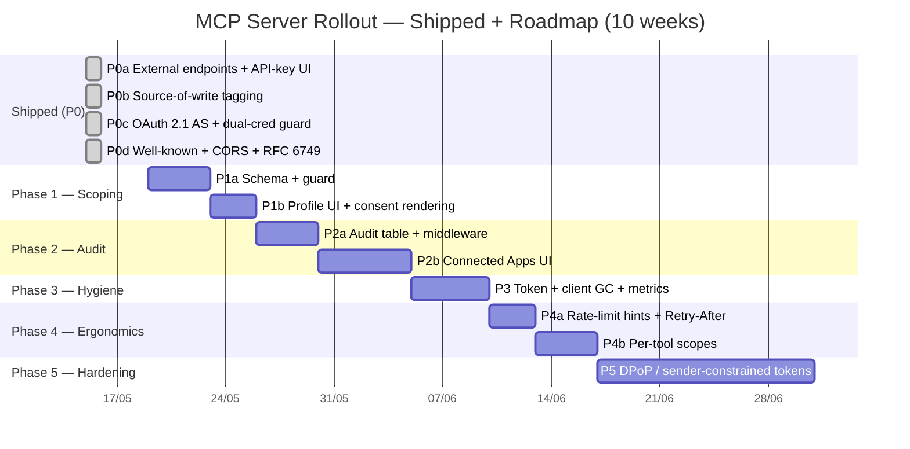

# Implementation Plan: MCP Server Rollout

> **This doc:** Phased plan covering the **shipped** P0 rollout (May 2026) and the **roadmap** (Phases 1–5) that closes the pain points raised in [`mcp-architecture.md`](./mcp-architecture.md) §1.2. Includes Gantt, per-phase task breakdown, dependencies, feature-flag rollback, and acceptance criteria.
>
> **Related:**
> - [`./mcp-architecture.md`](./mcp-architecture.md) — Target architecture, pain points P1–P10, tech choices
> - [`./oauth-server-design.md`](./oauth-server-design.md) — OAuth 2.1 AS deep-dive (P0c + P5)
> - [`../../changelogs/mcp-changelog.md`](../../changelogs/mcp-changelog.md) — Commit-level history of P0

---

## Table of contents

1. [Overview & principles](#1-overview--principles)
2. [Architecture diagrams](#2-architecture-diagrams)
3. [State machines](#3-state-machines)
4. [Sequence flows](#4-sequence-flows)
5. [Queue topology](#5-queue-topology)
6. [Database schema (by phase)](#6-database-schema-by-phase)
7. [Implementation phases](#7-implementation-phases)
8. [Per-phase task breakdown](#8-per-phase-task-breakdown)
9. [Risk register](#9-risk-register)
10. [Acceptance criteria & metrics](#10-acceptance-criteria--metrics)

---

## 1. Overview & principles

### 1.1. Design principles

1. **One BB-PM identity per MCP identity** — no service accounts, no shared keys. Authorization always flows from a human user.
2. **Reuse, don't reimplement** — every domain rule the web UI enforces (project membership, role gates, validation) is enforced for MCP by routing through the same services.
3. **Thin proxy at the edge** — `bbpm-internal-mcp` adds **zero** business logic. All decisions land in BB-PM. The MCP package can be updated without redeploying the API and vice versa.
4. **Feature-flagged phases** — every roadmap phase gates behind a config flag so a regression is a config flip, not a deploy revert.
5. **Visible provenance** — every row a Bot writes carries a `source` column; the UI renders a badge so a human reader sees "this came from Claude on Alice's behalf" without reading audit logs.
6. **Defense in depth on tokens** — short access TTL (1 h), rotating refresh tokens, single-use codes, byte-equal redirect-URI checks, mandatory PKCE S256, constant-time crypto compares.

### 1.2. Timeline



**Phase boundaries.** Each phase is at most ~2 weeks. P5 is the only longer one because DPoP carries cryptographic work and requires changes to both BB-PM and `bbpm-internal-mcp`.

---

## 2. Architecture diagrams

The full architecture is in [`mcp-architecture.md`](./mcp-architecture.md) §2. The two diagrams a reader of *this* doc most often needs:

- §2.1 — C4 context (who talks to whom)
- §2.2 — Container diagram (the deployment boundaries)

Re-printing them here would duplicate; instead, **read them as the canonical target state**. Each phase below references the components that change.

---

## 3. State machines

See [`mcp-architecture.md`](./mcp-architecture.md) §6 for:

- OAuth access-token lifecycle (Phase 0c shipped)
- OAuth client lifecycle (P3 adds the `GARBAGE_COLLECTED` terminal state)
- API-key lifecycle (P1 splits `ACTIVE` into `ACTIVE_SCOPED` substates implicitly)
- Row source lifecycle (P0b shipped)

---

## 4. Sequence flows

See [`mcp-architecture.md`](./mcp-architecture.md) §5 for:

- §5.1 Local tool call (X-API-Key)
- §5.2 Remote OAuth PKCE handshake
- §5.3 Refresh-token rotation
- §5.4 Revocation
- §5.5 Expired token + auto-refresh

A new flow lands in Phase 2 — **Profile → Connected Apps disconnect** — covered in §8 of this doc.

---

## 5. Queue topology

**Not applicable.** MCP itself is synchronous. The only async-adjacent moving parts are:

- Notification side effects of underlying domain writes — owned by the notification domain (existing outbox).
- Audit row inserts (Phase 2) — done inline in middleware. Inline because the row is shaped purely from the request and response and we want it co-located with the request that produced it; out-of-band publishing buys nothing here.
- Token / client GC sweep (Phase 3) — `@Cron` in-process, single Postgres connection. No broker.

---

## 6. Database schema (by phase)

### Phase 0 (shipped)

```sql
-- Migration: 20260515_oauth_2_1_authorization_server
CREATE TABLE oauth_clients ( ... );
CREATE TABLE oauth_auth_codes ( ... );
CREATE TABLE oauth_access_tokens ( ... );
CREATE TABLE oauth_refresh_tokens ( ... );
-- (full schema in mcp-architecture.md §7.1)

-- Migration: 20260515064854_add_source_columns
ALTER TABLE issues     ADD COLUMN source VARCHAR(20) NOT NULL DEFAULT 'WEB';
ALTER TABLE activities ADD COLUMN source VARCHAR(20) NOT NULL DEFAULT 'WEB';
ALTER TABLE comments   ADD COLUMN source VARCHAR(20) NOT NULL DEFAULT 'WEB';
```

### Phase 1 — per-credential scoping

```sql
-- Migration: 20260520_per_credential_scoping
ALTER TABLE api_keys
  ADD COLUMN scopes      TEXT[] NULL,   -- ['mcp:read'], ['mcp:read','mcp:write']; NULL = unrestricted (legacy)
  ADD COLUMN project_ids UUID[] NULL;   -- NULL/empty = all projects the user has access to

ALTER TABLE oauth_access_tokens
  ADD COLUMN project_ids UUID[] NULL;
ALTER TABLE oauth_refresh_tokens
  ADD COLUMN project_ids UUID[] NULL;
```

### Phase 2 — audit log

```sql
-- Migration: 20260603_external_request_audit
CREATE TABLE external_request_audit (
  id              UUID PRIMARY KEY DEFAULT gen_random_uuid(),
  user_id         UUID NOT NULL REFERENCES users(id) ON DELETE CASCADE,
  credential_kind VARCHAR(20) NOT NULL,                       -- 'API_KEY' | 'BEARER'
  api_key_id      UUID NULL REFERENCES api_keys(id)        ON DELETE SET NULL,
  oauth_client_id VARCHAR NULL REFERENCES oauth_clients(client_id) ON DELETE SET NULL,
  method          VARCHAR(8)   NOT NULL,
  path            VARCHAR(200) NOT NULL,
  status_code     INT          NOT NULL,
  source          VARCHAR(20)  NOT NULL,
  ip_address      INET         NOT NULL,
  user_agent      TEXT         NULL,
  duration_ms     INT          NOT NULL,
  created_at      TIMESTAMPTZ  NOT NULL DEFAULT now()
);
CREATE INDEX idx_audit_user_created    ON external_request_audit (user_id, created_at DESC);
CREATE INDEX idx_audit_client_created  ON external_request_audit (oauth_client_id, created_at DESC) WHERE oauth_client_id IS NOT NULL;
CREATE INDEX idx_audit_key_created     ON external_request_audit (api_key_id, created_at DESC)     WHERE api_key_id IS NOT NULL;
```

### Phase 3 — no schema; cron only

```sql
-- No schema. NestJS @Cron('0 4 * * *') runs:
DELETE FROM oauth_auth_codes
 WHERE expires_at < now();

DELETE FROM oauth_access_tokens
 WHERE expires_at < now() - INTERVAL '7 days';
-- 7-day grace lets the audit view still resolve token → client name.

DELETE FROM oauth_refresh_tokens
 WHERE expires_at < now();

DELETE FROM oauth_clients
 WHERE created_at < now() - INTERVAL '90 days'
   AND id NOT IN (
       SELECT DISTINCT c.id FROM oauth_clients c
        WHERE EXISTS (SELECT 1 FROM oauth_access_tokens  WHERE client_id = c.client_id)
           OR EXISTS (SELECT 1 FROM oauth_refresh_tokens WHERE client_id = c.client_id)
   );
```

### Phase 4 — no schema; header + scope-string changes

No DB changes. New tool-level scopes are strings (`'mcp:read:issue'`, etc.) that fit in the existing `scopes TEXT[]` columns.

### Phase 5 — DPoP

```sql
-- Migration: 20260801_dpop_support
ALTER TABLE oauth_clients
  ADD COLUMN require_dpop BOOLEAN NOT NULL DEFAULT false;

ALTER TABLE oauth_access_tokens
  ADD COLUMN dpop_jkt VARCHAR(64) NULL;   -- JWK thumbprint of the binding key (RFC 9449)
```

---

## 7. Implementation phases

| Phase | Name | Output | Pain points fixed | Risk |
|---|---|---|---|---|
| **P0a** | External endpoints + API-key UI | `bbpm-internal-mcp` Phase 1 endpoints live (`projects`, `members`, `labels`, `comments`, `activities`); Profile → API Keys ships | foundational | Low |
| **P0b** | Source-of-write tagging | `source` columns on `issues`/`activities`/`comments`; UI badges visible | foundational | Low |
| **P0c** | OAuth 2.1 AS | claude.ai / ChatGPT can onboard with consent flow; `ApiKeyGuard` accepts Bearer | — | Med |
| **P0d** | Well-known + CORS + raw response shape | claude.ai discovery works; CORS preflight passes; OAuth error bodies match RFC 6749 | — | Low |
| **P1** | Per-credential scoping | `api_keys.scopes` + `api_keys.project_ids`; OAuth tokens carry `project_ids`; `ExternalController` enforces both | **P1** (per-key scoping), **P2** (coarse scopes) | Med |
| **P2** | Audit + Connected Apps UI | `external_request_audit` populated; Profile → Connected Apps with per-token activity view | **P4** (no audit), **P7** (no admin UI) | Med |
| **P3** | Token + client GC | `@Cron('0 4 * * *')` deletes expired / orphaned rows nightly; metrics + alert | **P3** (no sweep), **P6** (orphan clients) | Low |
| **P4** | Rate-limit hints + per-tool scopes | `Retry-After` exposed to MCP; per-tool scope tags; consent UI shows granular scopes | **P8** (rate-limit blindness), **P10** (tool discovery) | Low |
| **P5** | DPoP / sender-constrained tokens | Opt-in `require_dpop` per OAuth client; `ApiKeyGuard` validates DPoP JWS | **P5** (no sender constraint) | High |

---

## 8. Per-phase task breakdown

### Phase 0 — Shipped (2026-05-15)

Already in production. Detail in [`docs/changelogs/mcp-changelog.md`](../../changelogs/mcp-changelog.md). The next 4 sections cover roadmap work.

---

### Phase 1 — Per-credential scoping

**Goal:** A user can mint a read-only or project-scoped credential, and `ExternalController` enforces it.

**Tasks:**

- [ ] **P1a — schema + guard** (4 days)
  - [ ] Migration `20260520_per_credential_scoping` (Section 6).
  - [ ] `ApiKeyService.validateKey()` returns `{ user, scopes, projectIds }`.
  - [ ] `ApiKeyGuard` attaches `request.scopes` + `request.allowedProjectIds`.
  - [ ] New decorator `@RequireScope('mcp:write')` for write endpoints; raises `403 insufficient_scope` per RFC 6750.
  - [ ] `ExternalService.resolveProject(projectKey, request)` rejects with 404 if `request.allowedProjectIds` is set and doesn't include the resolved project's UUID.
  - [ ] Feature flag `EXTERNAL_SCOPE_ENFORCEMENT` (defaults to `false` for 1 week of staging soak).
  - [ ] Unit tests: scoped key on out-of-scope project → 404; read-only key on `POST` → 403; null-scope (legacy) key → unchanged behaviour.

- [ ] **P1b — UI + consent rendering** (3 days)
  - [ ] Profile → Create API Key dialog: scope picker (Read-only / Read-write) + project multi-select.
  - [ ] Profile → API Keys list shows scopes inline.
  - [ ] OAuth consent screen: surface scope + project restrictions if registered on the client.
  - [ ] OAuth `POST /register` accepts `project_ids` in the request body; persisted on the client row (planned column in `oauth_clients`).

**Acceptance:**

| # | Scenario | Expected |
|---|---|---|
| AC1.1 | Alice creates a key scoped `['mcp:read']` on project BBPM only. | `POST /external/issues` (write) → 403 insufficient_scope; `GET /external/projects/BBPM/issues` → 200; `GET /external/projects/ZP/issues` → 404. |
| AC1.2 | Existing un-scoped keys keep working. | `EXTERNAL_SCOPE_ENFORCEMENT=true` + key with `scopes=NULL` → all routes pass as today. |
| AC1.3 | OAuth client registered with `project_ids=['<BBPM-uuid>']`. | Bearer issued from that client cannot read project ZP; returns 404. |

**Rollback:**

```bash
# Set flag, no deploy needed
$ vc env edit EXTERNAL_SCOPE_ENFORCEMENT false
# Worst case: drop the columns
ALTER TABLE api_keys DROP COLUMN scopes, project_ids;
ALTER TABLE oauth_access_tokens  DROP COLUMN project_ids;
ALTER TABLE oauth_refresh_tokens DROP COLUMN project_ids;
```

---

### Phase 2 — Audit + Connected Apps UI

**Goal:** A user can see "what has Claude been doing on my behalf?" in Profile, filtered by token/connector, with one-click disconnect.

**Tasks:**

- [ ] **P2a — audit table + middleware** (4 days)
  - [ ] Migration `20260603_external_request_audit` (Section 6).
  - [ ] NestJS middleware mounted on `external` + `oauth` routes:
    1. Capture `start_time`, `path`, `method`, `request.ip`, `user-agent` on enter.
    2. On exit (or error), capture `status_code`, `duration_ms`.
    3. Resolve `apiKeyId` / `oauthClientId` from `request.credentialKind` (set by guard).
    4. `INSERT` (single statement, no transaction needed).
  - [ ] Feature flag `EXTERNAL_AUDIT_ENABLED` (default `true` on staging from day 1, prod after 1 week).
  - [ ] 90-day retention: `@Cron('0 5 * * *')` deletes `WHERE created_at < now() - INTERVAL '90 days'`.

- [ ] **P2b — Connected Apps UI** (6 days)
  - [ ] `features/connected-apps/` slice on the web.
  - [ ] `GET /api/connected-apps` — returns list of `(oauth_clients ⨝ active tokens for user) ∪ (api_keys for user)` with `lastUsed` + `requestCount30d`.
  - [ ] Profile page tab "Connected Apps" alongside existing "API Keys".
  - [ ] Per-app detail page: paginated activity (last 100 requests), filters by method + status code.
  - [ ] One-click Disconnect for OAuth clients: `POST /api/connected-apps/:clientId/disconnect` deletes all tokens for `(user, clientId)`.
  - [ ] Confirmation dialog via existing `confirmDialog()`.

**Acceptance:**

| # | Scenario | Expected |
|---|---|---|
| AC2.1 | Alice makes 5 tool calls from Claude Code. | 5 rows in `external_request_audit` with `credential_kind='API_KEY'`, `api_key_id` set, all `source='MCP'`. |
| AC2.2 | Alice opens Profile → Connected Apps. | claude.ai connector listed with `lastUsed` ~now and `requestCount30d=42`. |
| AC2.3 | Alice clicks Disconnect on claude.ai. | All `oauth_access_tokens` + `oauth_refresh_tokens` for `(Alice, claudeClientId)` deleted; next claude.ai call returns 401. |
| AC2.4 | 91-day-old audit row. | Deleted by daily sweep within 24h of crossing the threshold. |

**Rollback:**

- Set `EXTERNAL_AUDIT_ENABLED=false` → middleware short-circuits, no writes.
- Drop the table if abandoning: `DROP TABLE external_request_audit;`.
- UI is a feature-flagged route; hidden by config.

---

### Phase 3 — Token + client GC

**Goal:** Dead rows don't accumulate; the operations team has metrics to spot anomalies.

**Tasks:**

- [ ] Scheduler class `OAuthGcScheduler` in `packages/api/src/oauth/`:
  ```typescript
  @Cron('0 4 * * *') // daily 04:00 server time
  async sweep() {
    const t1 = await this.prisma.oAuthAuthCode.deleteMany({
      where: { expiresAt: { lt: new Date() } }
    });
    const t2 = await this.prisma.oAuthAccessToken.deleteMany({
      where: { expiresAt: { lt: subDays(new Date(), 7) } }  // 7d grace
    });
    const t3 = await this.prisma.oAuthRefreshToken.deleteMany({
      where: { expiresAt: { lt: new Date() } }
    });
    const t4 = await this.prisma.$executeRaw`
      DELETE FROM oauth_clients
       WHERE created_at < now() - INTERVAL '90 days'
         AND NOT EXISTS (
             SELECT 1 FROM oauth_access_tokens  t WHERE t.client_id = oauth_clients.client_id
             UNION
             SELECT 1 FROM oauth_refresh_tokens t WHERE t.client_id = oauth_clients.client_id
         )
    `;
    this.logger.log(`GC swept: codes=${t1.count} access=${t2.count} refresh=${t3.count} clients=${t4}`);
    this.metrics.recordSweep(t1.count, t2.count, t3.count, t4);
  }
  ```
- [ ] Metrics (prom-client): `oauth_gc_deleted_total{table="..."}` counter; `oauth_gc_duration_seconds` histogram.
- [ ] Alert: per-day deleted clients > 10× rolling 7-day mean (registration storm signal).
- [ ] Feature flag `OAUTH_GC_ENABLED` (default `false` until verified in staging).

**Acceptance:**

| # | Scenario | Expected |
|---|---|---|
| AC3.1 | Staging: register 100 clients with no consent. | After 90 days simulated time, 100 client rows deleted; metric records count. |
| AC3.2 | Production: row count growth flat-lines over 30 days post-launch. | Per-table row counts per `pg_stat_user_tables` show net-positive growth ≤ active client increase. |

**Rollback:** Comment out `@Cron`. Nothing else to undo (delete-only sweep, can't break invariants).

---

### Phase 4 — Rate-limit hints + per-tool scopes

**Goal:** LLMs back off gracefully; consent UX shows what the connector actually does at tool granularity.

**Tasks:**

- [ ] **P4a — Retry-After & rate-limit headers** (3 days)
  - [ ] Override `ThrottlerGuard` to inject `Retry-After: <seconds>` + `X-RateLimit-Remaining` on 429.
  - [ ] `bbpm-internal-mcp` parses 429 + `Retry-After`, returns a structured MCP `ToolError` with `code: 'rate_limited'` and `retryAfterSeconds`.
  - [ ] Document the back-off contract in the package README so LLM hosts that consume it can implement linear / exponential delay.

- [ ] **P4b — Per-tool scopes** (4 days)
  - [ ] New scope strings recognised: `mcp:read:issue`, `mcp:write:issue`, `mcp:read:spec`, `mcp:write:spec`, `mcp:read:comment`, `mcp:write:comment`.
  - [ ] `@RequireScope('mcp:write:comment')` on `POST /external/issues/:proj/:num/comments` (and similar per-endpoint annotations).
  - [ ] Backward-compatible: a token with scope `'mcp'` still passes (`mcp` ⊃ all granular scopes).
  - [ ] OAuth consent screen: render granular scopes as friendly strings ("Create comments on issues", "Read specifications", …).
  - [ ] `bbpm-internal-mcp` tool descriptions updated to surface the scope each tool requires (so LLM hosts can present "this connector cannot post comments" before a doomed call).

**Acceptance:**

| # | Scenario | Expected |
|---|---|---|
| AC4.1 | Client hits 30/min/IP throttle on `/external/issues`. | 429 with `Retry-After: 12`; MCP returns `ToolError(rate_limited, retryAfterSeconds: 12)`; Claude waits and retries. |
| AC4.2 | Client registered with `scope='mcp:read:issue mcp:write:comment'`. | `GET /external/issues/BBPM/12` → 200; `POST /external/issues` → 403; `POST /external/issues/BBPM/12/comments` → 201. |
| AC4.3 | Legacy token with bare `scope='mcp'`. | All routes pass unchanged. |

**Rollback:** Granular scopes are additive — flipping a flag `EXTERNAL_GRANULAR_SCOPES=false` makes `@RequireScope` no-op (logs only). Retry-After header is informational; removing is a single-line revert.

---

### Phase 5 — DPoP / sender-constrained tokens

**Goal:** A leaked Bearer token cannot be used from a different machine if the client registered with `require_dpop: true`.

**Tasks:**

- [ ] Migration `20260801_dpop_support` (Section 6).
- [ ] `POST /api/oauth/register` accepts `require_dpop: bool` and persists to `oauth_clients.require_dpop`.
- [ ] OAuth token endpoint:
  - [ ] If client has `require_dpop=true`: require `DPoP` JWS header on `/token` request, validate (RFC 9449), persist the JWK thumbprint (`jkt`) to `oauth_access_tokens.dpop_jkt`.
- [ ] `ApiKeyGuard.resolveBearer()`:
  - [ ] If token has `dpop_jkt`, require valid `DPoP` JWS on the resource request and compare `jkt`.
  - [ ] Nonce handling (RFC 9449 §8): server-issued nonce on every response if clock skew detected; client must replay.
- [ ] `bbpm-internal-mcp`: optional DPoP client implementation using `jose` (auto-detected from registration).
- [ ] Documentation: when to require DPoP (prod-write connectors, finance integrations) vs when it's overkill (analytics).
- [ ] Feature flag `OAUTH_DPOP_AVAILABLE` (default `false` — per-client opt-in only).

**Acceptance:**

| # | Scenario | Expected |
|---|---|---|
| AC5.1 | Client registered with `require_dpop=true`. Token captured from network. Replayed from a different machine. | 401 invalid_dpop; legitimate client still succeeds. |
| AC5.2 | Same client, legitimate request signed correctly. | 200 OK. |
| AC5.3 | DPoP-required client doesn't send `DPoP` header on resource request. | 401 use_dpop_nonce. |
| AC5.4 | Client without DPoP (existing). | Unchanged behaviour, no signature required. |

**Rollback:** `OAUTH_DPOP_AVAILABLE=false` → registration field ignored; existing DPoP-required clients gracefully degrade (DPoP validation skipped, log warning, token still resolved).

---

## 9. Risk register

| # | Risk | P | I | Mitigation |
|---|---|---|---|---|
| R1 | P1 scope enforcement breaks existing keys | Med | High | Backfill `scopes=NULL` = unrestricted (legacy). Feature flag for 1-week soak. Per-route unit test that `NULL` scope passes. |
| R2 | P2 audit middleware adds tail latency | Low | Med | Inline `INSERT` is one round-trip on the local PG connection (~5 ms). Monitor P95 of `/external/*` before and after; rollback if regression > 30 ms. |
| R3 | P3 GC accidentally deletes active client | Low | High | Sweep `WHERE NOT EXISTS (... oauth_access_tokens / oauth_refresh_tokens)`; any active token blocks deletion. Run in staging for 30 days first. |
| R4 | P3 GC takes too long on large tables | Low | Low | Each `DELETE` is bounded by partial indexes / `expires_at` index. Worst case: 100K rows × 0.1 ms = 10 s, well within nightly window. |
| R5 | P4 Retry-After hint not honored by hosts | Med | Low | LLM hosts can still ignore; degrades gracefully to noisy 429 (today's behaviour). Document the contract for host implementers. |
| R6 | P5 DPoP implementation has subtle bug | Med | High | DPoP behind opt-in flag per client. Use battle-tested `jose` lib. Cross-test with public DPoP example servers. |
| R7 | P5 DPoP nonce + replay attack | Low | High | RFC 9449 explicit: server tracks nonces with a short TTL; reject reused nonces. Implement nonce store in Redis with 5-min TTL. |
| R8 | OAuth tables growth outpaces P3 sweep | Low | Low | Metric `oauth_*_rows_total{table=...}` gauge; alert at 1M rows. Sweep is generous (90 days for orphan clients); can tighten if needed. |
| R9 | Phase 2 audit table becomes a target for incident-response writers | Med | Low | Append-only at app layer. DB-level RBAC (separate role for the app's connection) blocks `UPDATE`/`DELETE`. |
| R10 | Phase 4 granular scopes confuse users at consent time | Med | Med | Default scope set still includes the broad `mcp`. Granular scopes are additive when clients opt in. UX research before P4b ships: 5 user consent walkthroughs. |

---

## 10. Acceptance criteria & metrics

### 10.1. Functional

| # | Scenario | Expected |
|---|---|---|
| AC1.1 | Phase 1 read-only key denies writes | 403 `insufficient_scope` |
| AC1.2 | Phase 1 project-scoped key denies out-of-scope reads | 404 |
| AC1.3 | Legacy un-scoped keys unchanged | All routes pass |
| AC2.1 | Phase 2 audit row per `/external/*` request | 1 row, ≤ 1 s after response |
| AC2.2 | Profile → Connected Apps lists active clients | claude.ai shown with `lastUsed`, `requestCount30d` |
| AC2.3 | Disconnect deletes all `(user, client)` tokens | Next call → 401 |
| AC3.1 | Phase 3 GC deletes expired tokens | Audit grace 7 days; no `lastUsed` ≥ `expiresAt + 7d` rows after sweep |
| AC3.2 | Phase 3 GC deletes orphan clients | 90-day-old + no tokens = deleted |
| AC4.1 | Phase 4 429 returns `Retry-After` | Header present; MCP returns structured `ToolError` |
| AC4.2 | Phase 4 granular scope enforced | Per-route scope rejection on insufficient |
| AC5.1 | Phase 5 DPoP replay from different machine fails | 401 `invalid_dpop` |
| AC5.4 | Phase 5 non-DPoP clients unchanged | Bearer-only resource request succeeds |

### 10.2. SLOs (post-Phase 5)

| Metric | Target |
|---|---|
| `ApiKeyGuard` P95 (X-API-Key path) | < 25 ms |
| `ApiKeyGuard` P95 (Bearer path) | < 5 ms |
| `ApiKeyGuard` P95 (Bearer + DPoP path) | < 15 ms |
| `/api/external/*` P95 | < 250 ms |
| `/api/oauth/token` P95 | < 100 ms |
| OAuth handshake end-to-end (P95, user click → first usable token) | < 8 s |
| Audit row write lag after request (Phase 2) | P99 < 100 ms |
| Token GC sweep duration (Phase 3, nightly, 100K rows) | < 30 s |
| Stolen access-token window without DPoP | ≤ 1 h (= access TTL) |
| Stolen access-token window with DPoP (Phase 5) | 0 (rejected immediately if used from different key) |
| Source-tagging accuracy (vs ground truth in test suite) | > 99.9% |

### 10.3. Coverage map

Cross-check that every pain point P1–P10 from [`mcp-architecture.md`](./mcp-architecture.md) §1.2 is addressed by at least one phase:

| Pain point | Phase that fixes it | Verifying AC |
|---|---|---|
| P1 — no per-credential scoping | Phase 1 | AC1.1, AC1.2 |
| P2 — coarse OAuth scopes | Phase 1 (initial) + Phase 4 (granular) | AC1.3, AC4.2 |
| P3 — no GC of expired rows | Phase 3 | AC3.1 |
| P4 — no audit log queryable | Phase 2 | AC2.1, AC2.2 |
| P5 — no sender-constraint | Phase 5 | AC5.1 |
| P6 — orphan OAuth clients | Phase 3 | AC3.2 |
| P7 — no admin UI for revocation | Phase 2 | AC2.3 |
| P8 — rate-limit blindness | Phase 4 | AC4.1 |
| P9 — long-tool responses | (deferred — needs separate design doc) | — |
| P10 — tool discovery | Phase 4 (tool descriptions) + bbpm-internal-mcp updates | — |

P9 and the documentation arm of P10 are deferred to a follow-up doc; both are runtime ergonomics decisions, not architecture changes.
