# Architecture: MCP Server — LLM Agents on BB-PM

> **Goal:** Let any MCP-capable LLM client (Claude Code, Claude Desktop, Cursor, claude.ai web custom connectors, ChatGPT remote MCP, MCP Inspector) read and write to BB-PM as the human user it represents — without leaking credentials, without bypassing project membership, and with full provenance on every row a Bot creates.
>
> **Scope:** The `/api/external/*` REST surface that MCP-class agents consume, the OAuth 2.1 Authorization Server (`/api/oauth/*`) that issues credentials to remote/cloud clients, the dual-credential `ApiKeyGuard` that normalises both auth paths to the same `request.user`, the source-of-write tagging pipeline (`X-Client-Source` + UA fallback), and the `bbpm-internal-mcp` thin proxy server distributed via `npx`. **Out of scope:** the internal JWT-cookie session used by the React SPA (see [`auth-changelog.md`](../../changelogs/auth-changelog.md)) and the project-membership / role model (see [`docs/architecture/backend/patterns.md`](../backend/patterns.md) §1).
>
> **Core requirements:**
> - One BB-PM user identity == one MCP identity. No service accounts, no shared tokens.
> - Same authorization model as the web UI: project membership, role gates, superuser bypass — all reused, none re-implemented.
> - Two credential modes addressing two delivery shapes: long-lived `X-API-Key` for local CLI clients spawned with `npx`; short-lived OAuth 2.1 PKCE Bearer for hosted/cloud clients (claude.ai, ChatGPT).
> - Provenance visible in the UI: every row tells the human reader whether a Bot or another human created it.
> - No new business logic on the MCP side — the server is a thin proxy.
>
> **Related docs:**
> - [`./implementation-plan.md`](./implementation-plan.md) — Phased rollout (already-shipped phases + future roadmap) with Gantt
> - [`./oauth-server-design.md`](./oauth-server-design.md) — OAuth 2.1 AS deep-dive (token lifecycle, PKCE math, recoverability)
> - [`../backend/mcp-server.md`](../backend/mcp-server.md) — Concise summary / pointer
> - [`../../changelogs/mcp-changelog.md`](../../changelogs/mcp-changelog.md) — Commit-level history
> - [`../../changelogs/external-api-changelog.md`](../../changelogs/external-api-changelog.md) — `/api/external/*` surface evolution
> - [`../backend/entities.md`](../backend/entities.md) — `OAuthClient`, `OAuthAuthCode`, `OAuthAccessToken`, `OAuthRefreshToken` Prisma models

---

## 1. Current state & pain points

### 1.1. Current state (production, post 2026-05-15 rollout)

| Component / File | Responsibility |
|---|---|
| `bbpm-internal-mcp` (external npm package, distributed via `npx`) | Thin MCP server. Surfaces tools (`bb_create_issue`, `bb_list_projects`, …) to the LLM host over stdio or HTTP. Stateless. Translates each tool call to one HTTPS request against `/api/external/*`. |
| `packages/api/src/external/external.controller.ts` | The 20+ public endpoints under `/api/external/*` (issues CRUD, project digest, specifications, links, comments, members, labels). `@Public()` + `@UseGuards(ApiKeyGuard)` at the class level. |
| `packages/api/src/external/external.service.ts` | Resolves human-friendly identifiers (`projectKey`, `assigneeEmail`, label `name`) to UUIDs and delegates to the same domain services the web UI uses. |
| `packages/api/src/api-key/api-key.guard.ts` | Dual-credential guard. Accepts `X-API-Key: bbpm_<56-hex>` *or* `Authorization: Bearer bbpm_at_<…>`. Normalises both into `request.user = { sub, email }`. Tags `request[bbpmSource]` from headers. |
| `packages/api/src/api-key/api-key.service.ts` | API-key CRUD per user. Bcrypt at rest, indexed by 8-char `keyPrefix`. |
| `packages/api/src/oauth/oauth.controller.ts` | OAuth 2.1 endpoints: `/register` (DCR, RFC 7591), `/authorize/{client,consent}`, `/token`, `/revoke` (RFC 7009), `/userinfo`. |
| `packages/api/src/oauth/oauth.service.ts` | Token lifecycle: mint single-use authorization codes (5 min TTL), exchange with PKCE S256 verifier, mint access tokens (1 h) + refresh tokens (30 d), rotate refresh tokens on every exchange, revoke. |
| `packages/api/src/oauth/well-known.controller.ts` | RFC 8414 metadata at `/api/.well-known/oauth-authorization-server`. The canonical discovery path that claude.ai / ChatGPT actually probe. |
| `packages/api/src/common/source.ts` | `detectSourceFromHeaders()` priority: `X-Client-Source` > UA sniffing > `API` fallback. Yields one of `WEB / MCP / SLACK / WEBHOOK / API / SYSTEM`. |
| `packages/api/src/main.ts` (CORS callback) | Allowlist with three layers: configured `CORS_ORIGINS`, loopback regex (`localhost/127.0.0.1/[::1]:*`), claude.ai/anthropic.com/chatgpt.com/openai.com regex. Exposes `WWW-Authenticate` + `Mcp-Session-Id`. |
| `packages/web/src/pages/OAuthAuthorizePage.tsx` | Consent screen at `/oauth/authorize`. Renders client name + scope descriptions, mints code via `POST /api/oauth/authorize/consent`, redirects with `?code=…&state=…`. Lives outside `<AuthGuard>` so OAuth params survive a round-trip through `/login`. |
| `packages/web/src/features/api-key/` | Profile UI: list + revoke + two-stage create dialog (raw key shown exactly once). |
| Prisma tables (migrations `20260515_oauth_2_1_authorization_server`, `20260515064854_add_source_columns`) | `oauth_clients`, `oauth_auth_codes`, `oauth_access_tokens`, `oauth_refresh_tokens`; plus `source` columns on `issues`, `activities`, `comments`. |

### 1.2. Pain points

The current rollout (Section 1.1) is functional and shipped — these are the gaps that the **future roadmap** (Section 10) targets:

| # | Problem | Impact |
|---|---|---|
| P1 | **No per-credential scoping.** A token / API key has the same authority as the user it was issued to. Cannot mint a read-only key for an analytics agent or a project-scoped key for a contractor. | A leaked or shared key is equivalent to a leaked password for the user's full BB-PM access. Forced rotation is the only mitigation, and rotation is manual. |
| P2 | **OAuth scopes are coarse.** Only `mcp` is enforced downstream. `openid` / `profile` / `email` exist in the metadata for OIDC interop but are not actually checked anywhere — any token can call any endpoint. | Consent screen claims granularity ("Read your email address") that the runtime doesn't enforce. Honest scope display blocked. |
| P3 | **No background sweep of expired OAuth rows.** Rows past `expiresAt` are rejected at use time but persist in `oauth_auth_codes` / `oauth_access_tokens` / `oauth_refresh_tokens`. | Today: tens of rows. At 100 dev users × 1 connector × 30-day refresh cycle, the tables reach ~3K rows/yr per client. Not a crisis but growing dead state. |
| P4 | **No audit log queryable by token.** Rows carry `source` (`MCP` vs `WEB`), but not the token id or client id that authored them. A "what did claude.ai do on my behalf this week?" query requires joining notification + activity rows and is not exposed in the UI. | Users cannot audit a connector's actions. Compliance work blocked. Suspicious-token investigation is manual. |
| P5 | **Bearer tokens are not sender-constrained.** No DPoP / mTLS. A stolen token in its 1-hour window is usable from any IP, any TLS client. | Theft window is 1 h (acceptable today, smaller than industry default of access-token bearer + same-origin). But high-value MCP integrations (e.g. PROD access) would warrant DPoP. |
| P6 | **`OAuthClient` rows are never garbage collected.** RFC 7591 Dynamic Client Registration is `@Public()` — anyone can register a `client_id`. Unused clients accumulate indefinitely. | DCR throttle (10/min/IP) caps abuse rate. Long-tail bloat is real but slow. |
| P7 | **No admin UI for force-revocation.** Revoking a leaked token / killing a rogue connector requires direct DB access (`DELETE FROM oauth_access_tokens WHERE ...`). | Operationally awkward. Incident response is a manual SQL session. |
| P8 | **MCP server has no rate-limit awareness.** The global `ThrottlerGuard` (30 req/min/IP) is the only limit. An LLM that loop-calls `bb_get_digest` will hit 429 and the agent doesn't know how to back off. | Agents fail noisily under load. No per-user / per-token tighter quota. |
| P9 | **No streaming for long-tool responses.** `bb_get_digest` for a year-window project returns 100+ activities + 50 issues in one JSON. LLM context fills up. | Heavy queries OOM the LLM's tool result budget. |
| P10 | **No discovery of which tools an LLM should call.** The MCP server lists tools, but the LLM has no idea that "list_members before create_issue" is the right sequence. | LLMs guess project keys / assignee names and fail; users complain about hallucinated assignees. |

Pain points P1–P4 motivate the **scoping & audit** phase. P5 motivates **DPoP / sender-constraint**. P6–P7 motivate the **operational tooling** phase. P8–P10 motivate **runtime ergonomics**.

---

## 2. High-level architecture

### 2.1. Context diagram (C4 Level 1)

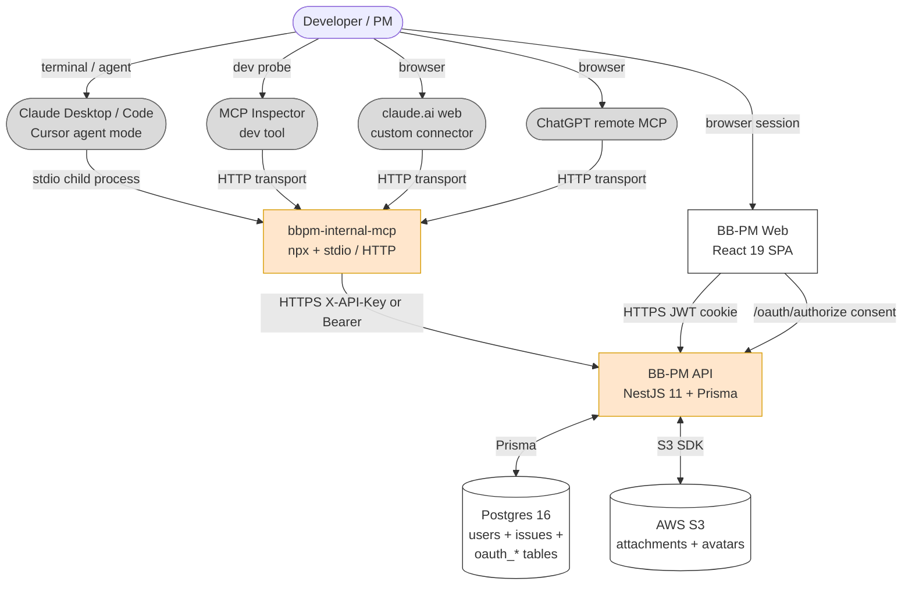

**Legend.** Orange (`#ffe6cc`) = components added or extended by the MCP rollout. Grey (`#dadada`) = external LLM hosts we don't own. White = pre-existing BB-PM internals (web SPA, DB, S3).

**Reading the diagram.** A human user has *two* relationships with BB-PM: they sit in front of the Web SPA (orange JWT-cookie path) **and** they delegate to an LLM host (grey) that talks to BB-PM through the `bbpm-internal-mcp` proxy. Both paths terminate at the same API; both paths end up identifying the same human user via `request.user`. The only forks are *how* the credential gets there.

### 2.2. Container diagram (C4 Level 2)

```mermaid
graph LR
    subgraph "MCP Clients"
        ClaudeLocal[Claude Code / Desktop / Cursor]
        ClaudeRemote[claude.ai / ChatGPT]
        Inspector[MCP Inspector]
    end

    subgraph "MCP Server Process"
        MCPstdio[stdio JSON-RPC handler]
        MCPhttp[HTTP transport handler]
        Tools[Tool registry<br/>bb_create_issue, bb_list_projects, ...]
        Forwarder[HTTP forwarder<br/>X-API-Key | Bearer]
    end

    subgraph "BB-PM API"
        WellKnown[WellKnownController<br/>/api/.well-known/...]
        OAuthCtl[OAuthController<br/>/register /token /revoke ...]
        ExtCtl[ExternalController<br/>/api/external/*]
        Guard[ApiKeyGuard<br/>dual credential]
        SourceTag[detectSourceFromHeaders]
        OAuthSvc[OAuthService<br/>PKCE + rotation]
        ExtSvc[ExternalService<br/>key->id resolution]
        DomainSvcs[Issue / Comment / Spec services<br/>shared with Web]
    end

    subgraph "BB-PM Web (React SPA)"
        Consent[OAuthAuthorizePage<br/>/oauth/authorize]
        ApiKeyUI[Profile → API Keys]
    end

    DB[(Postgres)]

    ClaudeLocal -->|stdio| MCPstdio
    ClaudeRemote -->|HTTPS| MCPhttp
    Inspector -->|stdio or HTTPS| MCPstdio
    Inspector -->|...| MCPhttp

    MCPstdio --> Tools
    MCPhttp --> Tools
    Tools --> Forwarder
    Forwarder -->|HTTPS| ExtCtl

    ClaudeRemote -.->|OAuth discovery| WellKnown
    ClaudeRemote -.->|register/token/revoke| OAuthCtl
    ClaudeRemote -.->|browser → consent| Consent
    Consent --> OAuthCtl
    OAuthCtl --> OAuthSvc
    OAuthSvc --> DB

    ExtCtl --> Guard
    Guard --> SourceTag
    Guard -->|resolve Bearer| DB
    Guard -->|resolve X-API-Key| DB
    ExtCtl --> ExtSvc
    ExtSvc --> DomainSvcs
    DomainSvcs --> DB

    ApiKeyUI -->|JWT-authed| ExtCtl

    classDef new fill:#ffe6cc,stroke:#d79b00
    class MCPstdio,MCPhttp,Tools,Forwarder,WellKnown,OAuthCtl,Guard,SourceTag,OAuthSvc,Consent,ApiKeyUI new
```

**Reading the diagram.** Two distinct data flows:

1. **Tool calls** (solid arrows): `LLM client → MCP server → ExternalController → Guard → DomainService → DB`. This path is taken by every request that's actually doing work (create/read/update issue, etc.).
2. **OAuth handshake** (dashed arrows): only the remote / cloud LLM clients walk through this. The MCP server itself is uninvolved — the LLM host talks directly to the BB-PM AS endpoints and to the React consent screen. Once tokens are issued, the host hands them to the MCP server, which then forwards them as the `Authorization` header on each tool call.

The seam between MCP and BB-PM is intentionally just **HTTPS + one header**. The MCP server has no shared state with BB-PM and no business logic of its own.

### 2.3. Two delivery modes

| Mode | Transport | Auth | Used by |
|---|---|---|---|
| **Local** | child-process spawned by host; JSON-RPC over **stdio** | `X-API-Key: bbpm_<56-hex>` (long-lived, env-injected) | Claude Code, Claude Desktop, Cursor (agent mode), local scripts, MCP Inspector in stdio mode |
| **Remote / cloud** | host-to-server HTTPS with the MCP **streamable HTTP** transport | `Authorization: Bearer bbpm_at_<…>` (1 h TTL, OAuth 2.1 PKCE) | claude.ai web custom connectors, ChatGPT remote MCP, MCP Inspector in HTTP mode, any RFC 7591 client |

The MCP server can serve both modes from the same process; the host picks one via its config.

---

## 3. Component breakdown

### 3.1. `bbpm-internal-mcp` (external npm package)

**Responsibility:**
- Surface a stable, versioned tool catalog (`bb_create_issue`, `bb_list_projects`, `bb_get_digest`, `bb_comment`, `bb_search`, etc.) to the LLM host via the MCP protocol.
- Validate tool arguments shape-wise (Zod schema per tool) **before** the network call.
- Translate one MCP tool call to one HTTPS request against `/api/external/*`, propagating the user's credential verbatim.
- Set `X-Client-Source: MCP` and `User-Agent: bbpm-mcp/<version>` on every request.
- Surface errors back to the LLM in a parseable shape (status code + message), not raw HTML.

**Why this exists.** Putting the tool surface in a separate process — rather than baking MCP into BB-PM's NestJS — means BB-PM stays a pure HTTP service. The LLM-protocol churn (transport changes, capability negotiation rounds, streamable HTTP vs stdio) is absorbed by a tiny package the user can update with `@latest`. No core API redeploy required to keep up with MCP spec changes.

**Canonical loop:**

```typescript
// Inside the MCP server (pseudo-code from bbpm-internal-mcp)
server.tool('bb_create_issue', CreateIssueSchema, async (args) => {
  const res = await fetch(`${env.BBPM_API_URL}/external/issues`, {
    method: 'POST',
    headers: {
      'Content-Type': 'application/json',
      'X-Client-Source': 'MCP',
      'User-Agent': `bbpm-mcp/${PKG_VERSION}`,
      ...(env.BBPM_API_KEY
        ? { 'X-API-Key': env.BBPM_API_KEY }
        : { Authorization: `Bearer ${runtime.bearer}` }),
    },
    body: JSON.stringify(args),
  });

  if (!res.ok) {
    const body = await res.json().catch(() => ({}));
    throw new ToolError(body.message ?? res.statusText, { code: res.status });
  }
  return await res.json();
});
```

### 3.2. `ApiKeyGuard` (BB-PM)

**Responsibility:**
- Single chokepoint for non-interactive auth on `/api/external/*`.
- Accept *either* `X-API-Key` (bcrypt-compared with `keyPrefix` narrowing) *or* `Authorization: Bearer bbpm_at_<…>` (resolved against `oauth_access_tokens`).
- Populate `request.user = { sub, email }` so downstream controllers are auth-agnostic.
- Reject any non-`ACTIVE` user (`PENDING` / `REJECTED` / `DELETED` denied).
- Resolve and stamp `request[bbpmSource]` for provenance.

**Why this exists.** The web app authenticates via the global `JwtAuthGuard`. The original MCP rollout would have introduced a second `BearerAuthGuard` next to `ApiKeyGuard`, but that means every external controller declares two `@UseGuards()`, and the question "which auth methods are accepted by this endpoint?" no longer has a single answer. Folding both into one guard keeps the controller surface uniform: `@UseGuards(ApiKeyGuard)` = "any non-interactive credential the platform trusts."

**Resolution order:**

```typescript
// packages/api/src/api-key/api-key.guard.ts (key path)
async canActivate(ctx) {
  const headers = ctx.switchToHttp().getRequest().headers;

  if (headers['x-api-key']) {
    const user = await this.apiKeyService.validateKey(headers['x-api-key']);
    if (!user) throw new UnauthorizedException('Invalid API key');
    request.user = { sub: user.id, email: user.email };
    return true;
  }

  const bearer = extractBearer(headers['authorization']);
  if (bearer) {
    const resolved = await this.resolveBearer(bearer);
    if (!resolved) throw new UnauthorizedException('Invalid or expired access token');
    request.user = { sub: resolved.userId, email: resolved.email };
    return true;
  }

  throw new UnauthorizedException('Authentication required');
}
```

### 3.3. `OAuthService` + `OAuthController`

**Responsibility:**
- RFC 7591 Dynamic Client Registration (anyone can register, throttled 10/min/IP).
- RFC 6749 / 8252 / 7636 (OAuth 2.1) authorization-code grant with **mandatory PKCE S256**.
- RFC 7009 token revocation.
- RFC 8414 metadata (mirrored from `WellKnownController` at the API root).
- Token lifecycle: mint codes (5 min TTL, single-use), exchange codes (verify PKCE + delete the code regardless of outcome), mint access (1 h) + refresh (30 d), rotate on refresh.

**Why this exists.** A long-lived `X-API-Key` is the right shape for a developer pasting a value into a `.env` file. It is the wrong shape for claude.ai or ChatGPT, where the user expects a "Connect" button that opens a browser tab, returns them logged-in, and never asks them to copy-paste a secret. OAuth 2.1 PKCE is the standard answer; making BB-PM the AS keeps user identity in one place (no third-party IdP).

### 3.4. `WellKnownController`

**Responsibility:**
- Serve RFC 8414 AS metadata at `/api/.well-known/oauth-authorization-server`.

**Why this exists separately from `OAuthController`.** RFC 8414 says: clients compute the well-known URL by *appending* `/.well-known/...` to the issuer string. BB-PM's issuer is `https://pm.burningbros.kr/api` — so the URL clients probe is `https://pm.burningbros.kr/api/.well-known/oauth-authorization-server`. That path must be reachable on the API host, not behind `/api/oauth/...`. The legacy `/api/oauth/.well-known/...` is kept for clients that already cached it.

### 3.5. Source tagging (`common/source.ts`)

**Responsibility:**
- Decide, on each authenticated request, which client class created the row(s) about to be written.
- Priority: `X-Client-Source` header (clients we own) > `User-Agent` sniffing (third parties) > `API` fallback.
- Attach `request[bbpmSource]` so services writing to `issues` / `activities` / `comments` can stamp `source`.

**Why this exists.** Without it, the bell-dropdown notification "Phạm Tùng commented on BBPM-12" is indistinguishable from "Phạm Tùng's Claude session commented on BBPM-12". The badge on every row makes Bot-vs-Human visible at a glance, which is the only thing keeping LLM-on-your-behalf actions ethically tractable.

### 3.6. `OAuthAuthorizePage` (React SPA)

**Responsibility:**
- Render the consent screen at `/oauth/authorize`.
- Pull params from the URL (`client_id`, `redirect_uri`, `code_challenge`, `state`, `scope`).
- Fetch client metadata (`GET /api/oauth/authorize/client?client_id=…`) to render the client name.
- On Approve: `POST /api/oauth/authorize/consent` → receive `{ code, state }` → redirect browser to `redirect_uri?code=…&state=…`.
- On Deny: redirect to `redirect_uri?error=access_denied&state=…` (RFC 6749 §4.1.2.1).
- Live **outside** `<AuthGuard>`. If the user isn't logged in, push to `/login?next=/oauth/authorize?<full query>` so the OAuth params survive the round-trip.

**Why this is in the SPA, not the API.** The session that "knows the user" is the JWT cookie owned by the React app. Re-implementing user login on the API side would mean either duplicating the auth UI or running the consent screen with a different session model. Routing the consent screen through the SPA keeps single-source-of-truth for "is this user logged in" — and makes the consent UX visually consistent with the rest of BB-PM.

---

## 4. Domain events & queue topology

**Not applicable to this domain.** MCP is a synchronous request/response surface — there is no broker, no event flow, no fan-out. Every tool call is a single HTTPS roundtrip and returns the result inline. The only async-ish behaviour is the side effects of underlying domain services (e.g. creating an issue may enqueue a Slack DM via the existing notification outbox — but that's the *issue* domain's event flow, not MCP's; see [`docs/changelogs/notification-changelog.md`](../../changelogs/notification-changelog.md)).

**Provenance is the closest thing MCP has to an "event":** every write captures a source, which the web UI surfaces as a badge. The source flow is one-way (header → request → DB column → UI badge), so it doesn't warrant a queue diagram.

---

## 5. Core flows

### 5.1. Flow: local CLI tool call (Claude Code → MCP → BB-PM)

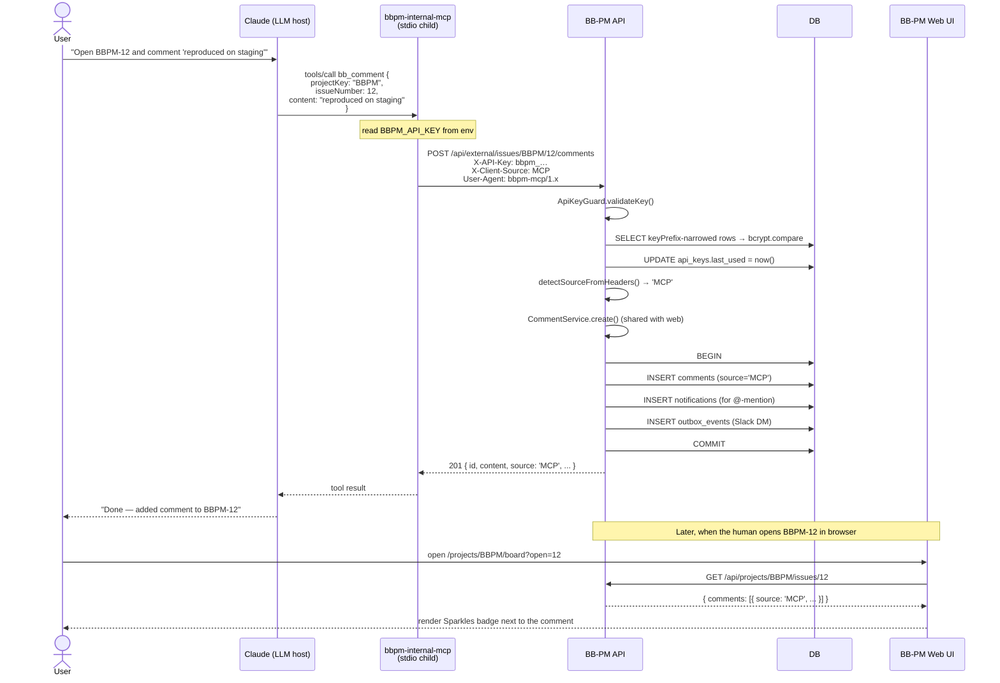

### 5.2. Flow: remote OAuth 2.1 PKCE handshake (claude.ai → BB-PM AS)

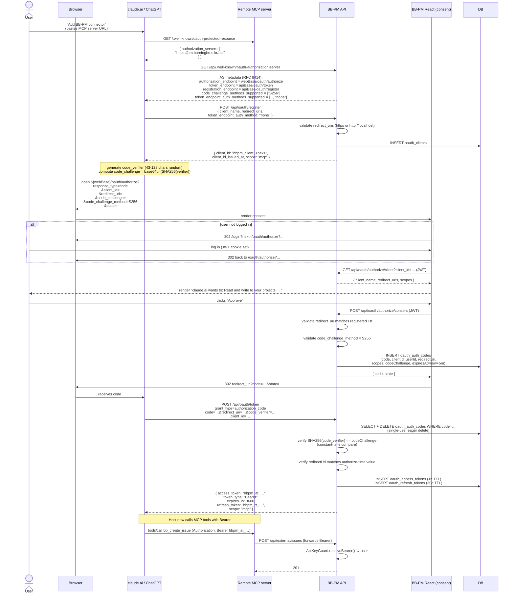

### 5.3. Flow: refresh-token rotation

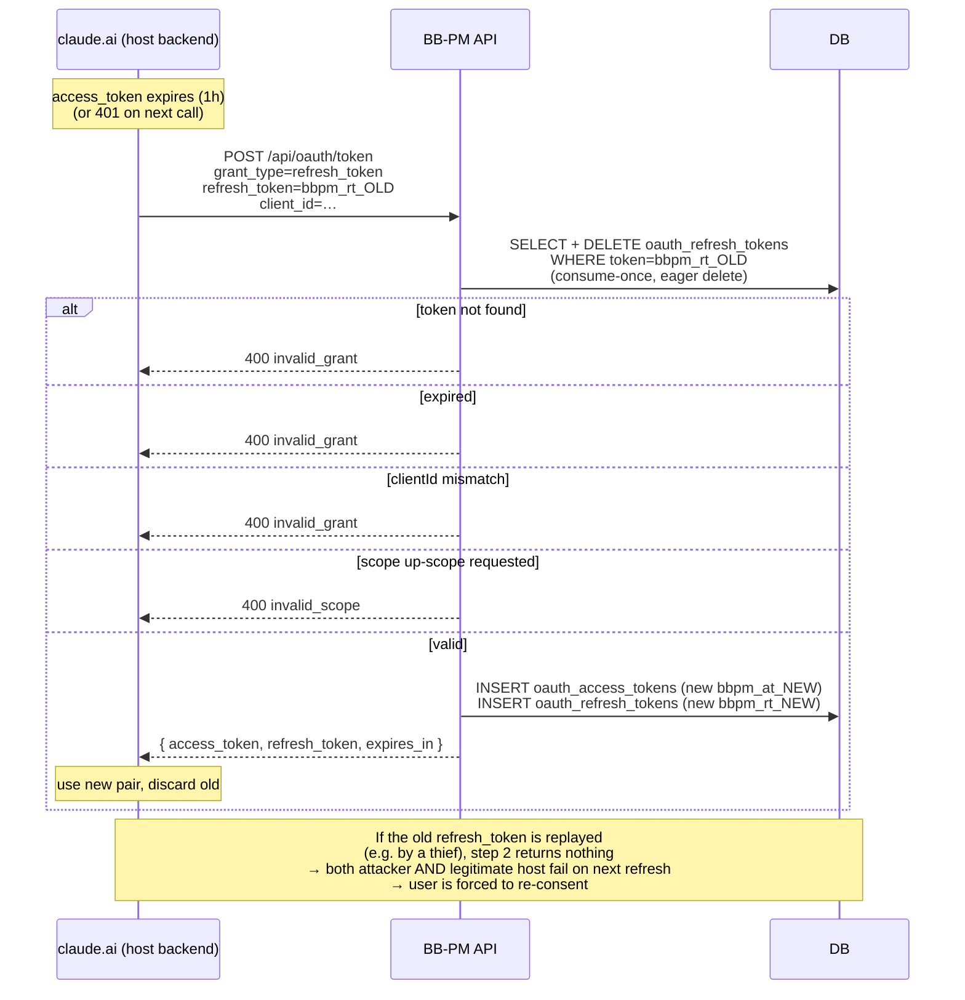

### 5.4. Flow: revocation (RFC 7009)

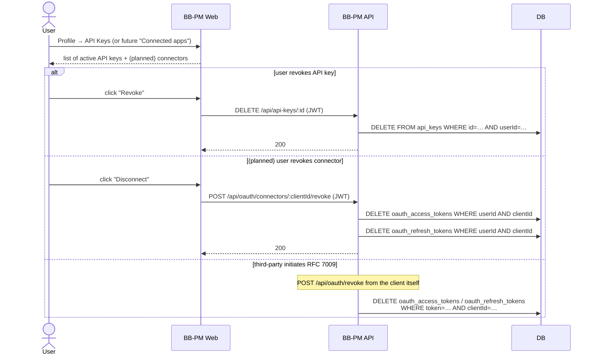

### 5.5. Flow: failure — expired access token, MCP doesn't know

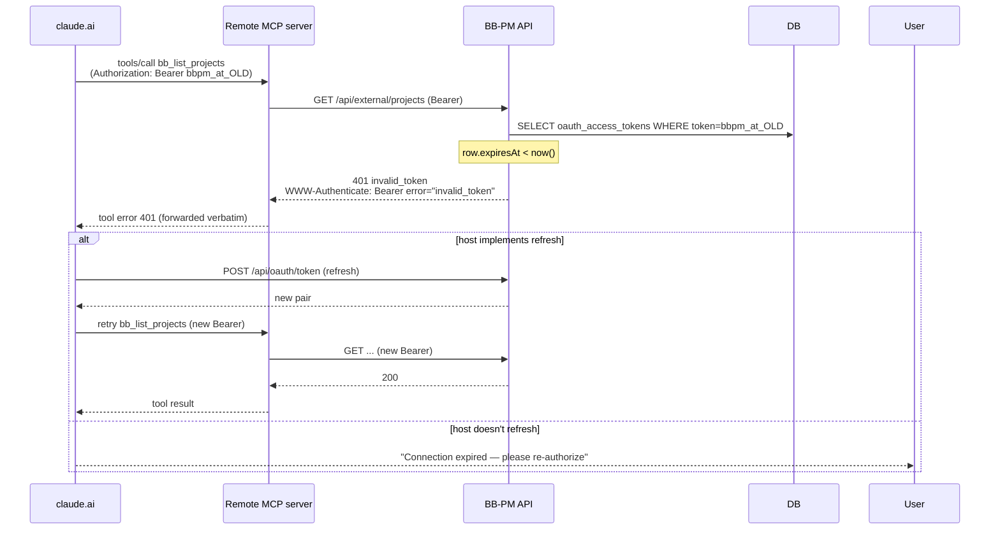

---

## 6. State machines

### 6.1. OAuth access-token lifecycle

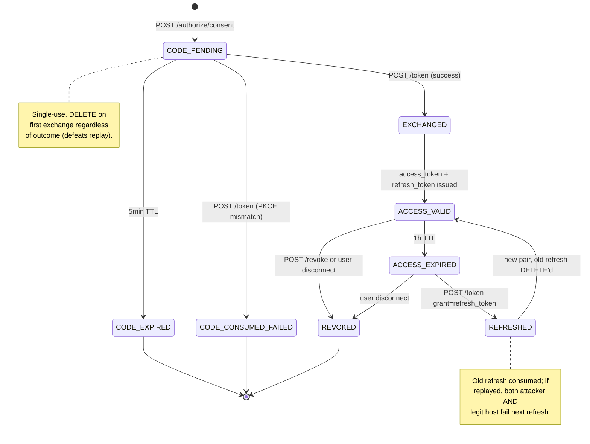

### 6.2. OAuth client lifecycle

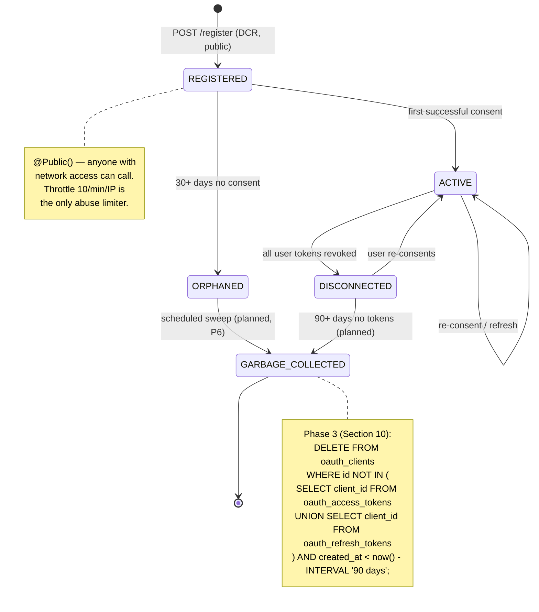

### 6.3. API-key lifecycle

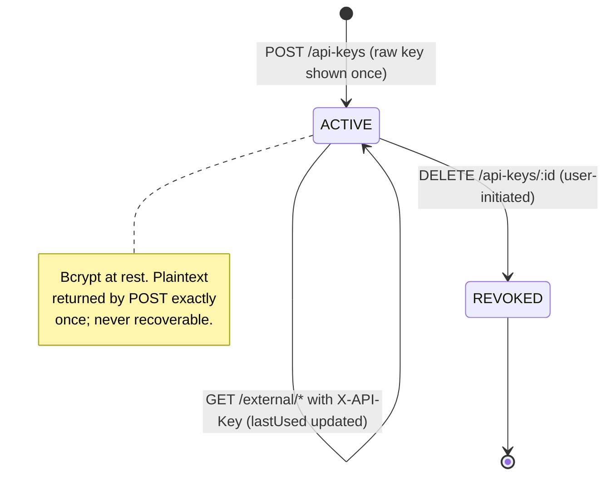

### 6.4. Row source lifecycle (issues / activities / comments)

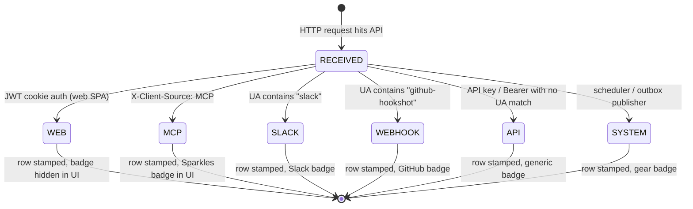

The `source` column is **terminal** — never updated after insert. The state machine is one-shot per row.

---

## 7. Schema changes

### 7.1. OAuth tables (migration `20260515_oauth_2_1_authorization_server`)

```sql
-- OAuth clients (RFC 7591 Dynamic Client Registration output)
CREATE TABLE oauth_clients (
  id                          UUID PRIMARY KEY DEFAULT gen_random_uuid(),
  client_id                   VARCHAR NOT NULL UNIQUE,
  client_secret               VARCHAR NULL,             -- NULL for public clients (PKCE-only)
  client_name                 VARCHAR NOT NULL,
  redirect_uris               TEXT[]  NOT NULL,         -- whitelisted at register, byte-matched at authorize+token
  scopes                      TEXT[]  NOT NULL DEFAULT ARRAY['mcp'],
  grant_types                 TEXT[]  NOT NULL DEFAULT ARRAY['authorization_code','refresh_token'],
  response_types              TEXT[]  NOT NULL DEFAULT ARRAY['code'],
  token_endpoint_auth_method  VARCHAR NOT NULL DEFAULT 'client_secret_basic',
                                                        -- 'none' for public (PKCE), 'client_secret_basic'/'_post' for confidential
  created_at                  TIMESTAMPTZ NOT NULL DEFAULT now()
);

-- Authorization codes (5-min TTL, single-use)
CREATE TABLE oauth_auth_codes (
  code                   VARCHAR PRIMARY KEY,           -- 32-byte base64url random
  client_id              VARCHAR NOT NULL REFERENCES oauth_clients(client_id) ON DELETE CASCADE,
  user_id                UUID    NOT NULL REFERENCES users(id) ON DELETE CASCADE,
  redirect_uri           VARCHAR NOT NULL,
  scopes                 TEXT[]  NOT NULL,
  code_challenge         VARCHAR NOT NULL,              -- base64url(SHA256(code_verifier))
  code_challenge_method  VARCHAR NOT NULL DEFAULT 'S256',
  resource               VARCHAR NULL,                  -- RFC 8707 resource indicator
  expires_at             TIMESTAMPTZ NOT NULL,
  created_at             TIMESTAMPTZ NOT NULL DEFAULT now()
);
CREATE INDEX idx_oauth_auth_codes_client ON oauth_auth_codes (client_id);

-- Access tokens (1h TTL, opaque, DB-resolved)
CREATE TABLE oauth_access_tokens (
  token       VARCHAR PRIMARY KEY,                      -- 32-byte base64url, prefixed bbpm_at_
  client_id   VARCHAR NOT NULL REFERENCES oauth_clients(client_id) ON DELETE CASCADE,
  user_id     UUID    NOT NULL REFERENCES users(id) ON DELETE CASCADE,
  scopes      TEXT[]  NOT NULL,
  resource    VARCHAR NULL,
  expires_at  TIMESTAMPTZ NOT NULL,
  created_at  TIMESTAMPTZ NOT NULL DEFAULT now()
);
CREATE INDEX idx_oauth_access_tokens_user    ON oauth_access_tokens (user_id);
CREATE INDEX idx_oauth_access_tokens_expires ON oauth_access_tokens (expires_at);
                                                        -- expires index supports the planned sweep job (Phase 3)

-- Refresh tokens (30d TTL, rotated on every use)
CREATE TABLE oauth_refresh_tokens (
  token       VARCHAR PRIMARY KEY,                      -- 32-byte base64url, prefixed bbpm_rt_
  client_id   VARCHAR NOT NULL REFERENCES oauth_clients(client_id) ON DELETE CASCADE,
  user_id     UUID    NOT NULL REFERENCES users(id) ON DELETE CASCADE,
  scopes      TEXT[]  NOT NULL,
  resource    VARCHAR NULL,
  expires_at  TIMESTAMPTZ NOT NULL,
  created_at  TIMESTAMPTZ NOT NULL DEFAULT now()
);
```

### 7.2. Source columns (migration `20260515064854_add_source_columns`)

```sql
-- Provenance: every write tells the reader which client created it.
-- Free-form VARCHAR (intentionally NOT a Prisma enum) so future clients
-- can be added by deploying a new value of `SourceLiteral` in TS without
-- another schema migration.

ALTER TABLE issues
  ADD COLUMN source VARCHAR(20) NOT NULL DEFAULT 'WEB';     -- WEB|MCP|SLACK|WEBHOOK|API|SYSTEM

ALTER TABLE activities
  ADD COLUMN source VARCHAR(20) NOT NULL DEFAULT 'WEB';

ALTER TABLE comments
  ADD COLUMN source VARCHAR(20) NOT NULL DEFAULT 'WEB';

-- Backfill: every existing row is from the web era.
-- (Default handles new inserts; existing rows pick up the default automatically.)
```

### 7.3. Planned: per-token scoping (Phase 1, Section 10)

```sql
-- Phase 1: read-only / project-scoped keys.
-- Adds explicit permission shape; existing rows default to "all" (NULL/empty).

ALTER TABLE api_keys
  ADD COLUMN scopes      TEXT[] NULL,                       -- e.g. ['mcp:read'], ['mcp:read','mcp:write']
  ADD COLUMN project_ids UUID[] NULL;                       -- empty / NULL = all projects user has access to

ALTER TABLE oauth_access_tokens
  ADD COLUMN project_ids UUID[] NULL;                       -- mirrored from client/consent at issuance

ALTER TABLE oauth_refresh_tokens
  ADD COLUMN project_ids UUID[] NULL;
```

### 7.4. Planned: audit log per request (Phase 2, Section 10)

```sql
-- Phase 2: queryable "what did this token do?" log.
CREATE TABLE external_request_audit (
  id              UUID PRIMARY KEY DEFAULT gen_random_uuid(),
  user_id         UUID NOT NULL REFERENCES users(id) ON DELETE CASCADE,
  credential_kind VARCHAR(20) NOT NULL,                       -- 'API_KEY' | 'BEARER'
  api_key_id      UUID NULL REFERENCES api_keys(id) ON DELETE SET NULL,
  oauth_client_id VARCHAR NULL REFERENCES oauth_clients(client_id) ON DELETE SET NULL,
  method          VARCHAR(8)   NOT NULL,                      -- GET/POST/PATCH/DELETE
  path            VARCHAR(200) NOT NULL,                      -- /api/external/issues/BBPM/12/comments
  status_code     INT          NOT NULL,
  source          VARCHAR(20)  NOT NULL,
  ip_address      INET         NOT NULL,
  user_agent      TEXT         NULL,
  duration_ms     INT          NOT NULL,
  created_at      TIMESTAMPTZ  NOT NULL DEFAULT now()
);
CREATE INDEX idx_audit_user_created    ON external_request_audit (user_id, created_at DESC);
CREATE INDEX idx_audit_client_created  ON external_request_audit (oauth_client_id, created_at DESC) WHERE oauth_client_id IS NOT NULL;
CREATE INDEX idx_audit_key_created     ON external_request_audit (api_key_id, created_at DESC) WHERE api_key_id IS NOT NULL;
```

---

## 8. End-to-end scenario

A realistic Friday afternoon trace exercising both delivery modes.

```
T+0:00      Dev "Alice" pastes BB-PM MCP URL into claude.ai → connector list
            claude.ai backend probes /.well-known, hits /api/oauth/register,
            opens browser tab to /oauth/authorize?...

T+0:01      Alice sees consent screen "claude.ai wants to: Read and write to
            your projects, issues, comments, and labels"; clicks Approve.
            BB-PM mints code (5min TTL), redirects browser → claude.ai callback.

T+0:01.2    claude.ai exchanges code at /api/oauth/token with PKCE verifier.
            BB-PM verifies SHA256(verifier) == challenge (constant-time),
            DELETEs code, INSERTs access_token (1h) + refresh_token (30d).
            Returns Bearer pair.

T+0:02      Alice asks claude.ai: "What's open in BBPM with priority HIGH?"
            claude.ai → MCP → POST /api/external/projects/BBPM/issues?status=...
            with Authorization: Bearer bbpm_at_…
            ApiKeyGuard resolves token → user, runs same filter logic as web UI.
            Returns 8 issues.

T+0:05      Alice: "Add a comment 'reproduced on staging — see ZP-4012' to BBPM-12"
            claude.ai → MCP → POST /api/external/issues/BBPM/12/comments
            Comment is created with source='MCP'.
            Notification system fans out:
              - in-app notification to assignee Tùng (source unchanged, NOTIFICATION
                table doesn't carry source — out of scope for now)
              - Slack DM to Tùng's mapped Slack user
            Comment row carries source='MCP'.

T+0:07      Tùng (a different user) opens BBPM-12 in browser.
            Sees Alice's comment with a Sparkles badge ("Bot via Alice's session").
            Tùng knows immediately: this is Alice delegating to Claude, not Alice typing.

T+1:00      Alice's access_token expires.
            Next claude.ai → MCP → API call returns 401 invalid_token.
            claude.ai's MCP wrapper catches 401, calls /api/oauth/token with
            refresh_token, gets new pair, retries the original call.
            User sees nothing — silent refresh.

T+8:00      Dev "Bob" also wants Claude access. Goes Profile → API Keys → Create.
            Names it "Claude Code on laptop", clicks Generate.
            Modal shows raw key bbpm_<56-hex> with copy-to-clipboard + warning
            "This key is shown once. Store it now or revoke and recreate."
            Bob pastes into ~/.claude/config.json → BBPM_API_KEY="...".
            Closes modal. Key in DB is bcrypt-hashed; raw value is gone.

T+8:05      Bob runs `claude` in his terminal: "Create BBPM SUB_TASK 'add fixture
            for ZP-4012 reproducer', assignee me".
            Claude Code launches bbpm-internal-mcp via npx, MCP proxies POST
            /api/external/issues with X-API-Key. Issue created with source='MCP'.

T+30:00     Failure scenario — Alice closes laptop without disconnecting.
            Refresh token still valid for 30 days.
            T+30 days: refresh_token naturally expires (no sweep needed).
            T+30 days +1: next claude.ai call returns 401, refresh returns
            invalid_grant. User must re-consent.

T+failure   Alternative — Alice realises her laptop was stolen.
            Goes to Profile → Connected Apps (planned, Phase 2 UI).
            Sees "claude.ai · Last used 4h ago · Disconnect" → clicks.
            POST /api/oauth/connectors/<clientId>/revoke → all rows for
            (userId, clientId) DELETEd from oauth_access_tokens and
            oauth_refresh_tokens. Future requests from the stolen laptop
            return 401 immediately.
```

---

## 9. Tech stack

| Component | Tech | Why |
|---|---|---|
| MCP server runtime | **Node 22 + `@modelcontextprotocol/sdk`** distributed via `npx` | MCP SDK is officially supported by Anthropic; npx delivery means users get latest tool catalog without manual install. Stateless → no Docker, no service. |
| MCP transport | **stdio (JSON-RPC) for local, streamable HTTP for remote** | stdio matches Claude Code / Desktop child-process model. Streamable HTTP needed for hosted clients (claude.ai, ChatGPT). Both supported by the SDK out of the box. |
| Tool argument validation | **Zod** | LLMs hallucinate field names; Zod schema rejects them before they hit the API. Same shape we'd want in the LLM-facing tool schema anyway. |
| AS framework | **NestJS 11 controllers** under `packages/api/src/oauth/` | Reuses BB-PM's existing DI, validation pipe, and exception filter. Avoids running a separate AS process. |
| AS persistence | **Postgres 16** (4 tables: clients, codes, access, refresh) | Same DB as the rest of BB-PM. Atomic INSERT/DELETE for single-use codes; rotation is a `$transaction([DELETE, INSERT])`. |
| Token format | **Opaque 32-byte base64url** (prefixed `bbpm_at_` / `bbpm_rt_`) | DB-resolved, not signed JWT. Lets us revoke instantly with a row delete; no signing key rotation problem. Trade-off vs JWT discussed in §11. |
| PKCE | **S256 mandatory** | `plain` is rejected. RFC 8252 baseline; OAuth 2.1 promotes from RECOMMENDED to REQUIRED. |
| Client auth | **HTTP Basic (default) + `client_secret_post` + `none` for public clients** | Public-client `'none'` is what claude.ai / ChatGPT use (browser-originated PKCE). Confidential clients (custom scripts) use Basic. |
| CORS | **Callback-based allowlist** in `main.ts` | Three layers: configured strict env list, loopback regex, hosted-LLM regex. Exposes `WWW-Authenticate` for OAuth discovery + `Mcp-Session-Id` for streamable HTTP. |
| API-key bcrypt | **bcryptjs cost 10**, indexed by 8-char `keyPrefix` | Validation is `O(1)` in expectation: narrow by prefix → ≤1 bcrypt compare per request. |
| Constant-time compare | **`node:crypto.timingSafeEqual`** | Used for client_secret and PKCE challenge compares. Length-equalised before call. |
| Source detection | **Pure function** in `common/source.ts` | Headers → `SourceLiteral` union; testable in isolation; called by `ApiKeyGuard` so every external request gets a source. |
| Discovery | **RFC 8414** at `/api/.well-known/oauth-authorization-server` | Canonical path that claude.ai / ChatGPT probe. Mirrored at the legacy `/api/oauth/.well-known/...` for backwards-compatibility. |
| Throttle | **`@nestjs/throttler`** — global 30/min/IP; `@Throttle({ default: { ttl: 60_000, limit: 10 } })` on `/oauth/register`; `60/min` on `/oauth/token` | Per-endpoint override needed because DCR (free, unauth) must be tighter than token exchange (legitimate refresh storms). |
| Observability (current) | **NestJS `Logger`** + access logs at reverse proxy | Adequate for current volume. Phase 2 of roadmap adds Prometheus metrics. |
| Observability (planned) | **`prom-client` histograms + audit table** (Phase 2) | Per-token latency histogram, per-endpoint counter, audit-table queryable view. |

---

## 10. Migration plan

### 10.1. Timeline

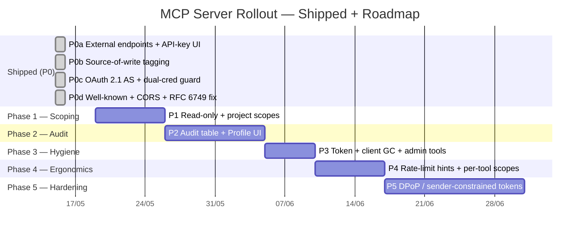

### 10.2. Phases

| Phase | Name | Output | Pain points fixed | Risk |
|---|---|---|---|---|
| **P0a** | External endpoints + API-key UI | `bbpm-internal-mcp` Phase 1 endpoints live (`projects`, `members`, `labels`, `comments`, `activities`); Profile → API Keys ships | (foundational, no P) | Low |
| **P0b** | Source-of-write tagging | `source` columns on `issues`/`activities`/`comments`; UI badges visible | (foundational) | Low |
| **P0c** | OAuth 2.1 AS | claude.ai / ChatGPT can onboard with consent flow; `ApiKeyGuard` accepts Bearer | — | Med (new auth path) |
| **P0d** | Well-known + CORS + raw response shape | claude.ai discovery actually works; CORS preflight passes | — | Low |
| **P1** | Per-credential scoping | `api_keys.scopes` + `api_keys.project_ids`; OAuth tokens carry `project_ids`; `ExternalController` enforces both | **P1** (per-key scoping), **P2** (coarse scopes) | Med |
| **P2** | Audit + connected-apps UI | `external_request_audit` table populated; Profile → Connected Apps + per-action filter | **P4** (no audit), **P7** (no admin UI) | Med |
| **P3** | Token + client GC | `pg_cron` (or NestJS scheduler) job deletes expired / orphaned rows nightly | **P3** (no sweep), **P6** (orphan clients) | Low |
| **P4** | Rate-limit hints + per-tool scopes | `Retry-After` exposed to MCP server; LLM gets structured back-off signal; tool-level scope (`bb:read:issue`, `bb:write:comment`) | **P8** (rate-limit blindness), **P9** (long-response), **P10** (tool discovery) | Low |
| **P5** | DPoP / sender-constrained tokens | Optional for high-value connectors (gated by a client-registration flag) | **P5** (no sender constraint) | High (cryptographic complexity) |

### 10.3. Per-phase task breakdown

#### Phase 1 — Per-credential scoping

**Goal:** A user can mint "read-only, project BBPM only" tokens / keys, and `ExternalController` refuses out-of-scope calls.

**Tasks:**
- [ ] Migration: `ALTER TABLE api_keys ADD COLUMN scopes TEXT[], project_ids UUID[]`
- [ ] Migration: `ALTER TABLE oauth_access_tokens / oauth_refresh_tokens ADD COLUMN project_ids UUID[]`
- [ ] `ApiKeyService.validateKey()` returns scopes + project_ids alongside user
- [ ] `ApiKeyGuard` attaches `request.scopes` + `request.allowedProjectIds`
- [ ] New decorator `@RequireScope('mcp:write')` for write endpoints
- [ ] `ExternalService` checks `request.allowedProjectIds.includes(project.id)` before delegating
- [ ] Profile → Create API Key dialog: scope selector (read-only / read-write) + project picker
- [ ] OAuth consent screen: surface the scope/project restrictions if the client registered with them
- [ ] Backfill: existing keys/tokens get `NULL` (= unrestricted, current behaviour)

**Acceptance:**
- Read-only API key returns `403 insufficient_scope` on `POST /external/issues`
- Project-scoped key returns `404` on a project not in `project_ids`
- Existing (un-scoped) keys keep working unchanged

**Rollback:** `ALTER TABLE … DROP COLUMN scopes, project_ids;` — feature flag `EXTERNAL_SCOPE_ENFORCEMENT=false` defaults to old behaviour and is removed only after a week of clean metrics.

#### Phase 2 — Audit table + Profile UI

**Goal:** Any user can see "what has Claude been doing on my behalf this week?" in the Profile UI, filtered by token.

**Tasks:**
- [ ] Migration: `CREATE TABLE external_request_audit` (Section 7.4 schema)
- [ ] Nest middleware: write one audit row per `/api/external/*` request after the handler returns
- [ ] Index: per-user, per-client, per-API-key time-range queries
- [ ] Retention: 90-day rolling delete (`pg_cron` or scheduler)
- [ ] Web: Profile → "Connected Apps" page
  - [ ] List active OAuth clients with `last_used` + `total_requests_30d`
  - [ ] Click → detail page with request list (method + path + status + when)
  - [ ] Per-client Disconnect button
- [ ] Web: Profile → "API Keys" gains the same activity view per key

**Acceptance:**
- Every `/api/external/*` request appears in the audit table within 1s of the response
- Profile page lists Alice's claude.ai connector with last 24 h of requests
- Click "Disconnect" → all tokens for `(user, clientId)` deleted; next request returns 401

**Rollback:** Drop the table + middleware; UI hidden behind a feature flag.

#### Phase 3 — Token + client GC

**Goal:** Dead OAuth rows don't accumulate; orphan clients are cleaned up.

**Tasks:**
- [ ] NestJS `@Cron('0 4 * * *')` (daily 04:00):
  - `DELETE FROM oauth_auth_codes WHERE expires_at < now()`
  - `DELETE FROM oauth_access_tokens WHERE expires_at < now() - INTERVAL '7 days'`
    (keep a 7-day grace so audit queries by-token still resolve)
  - `DELETE FROM oauth_refresh_tokens WHERE expires_at < now()`
  - `DELETE FROM oauth_clients WHERE id NOT IN (active tokens) AND created_at < now() - INTERVAL '90 days'`
- [ ] Metric: per-run row counts deleted
- [ ] Alert: deleted count > 10× rolling 7-day mean (anomaly = registration storm)

**Acceptance:**
- After 1 week, table row counts plateau under normal usage
- Test: register 100 clients without any consent → all GC'd 90 days later

**Rollback:** Comment out the `@Cron` decorator; nothing else to undo.

#### Phase 4 — Rate-limit hints + per-tool scopes

**Goal:** LLMs back off gracefully and don't have to call `list_members` to know the right verb.

**Tasks:**
- [ ] `ThrottlerGuard` response: include `Retry-After: <seconds>` and `X-RateLimit-Remaining`
- [ ] `bbpm-internal-mcp`: surface 429 as a tool error with structured `retryAfterSeconds`
- [ ] Tool descriptions in MCP catalog: include "before-call hints" — e.g. `bb_create_issue` description says "Call `bb_list_members` first if you don't have an assignee UUID"
- [ ] Per-tool scope tags: `mcp:read:issue`, `mcp:write:issue`, `mcp:write:comment`, …
- [ ] Consent screen renders the tool-level scopes (more granular than today's "Read and write")

**Acceptance:**
- LLM observed to back off and retry on 429 instead of failing the conversation
- Read-only client's consent screen shows distinct tool capabilities

**Rollback:** Default scope set continues to be `mcp` (the broad one); tool-level scopes are additive.

#### Phase 5 — DPoP / sender-constrained tokens

**Goal:** A leaked Bearer token cannot be used from a different machine.

**Tasks:**
- [ ] OAuth registration accepts `require_dpop: true`
- [ ] Token endpoint accepts `DPoP` header (signed JWT with public key + HTTP method + URL + nonce)
- [ ] `ApiKeyGuard` validates `DPoP` signature against the `cnf.jkt` claim stored in `oauth_access_tokens.dpop_jkt` (new column)
- [ ] Per-request nonce challenge if the client's clock skew is high
- [ ] `bbpm-internal-mcp`: implement DPoP signing using `jose`
- [ ] Documentation: when to require DPoP (prod-write connectors), when it's overkill (analytics agent)

**Acceptance:**
- Token captured from a DPoP-required client fails when replayed without DPoP
- Token captured + replayed with a *different* private key fails signature check

**Rollback:** `require_dpop` defaults to `false`; existing clients unaffected.

### 10.4. Rollback strategy across phases

Every phase is guarded by a feature flag in BB-PM API config:

| Phase | Flag | Default during rollout | Default after stable |
|---|---|---|---|
| P1 | `EXTERNAL_SCOPE_ENFORCEMENT` | `false` for 1 week | `true` |
| P2 | `EXTERNAL_AUDIT_ENABLED` | `true` (writes only) for 1 week before UI ships | `true` |
| P3 | `OAUTH_GC_ENABLED` | `false` until verified in staging | `true` |
| P4 | `MCP_RATE_LIMIT_HINTS` | `true` (additive header) | `true` |
| P5 | `OAUTH_DPOP_AVAILABLE` | `false` (opt-in per client) | `false` (still opt-in) |

Flags live in `ConfigService`; flipping them is a config reload, not a deploy.

---

## 11. Trade-offs

| Decision | Pros | Cons | Mitigation |
|---|---|---|---|
| **MCP server as separate `npx` package, not bundled in BB-PM API** | BB-PM API stays pure HTTPS. MCP protocol churn absorbed externally. Users update with `@latest`. No core API redeploy needed. | Two-package coordination. Stale `bbpm-internal-mcp` on a user's machine can mismatch BB-PM API surface. | Tool schemas in `bbpm-internal-mcp` are versioned. `bb_health` tool returns BB-PM API version + required MCP version; LLM can warn user. |
| **Opaque DB-resolved tokens instead of signed JWT** | Instant revocation by row delete; no key-rotation problem; no JWT clock-skew issues. Token contents never leak. | One DB read per authenticated request (resolved through `oauth_access_tokens` index). | Index on `token` PK is O(1); per-request cost ~0.2ms. If it ever matters, add a per-process LRU cache keyed by token hash with a 60s TTL. |
| **Public-client PKCE (`token_endpoint_auth_method: 'none'`) for hosted LLMs** | Matches OAuth 2.1 + RFC 8252 for browser-flow apps. No shared secret to leak from the LLM host's backend. | Anyone who can intercept the redirect (rare with TLS) plus the code_verifier can forge a token. | PKCE S256 + 5-min code TTL + single-use code consume make practical exploitation extremely narrow. |
| **Dynamic Client Registration is `@Public()`** | Zero-friction onboarding for hosted LLMs. Matches MCP spec expectations. | Anyone can mint a `client_id`. Tables can grow. | Throttle 10/min/IP; consent screen still requires end-user approval to grant any authority. Phase 3 GC cleans orphans. |
| **Single `ApiKeyGuard` accepts both X-API-Key and Bearer** | Controllers stay auth-agnostic. One place to grep for "what's exposed externally". | The guard's name is misleading once it also handles Bearer. | Documented (Section 3.2); rename deferred — renaming a guard touches every external controller decorator. Cost > benefit today. |
| **OAuth consent screen runs in the React SPA, not in the API** | Single source of truth for "is this user logged in" (JWT cookie). Visual consistency with rest of BB-PM. Users see a familiar URL. | Two services participate in the OAuth flow (API + Web). Deploying out-of-sync versions can break the handshake. | Both deploy from the same monorepo at the same commit. `OAuthAuthorizePage` validates AS metadata before submitting. |
| **`source` column is `VARCHAR` not enum** | Add new clients (`MOBILE`, `CI`, `JIRA_IMPORT`) without a schema migration. | Typos in `SourceLiteral` won't be caught by the DB. | Pure-function `detectSourceFromHeaders` is the only writer; type-checked at compile time. |
| **No per-key scoping in P0** | Ship fast; smallest possible surface for first MCP rollout. Matches the threat model ("developer wants to lend Claude their own auth for a session"). | Cannot mint read-only / project-scoped credentials today. P1 risk register entry. | Phase 1 lifts this (Section 10). UI for it ships before the threat model needs it. |
| **Refresh tokens rotated on every use (consume-once)** | Detects replay: legitimate + attacker copy both fail next refresh. RFC 6819 best practice. | Two concurrent hosts (e.g. claude.ai on laptop + same account on iPad) cannot share a refresh token. | Out of scope — MCP semantics assume one host per token pair. If a user adds a second host, they get a second client registration + token pair. |
| **Bearer tokens are opaque, not JWT** (revisited as a feature) | Revocation is a `DELETE`. No JWT signing-key rotation problem. Resists offline analysis. | Cannot validate without a DB lookup; can't use signed-token shortcuts (e.g. trusting a token at a CDN edge). | We don't have an edge layer that needs offline validation, so the trade-off is free. |

---

## 12. Acceptance criteria & SLOs

### 12.1. Functional acceptance

| # | Scenario | Expected |
|---|---|---|
| AC1 | Alice's BB-PM user is `ACTIVE`. She creates an API key and runs Claude Code → `bb_list_projects`. | 200 OK; list matches the projects Alice is a member of (same as web UI). |
| AC2 | Alice's user gets soft-deleted (`status='DELETED'`). | Next MCP call returns `401 Unauthorized` immediately; API key row still exists but is unusable. |
| AC3 | claude.ai connector is added. Handshake completes. | `oauth_clients` row exists; consent recorded; access + refresh tokens minted; first `bb_*` tool call succeeds within 30s of "Add Connector" click. |
| AC4 | claude.ai access token expires after 1 h. Next tool call returns 401. | claude.ai backend exchanges refresh token; new access token issued; user sees no error. |
| AC5 | Alice clicks Disconnect on her claude.ai connector. | All `oauth_access_tokens` + `oauth_refresh_tokens` rows for `(Alice, claudeClientId)` deleted; next claude.ai call returns 401. |
| AC6 | Alice's MCP-driven create-issue assigns to Tùng. | `issues.source='MCP'`, `activities.source='MCP'` for the create activity; Tùng's Slack DM shows the issue normally; Sparkles badge appears next to the issue in Tùng's board view. |
| AC7 | Attacker replays Alice's authorization code (intercepted somehow). | Second exchange returns `400 invalid_grant`; code was DELETE'd on first exchange. |
| AC8 | Attacker submits valid code but wrong PKCE verifier. | `400 invalid_grant` "PKCE verifier mismatch"; code still DELETE'd (no replay window). |
| AC9 | Attacker replays Alice's old refresh token after Alice's legitimate refresh. | `400 invalid_grant`; legitimate Alice's next refresh also fails because the row was already consumed; Alice forced to re-consent. |
| AC10 | claude.ai sends `redirect_uri` at token exchange different from authorize-time value. | `400 invalid_grant` "redirect_uri does not match". |
| AC11 | A confidential client (`token_endpoint_auth_method='client_secret_basic'`) sends no `Authorization` header. | `401 client_secret required`. |
| AC12 | A public client (`'none'`) sends a `client_secret`. | `401 Public client must not present a client_secret`. |
| AC13 | MCP Inspector at `http://localhost:6274` calls `POST /api/oauth/register`. | CORS preflight allowed by loopback regex; registration succeeds; access tokens work. |

### 12.2. SLOs

| Metric | Target |
|---|---|
| `ApiKeyGuard` P95 latency (X-API-Key path) | < 25 ms (bcrypt-compare bound) |
| `ApiKeyGuard` P95 latency (Bearer path) | < 5 ms (one indexed PK lookup) |
| `/api/external/issues/:projectKey/:issueNumber` P95 | < 250 ms |
| `/api/external/projects/:projectKey/digest?days=7` P95 | < 800 ms |
| `/api/oauth/token` P95 (authorization_code) | < 100 ms |
| `/api/oauth/token` P95 (refresh_token) | < 100 ms |
| `/api/oauth/register` P95 | < 50 ms |
| OAuth handshake end-to-end (user click → first usable token) | P95 < 8 s |
| Stolen access token usable window | ≤ 1 h (= access TTL); ≤ 5 min if user disconnects |
| Stolen refresh token replay → both copies fail | 100% of the time (consume-once invariant) |
| Source-tag classification accuracy (vs ground truth in tests) | > 99.9% (only failure is misconfigured client UA) |
| Audit row write lag after request (Phase 2) | P99 < 100 ms |
| Token GC sweep duration (Phase 3, nightly) | < 30 s on 100K rows |

---

## 13. Risk register

| # | Risk | P | I | Mitigation |
|---|---|---|---|---|
| R1 | Single key without scopes equals user password | High | High | Phase 1 (`EXTERNAL_SCOPE_ENFORCEMENT`) lands per-key scopes. Until then: bcrypt at rest + revocable from UI + raw value shown once. |
| R2 | Stolen Bearer token in 1 h window | Med | Med | Token TTL = 1 h (vs 30 d industry default for bearer). DPoP roadmap (Phase 5) for high-value connectors. Disconnect UI (Phase 2) for immediate revocation. |
| R3 | DCR abuse — registration storm | Low | Low | Throttle 10/min/IP at `@Throttle({ default: { ttl: 60_000, limit: 10 } })`. Phase 3 GC cleans orphans automatically. |
| R4 | OAuth tables grow unbounded | Med | Low | Phase 3 GC cron. Audit table (Phase 2) has 90-day rolling delete. Operations metric tracks row counts per table. |
| R5 | Refresh-token replay race | Low | High | Eager `DELETE` on consume; transaction wraps the new pair insert; PK contention is the only way to win, which Postgres serialises. |
| R6 | PKCE downgrade attack (client requests `plain`) | Low | High | Service rejects anything but `S256` at authorize time. Code review enforces it on every change to `OAuthService.mintAuthorizationCode`. |
| R7 | Open-redirect via maliciously registered `redirect_uri` | Low | Med | At register: must be `https://` or `http://localhost/127.0.0.1/[::1]`. At authorize: byte-equal match against the registered list. At token exchange: byte-equal match against authorize-time value. |
| R8 | CORS allowlist too permissive (claude.ai subdomain takeover, etc.) | Low | Med | Regex anchored on full domain (`^https://([a-z0-9-]+\.)?(claude\.ai|...)$`). Subdomain takeover would still require valid OAuth flow. Periodic regex audit. |
| R9 | Source-tagging spoofed by malicious external client | Low | Low | `X-Client-Source` is informational only. It doesn't grant any authority. Worst case is a row mislabelled in the UI. |
| R10 | MCP Inspector / dev tools used against prod | Low | Med | Inspector is allowlisted on localhost only — production is reached only by going through `claude.ai` / `chatgpt.com` regex. No bypass through the dev allowlist. |
| R11 | OAuth audit log itself becomes a target (writes during incident response) | Med | Low | Phase 2 audit table is append-only at the app layer. No `UPDATE`/`DELETE` paths exposed. DB role for the app cannot modify rows after insert (planned RBAC). |
| R12 | LLM convinces user to grant a malicious connector | Med | High | Consent screen shows client name from `oauth_clients.client_name` (admin-renamed to "Untrusted: <name>" if flagged). Disconnect UI is one click. No silent re-grant on token expiry — full consent required. |
| R13 | `bbpm-internal-mcp` upstream npm compromise | Low | High | Package version pinned in user's MCP config (`@1.x.x`); not always `@latest`. Signed npm tarball + provenance attestations (future, Phase 5+). Dependency review on every release. |

---

## 14. Next steps

1. **Phase 1 kickoff — per-credential scoping.** Open issue on the implementation plan; schema migration for `api_keys.scopes` + `api_keys.project_ids` is the first work unit.
2. **Phase 2 prep — audit middleware.** Decide whether to write audit rows inline (cheap, blocks request) or via the existing outbox publisher (decoupled, ~100 ms delay). Trade-off worth a short ADR.
3. **Documentation followup.** Add a one-page **end-user guide** under `docs/architecture/mcp/user-guide.md` explaining: "How to add BB-PM to Claude Desktop / claude.ai / Cursor". Worth its own doc because the audience is non-technical staff onboarding their team.
4. **Inspector dry-run.** Before Phase 1 ships, do a recorded session with MCP Inspector hitting the OAuth flow on staging and capture failure-mode traces (the "real" client-experience tests). Findings feed into Phase 4 ergonomics tasks.
5. **Threat-model review with security peer.** Sections 8 + 13 of [`oauth-server-design.md`](./oauth-server-design.md) are the highest-leverage review surface; book a 30-min walk-through.

**Open questions / deeper dives:**

- Should DPoP (Phase 5) be required for *any* MCP client by default, with `require_dpop: false` as opt-out? Or opt-in by default with a per-project policy? — needs a security-vs-UX trade-off doc.
- Long-running tool calls (e.g. `bb_search` returning 1000 issues): should we adopt MCP's streaming response format, or paginate at the tool level? — needs a benchmarks doc against real LLM context budgets.
- Should the audit log feed Slack notifications ("Claude on Alice's behalf created 14 issues in the last hour — review?"). Tiered detection — needs an event-rate study before designing.
