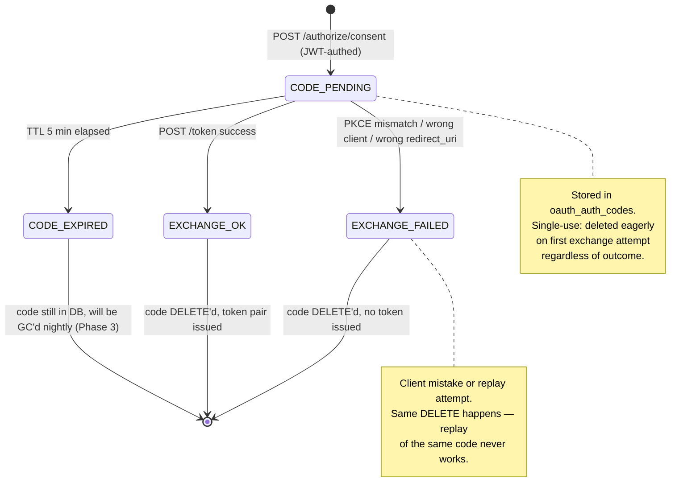
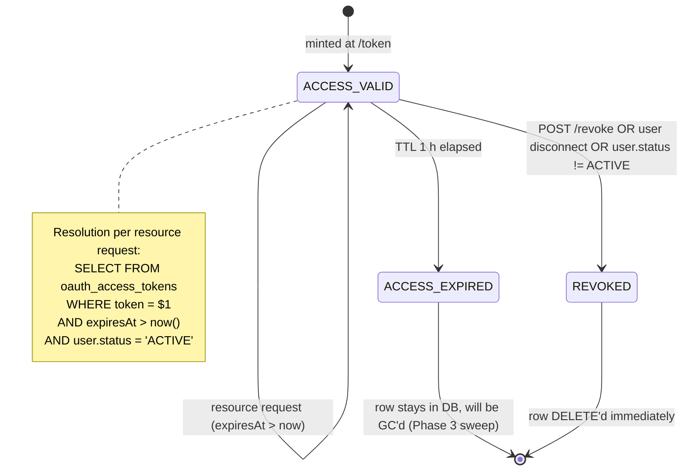
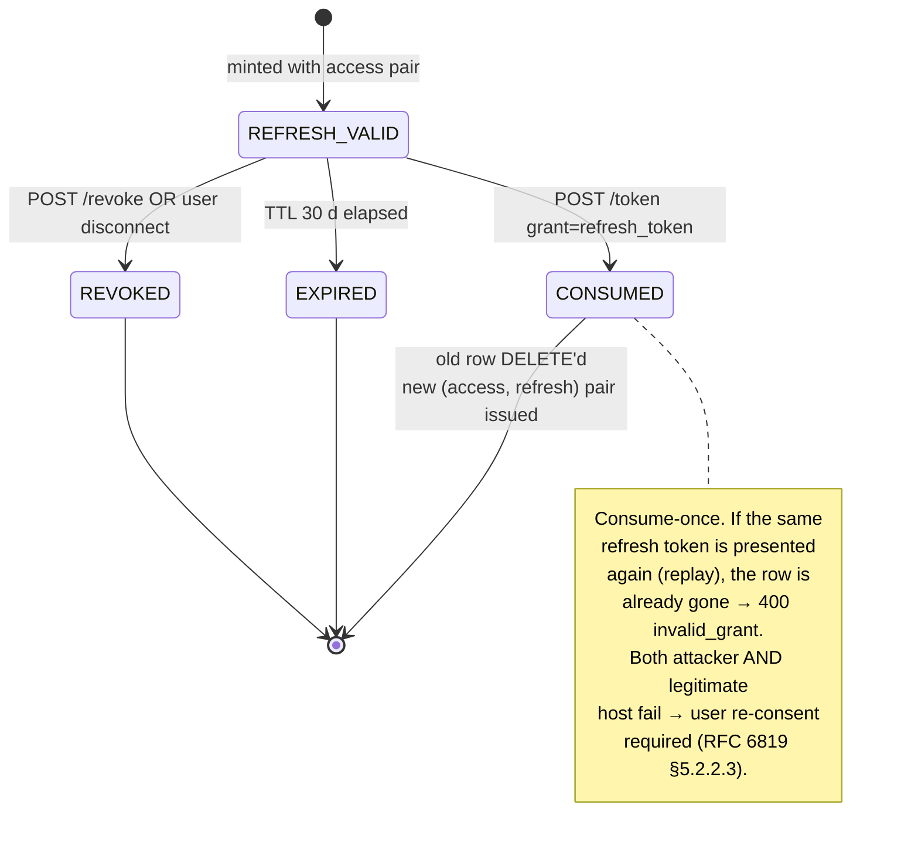

# OAuth Authorization Server Design

> **Scope:** Deep-dive on the **OAuth 2.1 Authorization Server** hosted at `https://pm.burningbros.kr/api/oauth/*` plus the discovery endpoint at `/api/.well-known/oauth-authorization-server`. Covers token lifecycle, PKCE verification math, single-use / consume-once invariants, the consent-screen-in-SPA architectural split, failure modes, observability, and what would break if you misimplemented each invariant.
>
> **Related:**
> - [`./mcp-architecture.md`](./mcp-architecture.md) — Parent architecture; where the AS sits in the system
> - [`./implementation-plan.md`](./implementation-plan.md) — Phased rollout; this component shipped as P0c
> - [`../../changelogs/mcp-changelog.md`](../../changelogs/mcp-changelog.md) — Commit history

---

## 1. Responsibility

The AS is responsible for:

- Issuing **authorization codes** to authenticated BB-PM users on behalf of registered OAuth clients (RFC 6749 §4.1, OAuth 2.1 §1.3.1).
- Exchanging authorization codes for **access + refresh token pairs** under PKCE S256 verification (RFC 7636).
- Rotating refresh tokens on each use under consume-once semantics (RFC 6819 §5.2.2.3, OAuth 2.1 §4.3.1).
- Resolving Bearer tokens to `(userId, scopes, clientId)` for the `ApiKeyGuard`.
- Revoking tokens (RFC 7009).
- Accepting **Dynamic Client Registration** (RFC 7591) under throttle.
- Publishing **AS metadata** (RFC 8414) under both the canonical (`/.well-known/oauth-authorization-server` mounted at API root) and legacy (`/oauth/.well-known/...`) paths.

It is **not** responsible for:

- Authenticating users (delegated to the BB-PM JWT cookie session; the consent screen runs inside the React SPA).
- Authorizing access to specific resources (`ApiKeyGuard` + project membership + role guards do that on every `/api/external/*` call).
- Storing client-side key material — Bearer tokens are opaque (DB-resolved), not JWT.
- Multi-tenant isolation of OAuth clients (one tenant: BB-PM itself).

---

## 2. Why this component exists

Before the OAuth 2.1 rollout, BB-PM had exactly one non-interactive auth path: long-lived `X-API-Key` (bcrypt-hashed, indexed by 8-char `keyPrefix`). That works for **developer clients** (Cursor, Claude Code, scripts) — the user pastes a value into a `.env` file, the same value is used forever, and revocation is a manual `DELETE FROM api_keys`.

It does **not** work for **hosted LLM clients** (claude.ai web custom connectors, ChatGPT remote MCP, Anthropic Workbench, future similar):

- The user expects a "Connect" button that opens a browser tab and returns them logged-in. No copy-paste.
- The host (claude.ai backend) holds the credential, not the user — so we want short TTL and rotation.
- The host may register thousands of clients (one per user, per workspace, per connector). We need Dynamic Client Registration (RFC 7591), not a manual admin step.
- The host is browser-originated; its "client secret" is unreliable. PKCE replaces it for public clients (OAuth 2.1 §1.4).

**Two alternatives considered:**

1. **Use an external IdP (Clerk, WorkOS, Auth0)** with BB-PM as a downstream resource server.
   *Rejected*: introduces a second identity store. BB-PM's `users` table is the system of record for permissions; bridging that to an external IdP doubles the surface area.
2. **Issue signed JWT access tokens instead of DB-resolved opaque tokens.**
   *Rejected*: instant revocation is the load-bearing requirement (compromised connector → click Disconnect → done). With JWT we'd need a revocation list of equivalent size. The DB lookup is cheap (one indexed PK read).

The chosen design — **BB-PM itself is the AS** with **opaque, DB-resolved Bearer tokens** — has one drawback (one DB round-trip per request) and a long list of operational benefits (revocation, key rotation moot, audit alignment with existing tables).

---

## 3. Inputs & outputs

### 3.1. Inputs

| Source | Channel | Shape |
|---|---|---|
| OAuth client (host backend) | `POST /api/oauth/register` | RFC 7591 body: `client_name`, `redirect_uris[]`, optional `grant_types[]`, `response_types[]`, `scope`, `token_endpoint_auth_method` |
| OAuth client (host) | `POST /api/oauth/token` | `grant_type` ∈ {`authorization_code`, `refresh_token`} + grant-specific params + client auth (Basic or post body) |
| OAuth client | `POST /api/oauth/revoke` | RFC 7009 body: `token` + client auth |
| User (via React) | `POST /api/oauth/authorize/consent` (JWT cookie) | `client_id`, `redirect_uri`, `scope`, `code_challenge`, `code_challenge_method`, `state`, `resource?` |
| User (via React) | `GET /api/oauth/authorize/client?client_id=…` (JWT cookie) | client discovery for the consent UI |
| Any client | `GET /api/.well-known/oauth-authorization-server` | RFC 8414 metadata request |
| Any client | `POST /api/oauth/userinfo` (Bearer) | userinfo request |
| `ApiKeyGuard` | function call `resolveAccessToken(token)` | bare token string |

### 3.2. Outputs

| Sink | Channel | Shape |
|---|---|---|
| OAuth client | `200` from `POST /token` | `{ access_token, token_type: 'Bearer', expires_in, refresh_token, scope }` |
| OAuth client | `200` from `POST /register` | Client credentials envelope (incl. `client_id`, optional `client_secret`) |
| Browser | `302` from `/oauth/authorize/consent` | Redirect to `redirect_uri?code=…&state=…` or `?error=…&state=…` |
| Any client | `200` from `/.well-known/oauth-authorization-server` | RFC 8414 metadata JSON |
| `ApiKeyGuard` | function return | `{ userId, email, clientId, clientName, scopes }` or `null` |
| Postgres | `INSERT` / `DELETE` | rows in `oauth_clients`, `oauth_auth_codes`, `oauth_access_tokens`, `oauth_refresh_tokens` |

### 3.3. Side effects

- **DB writes:** the 4 OAuth tables; `users.refresh_token` is **not** touched (that's the web JWT refresh; orthogonal).
- **DB reads:** `oauth_clients` per `/token` call; `oauth_access_tokens` per Bearer-authed `/api/external/*` request; `users` per Bearer (to gate `status='ACTIVE'`).
- **Logs:** Nest `Logger` info-level for every mint / revoke; warn-level for every reject.
- **No external API calls.** The AS is self-contained.

---

## 4. Internal design

### 4.1. State machine — Authorization code lifecycle



### 4.2. State machine — Access token lifecycle



### 4.3. State machine — Refresh token lifecycle



### 4.4. Core loop — `OAuthService.exchangeCode`

```typescript
// packages/api/src/oauth/oauth.service.ts (paraphrased)
async exchangeCode(input: TokenExchangeCodeInput) {
  // 1. AuthN the client (Basic / post body / 'none' for public).
  const client = await this.requireClient(input.client_id, input.client_secret);

  // 2. Load the code OR fail closed.
  const authCode = await prisma.oAuthAuthCode.findUnique({
    where: { code: input.code },
  });
  if (!authCode) throw new BadRequestException('Invalid or expired code');

  // 3. EAGER DELETE — invariant: a code can be presented at most once for exchange,
  //    regardless of whether the exchange succeeds. This defeats replay.
  await prisma.oAuthAuthCode.delete({ where: { code: input.code } });

  // 4. Validate temporal + identity + binding.
  if (authCode.expiresAt < new Date())       throw new BadRequestException('Authorization code expired');
  if (authCode.clientId !== client.clientId) throw new BadRequestException('Code was issued to a different client');
  if (authCode.redirectUri !== input.redirect_uri) {
    throw new BadRequestException('redirect_uri does not match authorize-time value');
  }

  // 5. PKCE: SHA256(verifier) base64url-encoded must equal stored challenge.
  const computed = createHash('sha256').update(input.code_verifier).digest('base64url');
  if (!constantTimeEqual(computed, authCode.codeChallenge)) {
    throw new BadRequestException('PKCE verifier mismatch');
  }

  // 6. Mint pair atomically.
  return this.issueTokenPair(
    authCode.userId,
    client.clientId,
    authCode.scopes,
    authCode.resource ?? input.resource,
  );
}

private async issueTokenPair(userId, clientId, scopes, resource) {
  const accessToken = `bbpm_at_${randomBytes(32).toString('base64url')}`;
  const refreshToken = `bbpm_rt_${randomBytes(32).toString('base64url')}`;
  const accessExpiresAt  = new Date(Date.now() + this.accessTokenTtlSeconds * 1000);
  const refreshExpiresAt = new Date(Date.now() + this.refreshTokenTtlSeconds * 1000);

  await prisma.$transaction([
    prisma.oAuthAccessToken.create({ data: { token: accessToken, clientId, userId, scopes, resource, expiresAt: accessExpiresAt } }),
    prisma.oAuthRefreshToken.create({ data: { token: refreshToken, clientId, userId, scopes, resource, expiresAt: refreshExpiresAt } }),
  ]);

  return {
    access_token: accessToken,
    token_type: 'Bearer',
    expires_in: this.accessTokenTtlSeconds,
    refresh_token: refreshToken,
    scope: scopes.join(' '),
  };
}
```

### 4.5. Configuration

| Setting | Default | Why |
|---|---|---|
| `OAUTH_ACCESS_TOKEN_TTL` | `3600` (1 h) | Short enough that a stolen token has limited usefulness. Long enough that refresh storms are rare under normal LLM tool usage. |
| `OAUTH_REFRESH_TOKEN_TTL` | `2592000` (30 d) | Hosted clients (claude.ai) reconnect monthly without prompting; longer than that and stolen refresh tokens become valuable. |
| `OAUTH_AUTH_CODE_TTL` | `300` (5 min, hard-coded) | RFC 6749 recommends "as short as practical". 5 min covers slow user reading the consent screen + browser redirect chain. |
| `OAUTH_REGISTER_THROTTLE` | `10 req / 60 s / IP` | DCR is `@Public()`; this is the only abuse cap. |
| `OAUTH_TOKEN_THROTTLE` | `60 req / 60 s / IP` | Higher than register: legitimate refresh storms (many users, single host IP) need headroom. |
| Token alphabet | base64url(32 bytes) | 256 bits of entropy. `_at_` / `_rt_` prefixes for visual + log differentiation. |
| Code alphabet | base64url(32 bytes) | Same — no need to distinguish codes from tokens because they live in different tables. |
| Allowed `code_challenge_method` | `['S256']` | OAuth 2.1 forbids `plain`. Service rejects anything else with `400`. |
| Allowed `token_endpoint_auth_method` | `client_secret_basic` (default), `client_secret_post`, `none` (public/PKCE) | `none` for hosted LLMs (browser-originated PKCE). |
| Redirect-URI scheme allowlist | `https://` OR `http://(localhost|127.0.0.1|[::1])` | OAuth 2.1 + RFC 8252; loopback for native apps + dev. |

---

## 5. Decision logic

### 5.1. PKCE verification algorithm

```
input:  codeChallenge   (stored at consent time)
        codeVerifier    (presented at /token time)
        codeChallengeMethod = 'S256' (enforced at consent)
output: PASS or FAIL

1. computed = base64url(SHA256(UTF8(codeVerifier)))
2. if length(computed) != length(codeChallenge): FAIL
3. compare using constant-time:
     for each byte: result |= computed[i] XOR codeChallenge[i]
     PASS iff result == 0
```

The constant-time compare is `node:crypto.timingSafeEqual`. Length must be pre-equalised because the function throws on length mismatch — we equalize implicitly by checking length first.

### 5.2. Worked examples

**Example 1: Successful exchange.**

| Input | Value |
|---|---|
| `code_verifier` | `dBjftJeZ4CVP-mB92K27uhbUJU1p1r_wW1gFWFOEjXk` (43 chars) |
| `code_challenge` (stored) | `E9Melhoa2OwvFrEMTJguCHaoeK1t8URWbuGJSstw-cM` |
| `SHA256(verifier)` base64url | `E9Melhoa2OwvFrEMTJguCHaoeK1t8URWbuGJSstw-cM` |

→ **PASS**: computed equals stored.

**Example 2: PKCE downgrade attempt (`plain` method).**

| Input | Value |
|---|---|
| `code_challenge_method` requested at `/authorize/consent` | `plain` |

→ **REJECT at consent time**: `OAuthService.mintAuthorizationCode` throws `BadRequestException('Only PKCE code_challenge_method=S256 is supported')`. Never reaches token exchange.

**Example 3: Code presented to wrong client.**

| Input | Value |
|---|---|
| `authCode.clientId` (stored) | `bbpm_client_A` |
| `client.clientId` (presented at `/token`) | `bbpm_client_B` |

→ **REJECT after delete**: `BadRequestException('Code was issued to a different client')`. Code already DELETE'd, so legitimate `client_A` also cannot replay.

**Example 4: Code replay attempt.**

| Step | Outcome |
|---|---|
| First `/token` call (legitimate) | Code exists → DELETE → token pair issued |
| Second `/token` call (attacker, same code) | `findUnique` returns `null` → `BadRequestException('Invalid or expired code')` |

→ **REPLAY PROOF**: the eager DELETE makes the code unreachable on the second try.

**Example 5: Refresh-token replay race.**

| Step | Outcome |
|---|---|
| T0: Legitimate refresh from host | `findUnique` returns row → DELETE → new pair issued |
| T0+ε: Attacker replays same refresh token | `findUnique` returns null → `400 invalid_grant` |
| T1h: Host's new access token expires; tries to refresh again with the *new* refresh from T0 | New token still in DB → DELETE → pair issued |

→ **ASYMMETRIC OUTCOME**: only the host that got the new pair at T0 can refresh again. If the attacker had won the race instead, both copies would fail at T1h and the user is forced to re-consent (which is the desired outcome of detecting replay).

### 5.3. Redirect-URI validation algorithm

```
input:  uri (string)
output: VALID or INVALID

1. parse uri as URL (rejects malformed)
2. if uri.protocol == 'https:': VALID
3. else if uri.protocol == 'http:' AND uri.hostname in {localhost, 127.0.0.1, [::1]}: VALID
4. else: INVALID

At consent time:
5. require uri to be exactly one of the strings in client.redirect_uris (byte-equal)
6. INVALID otherwise

At token-exchange time:
7. require uri to byte-equal authCode.redirectUri
8. INVALID otherwise
```

The three-step check (register, authorize, exchange) is intentional. Each step protects against a different attack:

- Register: blocks an attacker from registering a `redirect_uri` they don't control (subdomain takeover etc. is the residual risk, mitigated by CORS allowlist).
- Authorize: blocks an attacker from injecting an alternative `redirect_uri` into a legitimate handshake.
- Exchange: blocks an attacker from substituting a `redirect_uri` between authorize and exchange (mismatch attack RFC 6819 §4.4.1.7).

### 5.4. Client authentication

```
parse Authorization header for "Basic <base64(client_id:client_secret)>"
fallback: parse body for client_id and client_secret

if client.token_endpoint_auth_method == 'none' (public client):
  if client_secret present:           REJECT (401 — public clients must not present a secret)
  return client                       (PKCE is the binding instead)

else (confidential client):
  if !client_secret OR !client.client_secret:   REJECT (401 — secret required)
  if !timingSafeEqual(presented, stored):       REJECT (401 — invalid secret)
  return client
```

Constant-time comparison via `node:crypto.timingSafeEqual` after length-equalisation.

---

## 6. Failure modes

| # | Failure | Detection | Response |
|---|---|---|---|
| F1 | Code presented after expiry (5 min) | `authCode.expiresAt < now()` | `400 invalid_grant`; code DELETE'd already by step 3 of exchange |
| F2 | Code presented to wrong client | `authCode.clientId !== client.clientId` | `400 invalid_grant` `Code was issued to a different client` |
| F3 | Code presented with mismatched `redirect_uri` | byte-compare fails | `400 invalid_grant` `redirect_uri does not match` |
| F4 | PKCE verifier mismatch | `SHA256(verifier) !== stored challenge` (constant-time) | `400 invalid_grant` `PKCE verifier mismatch` |
| F5 | Code replayed | `findUnique` returns null on second call | `400 invalid_grant` `Invalid or expired code` |
| F6 | Refresh token expired | `expiresAt < now()` | `400 invalid_grant` |
| F7 | Refresh token replayed (consume-once violation) | row already deleted | `400 invalid_grant` (both legit + attacker fail; user re-consent) |
| F8 | Refresh token belongs to another client | `existing.clientId !== client.clientId` | `400 invalid_grant` |
| F9 | Refresh asks for additional scope | requested ⊄ existing.scopes | `400 invalid_scope` |
| F10 | Public client sends client_secret | `client.tokenEndpointAuthMethod === 'none' && clientSecret` | `401 invalid_client` |
| F11 | Confidential client misses secret | no header, no body field | `401 invalid_client` |
| F12 | Confidential client wrong secret | timingSafeEqual fails | `401 invalid_client` |
| F13 | Unknown client_id | `findUnique` returns null | `401 invalid_client` |
| F14 | Bearer token expired (resource request) | `expiresAt < now()` | `401 invalid_token`; `WWW-Authenticate` exposed via CORS |
| F15 | Bearer token for non-ACTIVE user | `user.status != 'ACTIVE'` | `401`; user might be PENDING / DELETED |
| F16 | Authorize with non-S256 code_challenge_method | mint code stage check | `400 invalid_request` |
| F17 | Authorize with too-short code_challenge | length < 43 | `400 invalid_request` |
| F18 | Authorize with unknown scope | `requestedScopes ∩ client.scopes = ∅` | `400 invalid_scope` |
| F19 | Register with invalid redirect_uri | scheme not https / not loopback http | `400 invalid_redirect_uri` |
| F20 | Register storm | throttler limit hit | `429 Too Many Requests` |
| F21 | DB unavailable (rare) | Prisma error | `500` via `GlobalExceptionFilter`; OAuth error envelope `{error: 'server_error', error_description: ...}` |

Every error response uses the **RFC 6749 error shape** `{ error: 'invalid_grant', error_description: '...' }` because the `@RawResponse()` decorator on `OAuthController` bypasses the global `TransformInterceptor` envelope.

---

## 7. Recovery

| Scenario | Recovery path |
|---|---|
| Stolen Bearer (< 1 h window) | User: Profile → Connected Apps → Disconnect (Phase 2 UI). DBA: `DELETE FROM oauth_access_tokens WHERE user_id = $1`. Either action terminates within seconds. |
| Stolen refresh token | One of two outcomes: legitimate host refreshes first (attacker stuck with expired access), or attacker refreshes first (legitimate host fails next refresh, user re-consents). Both expose the breach. |
| Compromised OAuth client (stolen `client_secret`) | DBA: `DELETE FROM oauth_clients WHERE client_id = $1` (cascade deletes all tokens). User notified; re-register client. |
| Lost user `JWT_SECRET` | Out of scope for the AS (web-session secret, see [`auth-changelog.md`](../../changelogs/auth-changelog.md)). Note: rotation invalidates all interactive sessions; OAuth tokens continue to work until they expire. |
| OAuth table corrupted / restored from backup | Tokens issued after the backup point are invalidated automatically (PK conflict on re-issue is impossible — they don't exist in the restored snapshot). Hosts catch 401 and refresh; refresh succeeds if the refresh token is in the snapshot. |
| Lost discovery URL (DNS / certificate issue) | Existing tokens unaffected (`ApiKeyGuard` works fine). New clients cannot register / authorize. Recovery is in CDN / infrastructure layer, not in the AS. |

---

## 8. Observability

### 8.1. Metrics (current — minimal; Phase 2 fills the gap)

| Metric | Type | Purpose |
|---|---|---|
| Nest `Logger` info on every mint / revoke | log line | post-hoc grep |
| Nest `Logger` warn on every reject | log line | reject-rate eyeballing |

### 8.2. Metrics (planned — Phase 2)

| Metric | Type | Purpose |
|---|---|---|
| `oauth_codes_minted_total{client_id}` | counter | Detect a single client minting unusual volume |
| `oauth_token_exchanges_total{grant_type, outcome}` | counter | Track exchange-vs-refresh ratio; alert on exchange spike (= replay attempts) |
| `oauth_token_resolve_duration_seconds` | histogram | `ApiKeyGuard` latency budget |
| `oauth_clients_active{has_recent_tokens}` | gauge | Trim orphan clients (Phase 3) |
| `oauth_tokens_active{kind=access/refresh}` | gauge | Capacity planning |
| `oauth_gc_deleted_total{table}` | counter | Phase 3 sweep success |
| `external_request_audit_lag_seconds` | histogram | Phase 2 middleware lag |

### 8.3. Logs

- All AS log lines tagged `OAuthService` (Nest `Logger.context`).
- INFO: mint code, mint token pair, revoke, refresh.
- WARN: every reject — include the failure mode ID (F1..F21) in the message for grep.
- ERROR: only for DB failures (the service should never throw).
- No PII in logs — token strings are never logged; `client_id` is safe (public identifier).

### 8.4. Alerts (planned)

| Alert | Threshold | Severity |
|---|---|---|
| `oauth_codes_minted_total` rate > 5× rolling 7-day mean for any client | sustained for 10 min | page on-call (potential abuse) |
| `oauth_token_exchanges_total{outcome="failed"}` rate > 1/s | sustained for 5 min | ticket (replay / brute-force) |
| `oauth_token_resolve_duration_seconds` P95 > 10 ms | sustained for 5 min | ticket (DB perf regression) |
| `oauth_gc_deleted_total{table='oauth_clients'}` daily count > 10× rolling 7-day mean | once | ticket (registration storm) |
| `oauth_clients_active{has_recent_tokens=false}` > 1000 | once | ticket (orphan accumulation) |

---

## 9. Security boundary tables

### 9.1. What every endpoint accepts

| Endpoint | Auth | Public? | Throttle |
|---|---|---|---|
| `GET /.well-known/oauth-authorization-server` | none | yes | global 30/min/IP |
| `GET /api/oauth/.well-known/oauth-authorization-server` (legacy) | none | yes | global |
| `POST /api/oauth/register` | none | yes | **10/min/IP** |
| `GET /api/oauth/authorize/client` | JWT cookie | no | global |
| `POST /api/oauth/authorize/consent` | JWT cookie | no | global |
| `POST /api/oauth/token` | client auth (Basic / post / 'none') | yes | **60/min/IP** |
| `POST /api/oauth/revoke` | client auth | yes | global |
| `ANY /api/oauth/userinfo` | Bearer (via `ApiKeyGuard`) | no | global |

### 9.2. What an attacker can achieve without credentials

| Attack | Outcome | Mitigation |
|---|---|---|
| Register a malicious `oauth_clients` row | Yes (it's `@Public()`) — but the row alone has no authority | Consent screen requires end-user approval; throttle 10/min/IP. Phase 3 GC cleans orphans. |
| Read AS metadata | Yes — by design (RFC 8414) | The metadata reveals nothing sensitive. |
| Trigger arbitrary 400/401 on `/token` | Yes (anyone can POST) | Throttle 60/min/IP. Rejected requests don't change DB state. |
| Brute-force a token | Practically no — 256-bit tokens; even at 60/min/IP it takes 2^248 attempts |
| Brute-force a client_secret | Constant-time compare resists timing oracle; throttle resists volume |
| Subdomain takeover of `https://*.claude.ai` to receive redirected codes | Theoretical (depends on Anthropic infra); even if successful, the attacker still needs the code_verifier (PKCE), which they don't have |

### 9.3. What a stolen credential allows

| Stolen | Window | Mitigation in flight |
|---|---|---|
| `X-API-Key` plaintext | Forever (until revoked) | UI shows the raw key once; user revokes via Profile. Per-key scoping (Phase 1) limits blast radius. |
| Bearer access token | ≤ 1 h | Phase 2 UI shrinks to "seconds after disconnect"; Phase 5 DPoP binds to per-key. |
| Refresh token | ≤ 30 d, but replay-detected on second use | Re-consent required after detection. |
| Authorization code | ≤ 5 min, single use | Already consumed in legitimate exchange; replay returns 400. |
| `client_secret` | Forever (until rotated; no rotation UI today) | Phase 2 admin tool to rotate; meanwhile DBA action. |
| `code_verifier` (network capture) | ≤ 5 min, only useful with the matching code | PKCE binding is per-code; capturing the verifier alone gives nothing. |

---

## 10. Testing strategy

### 10.1. Unit tests

`packages/api/test/oauth/oauth.service.spec.ts` (planned, currently sparse):

- **PKCE math:** `computeChallenge(verifier) === storedChallenge` for the RFC 7636 §B.1 example vectors.
- **Code expiry:** code minted 5+ min ago → `400 invalid_grant`.
- **Code replay:** exchange same code twice → second call `400`.
- **PKCE downgrade:** `code_challenge_method = 'plain'` → `400 invalid_request` at mint time.
- **Redirect URI mismatch:** authorize with `https://a/cb`, exchange with `https://a/other` → `400`.
- **Client authentication:** public client + secret → `401`; confidential client + wrong secret → `401`; confidential client + right secret → success.
- **Refresh rotation:** refresh once → old token deleted; refresh same token again → `400`.
- **Refresh up-scope:** request scope superset of issued scopes → `400 invalid_scope`.
- **Refresh down-scope:** request scope subset → success with reduced scope.

### 10.2. Integration tests

`packages/api/test/oauth/oauth.e2e-spec.ts`:

- **Full handshake:** register → mint code (with mocked authenticated user) → exchange → call `/api/external/projects` with Bearer → 200.
- **Token resolution:** `ApiKeyGuard.resolveBearer` integration with real DB row.
- **Bearer for deleted user:** soft-delete user → next Bearer call → `401`.
- **Revocation:** call `/revoke` → next resource request → `401`.

### 10.3. Chaos tests (planned)

- **DB connection lost mid-exchange:** PG kill while `/token` is processing → request fails clean; no partial state (no auth code DELETE without token issuance? — the eager-DELETE-before-issue ordering is the trade-off; on PG failure, **the code is DELETE'd but the token pair isn't issued** → the user must re-consent. Acceptable single-failure outcome).
- **Clock skew:** issue token, set DB clock 2 h forward → token resolves as expired ahead of TTL. (Defensive — production runs NTP, but worth a chaos test.)
- **Concurrent refresh:** two requests with the same refresh token → exactly one succeeds, exactly one fails. PG MVCC + the `delete` returning rowcount-not-zero is the serialisation point.

### 10.4. Load tests (planned)

- **Steady state:** 100 RPS to `/token` with valid `refresh_token` over 10 min. P95 < 100 ms. No PG connection-pool saturation.
- **Spike:** 100 → 1000 RPS over 30 s. Throttle kicks at 60/min/IP per node; cluster-wide capacity scales with node count.
- **Soak:** 50 RPS for 24 h. Row counts on `oauth_*` tables grow linearly; no leak.

---

## 11. Open questions

- **Should refresh tokens have an absolute expiry independent of last use?** Today: any refresh resets the 30-day TTL on the new refresh. So a token that gets refreshed nightly never expires. RFC 6819 §5.2.2.3 recommends both rotation *and* an absolute end-of-life. Decision deferred until a real abuse case is observed.
- **Userinfo endpoint shape — OIDC compatible or BB-PM specific?** Today returns `{ sub, email }` only. OIDC `userinfo` would add `name`, `picture`, `email_verified`. Worth adding for future SSO-via-BBPM scenarios. Low priority.
- **Server-side nonce for DPoP (Phase 5).** Should the nonce store live in Redis (existing dep) or in a new `oauth_dpop_nonces` table? Trade-off: Redis is fast and TTL-friendly but adds a hard dependency; Postgres is simpler but slower. Decision pending Phase 5 design.
- **Token introspection endpoint (RFC 7662)?** Useful for an external resource server that wants to validate a Bearer without doing the DB lookup itself. We currently *are* the resource server, so not needed yet. Add if/when a separate microservice consumes BB-PM tokens.
